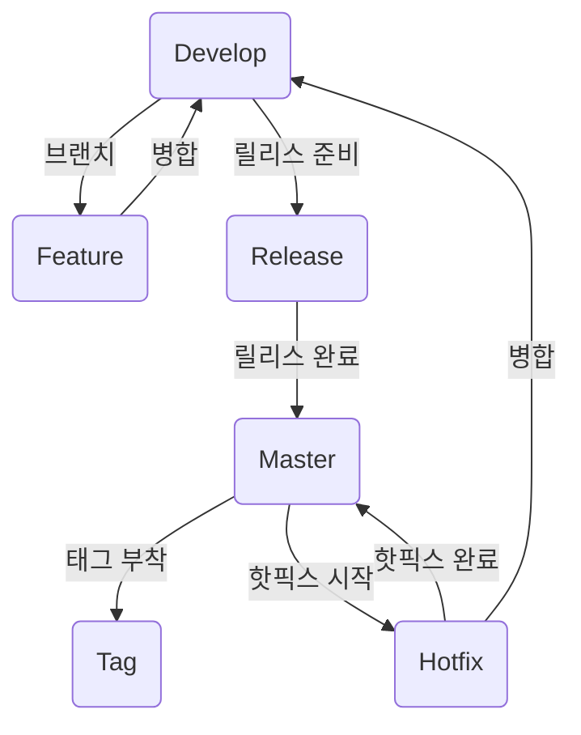

# 프로젝트 규칙

- 이슈관리 참조

    - [Vitamin-Monorepo](https://github.com/users/thanksLee/projects/6)

## 1. Backlog 관리 규칙
- 규칙
    - Prefix는 모두 대문자로 한다.
    ```
    - Common + PROJECT_NAME + [ISSUE_NUMBER]
    - FrontEnd + PROJECT_NAME + [ISSUE_NUMBER]
    - BackEnd + PROJECT_NAME + [ISSUE_NUMBER]
    ```
- 작성 예시
    ```
    ex) [COMMON][MONOREPO][#1]
    ex) [FE][MONOREPO][#1], [FE][VITAMIN-UI][#2], [FE][VITAMIN-CORE][#3]
    ex) [BE][MONOREPO][#1], [BE][VITAMIN-UI][#2], [BE][VITAMIN-CORE][#3]
    ```

## 2. 커밋 메시지 규칙
- 규칙
    - [Conventional Commits](https://www.conventionalcommits.org/ko/v1.0.0/) 을 참고한다.
    - 커밋 메시지는 영어로 작성한다.
    - 커밋 메시지는 최대한 간결하게 작성한다.
    - 커밋 메시지는 최대한 명확하게 작성한다.
    - 커밋 메시지는 최대 50자를 넘지 않도록 작성한다.

    ```
    - init     : 프로젝트 초기화와 관련된 커밋 타입
    - fix      : 버그 수정과 관련된 커밋 타입. Semantic Versioning의 Patch와 관련
    - feat     : 새로운 기능에 대한 커밋 타입. Semantic Versioning의 Minor와 관련
    - build    : 빌드 관련 파일 수정에 대한 커밋 타입
    - chore    : 분류하기 어려운 자잘한 수정에 대한 커밋 타입
    - ci       : CI 관련 수정에 대한 커밋 타입
    - docs     : Documentation 수정에 대한 커밋 타입
    - style    : 코드 의미에 영향을 주지 않는 수정에 대한 커밋 타입
    - refactor : 코드 리팩토링에 대한 커밋 타입
    - test     : 테스트 코드 수정에 대한 커밋 타입
    ```

- 작성 예시
    ```
    ex) [COMMON][MONOREPO][#1] feat: 새로운 기능 추가
    ex) [FE][MONOREPO][#1] feat: 새로운 기능 추가
    ex) [BE][MONOREPO][#2] fix: 버그 수정
    ```

## 3. 브랜치 규칙

- 설명

    - master : 제품으로 출시될 수 있는 브랜치 이며, 안정된 릴리스 버전들이 저장되는 브랜치. 각 릴리스 포인트에는 태그가 붙는다.
    - develop : 새 기능, 버그 수정, 그리고 다음 릴리스를 준비하는 모든 변경사항이 먼저 통합되는 브랜치.
    - feature : 새로운 기능을 개발하는 브랜치. 각각은 develop에서 분기되며, 개발 완료 후 다시 develop에 병합된다.
    - release : 다가오는 릴리스를 준비하기 위한 브랜치. develop에서 분기되어 릴리스 준비 과정(버그 수정, 문서 작성, 기타 마지막 수정사항)을 거친 후, master에 병합되고 릴리스 태그가 붙는다.
    - hotfix : 이미 릴리스된 버전에서 긴급한 버그 수정을 위한 브랜치. master에서 직접 분기되며, 수정 후에는 master와 develop 둘 다에 병합된다.

- 규칙
    - Main Prefix
        - master, develop, release, feature, hotfix
    - Sub Prefix
        - FrontEnd : FE
        - BackEnd : BE
        - Project : PROJECT_NAME
        - Issue : ISSUE_NUMBER

- 작성 예시
    ```
    ex) develop/COMMON/MONOREPO/#1
    ex) develop/FE/MONOREPO/#1
    ex) develop/FE/VITAMIN-UI/#2
    ex) develop/BE/MONOREPO/#1
    ex) develop/BE/VITAMIN-UI/#2
    ```

## 4 배포 규칙

