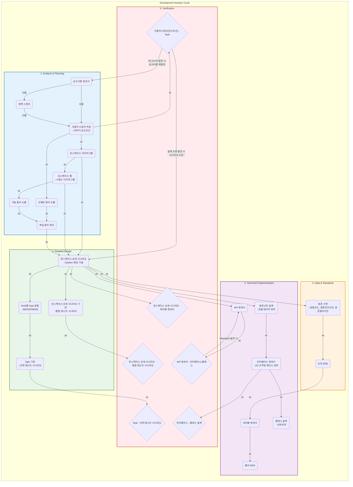
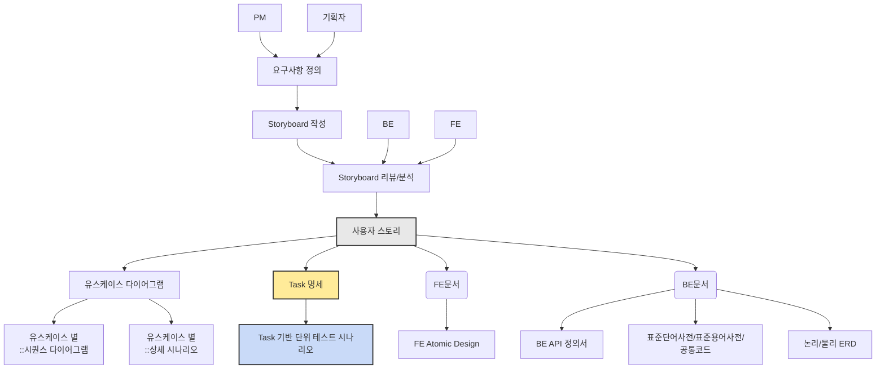

## 1. 개발 방법론

   AI 협업 기반 구현 중심 개발(AICD: AI-Collaborative Implementation-Driven Development) 방법론으로써 AI 협업 그라운드 룰(Ground Rule)을 준수하여 구현합니다.

---

## 2. 구현 프로세스



---

## 3. 특징

- 사용자 스토리 작성 중심: 추상적인 요구사항이나 유스케이스보다 구체적인 사용자 스토리를 먼저 작성합니다.

- **사용자 스토리(User Story)**는 복잡한 요구사항 정의서를 대신하여, **"우리가 이 기능을 왜, 누구를 위해 만드는가?"**를 가장 직관적으로 설명하는 도구입니다.

### 3.1. 사용자 스토리의 구조 (3C)

사용자 스토리는 단순히 글만 쓰는 게 아니라, **Card(카드), Conversation(대화), Confirmation(확인)**이라는 3단계 개념을 포함합니다.

보통 물리적인 포스트잇이나 Jira 티켓의 **앞면**과 **뒷면**으로 구분해서 이해하면 가장 빠릅니다.

#### 🅰️ 앞면: 이야기 (Card)

"누가, 무엇을, 왜" 원하는지 한 문장으로 정리합니다.

* **양식:**
> **As a** (누가 - 역할) 
> 
> 
> 
> 
> **I want to** (무엇을 - 기능) 
> 
> 
> 
> 
> **So that** (왜 - 가치/목적)


* **예시:**
> **[누가]** 잠재 고객으로서 
> 
> 
> 
> 
> **[무엇을]** 이메일로 회원가입을 하고 싶다. 
> 
> 
> 
> 
> **[왜]** 내 개인 정보를 안전하게 보호받으며 서비스를 이용하기 위해서.


#### 🅱️ 뒷면: 인수 조건 (Confirmation / Acceptance Criteria)

**"핵심 조건"**들이 적히는 곳입니다. 이 조건이 충족되어야 "이 스토리는 개발이 끝났다(Done)"라고 말할 수 있습니다.

* **내용:** 기능이 구체적으로 어떻게 동작해야 하는지, 제약사항은 무엇인지 기술.
* **예시:**
> 1. 아이디는 이메일 형식(`@`, `.`)을 검증해야 한다.
> 2. 비밀번호는 영문/숫자/특수문자 조합 10자리 이상이어야 한다.
> 3. 이미 가입된 이메일이면 안내 메시지와 로그인 버튼을 노출한다.
> 4. 가입 완료 즉시 환영 메일이 발송되어야 한다.
> 
> 

---

### 3.2. 좋은 사용자 스토리의 조건 (INVEST 원칙)

AI에게 스토리를 평가해달라고 할 때 이 기준을 쓰면 좋습니다.

1. **I**ndependent (독립적인가?): 다른 스토리 없이 혼자 개발 가능한가?
2. **N**egotiable (협상 가능한가?): 무조건적인 명령이 아니라, 개발자와 대화하며 디테일을 바꿀 수 있는가?
3. **V**aluable (가치 있는가?): 사용자에게 이득이 되는가?
4. **E**stimatable (추정 가능한가?): 개발자가 "이거 3일 걸려요"라고 견적을 낼 수 있는 크기인가?
5. **S**mall (작은가?): 2주(스프린트) 안에 개발할 수 있을 만큼 작아야 함. (너무 크면 쪼개야 함)
6. **T**estable (테스트 가능한가?): **인수 조건(뒷면)이 명확해서 테스트를 통과했는지 알 수 있는가?**

---

### 3.3 AI와 함께 사용자 스토리 만들기 (실전 프롬프트)

막연한 요구사항을 던져주고 **"INVEST 원칙에 맞는 사용자 스토리와 인수 조건을 써줘"**라고 하면 AI가 기가 막히게 작성해 줍니다.

#### 📝 입력 (사람)

> "우리 서비스에 '비밀번호 찾기' 기능이 필요해. 보안이 중요하고 이메일로 링크를 보내주는 방식이면 좋겠어."

#### 🤖 AI 프롬프트 (요청)

> "위 요구사항을 바탕으로 개발자가 바로 작업할 수 있는 **사용자 스토리**를 작성해줘.
> 1. `As a`, `I want to`, `So that` 형식을 지킬 것.
> 2. **인수 조건(Acceptance Criteria)**을 4가지 이상 구체적으로 명시해줘 (엣지 케이스 포함)."
> 
> 

#### 📄 출력 결과 (AI)

> **[사용자 스토리]**
> * **As a** 비밀번호를 잊어버린 회원으로서
> * **I want to** 가입한 이메일로 비밀번호 재설정 링크를 받고 싶다.
> * **So that** 고객센터에 연락하지 않고 스스로 계정에 다시 접근하기 위해서.
> 
> 
> **[인수 조건]**
> 1. 가입되지 않은 이메일을 입력해도 보안을 위해 "메일이 발송되었습니다"라고 동일하게 표시해야 한다. (해킹 방지)
> 2. 재설정 링크는 10분 동안만 유효해야 한다.
> 3. 새 비밀번호는 이전 비밀번호와 달라야 한다.
> 4. 메일 발송에 실패하면 사용자에게 "잠시 후 다시 시도해주세요" 알림을 띄운다.
> 
> 

---

### 3.4 💡 요약

사용자 스토리는 **"개발자와 대화하기 위한 초대장"**입니다.

* **앞면(3C):** 우리의 목표와 가치 (방향성)
* **뒷면(인수조건):** 구현해야 할 구체적인 규칙 (나중에 테스트 케이스가 됨)

사용자 스토리의 **'뒷면'**을 얼마나 꼼꼼하게 AI와 함께 정의하느냐가 나중에 상세 시나리오와 테스트 케이스의 품질을 결정합니다.

- FE/BE 협업 명확화: 프론트엔드와 백엔드의 책임과 상호작용을 명확히 구분

- AI 협업 최적화: AI가 이해하고 활용할 수 있는 형태로 정보 구조화

- 문서 자동 생성: 사용자 스토리를 기반으로 다양한 산출물을 AI를 통해 자동 생성

## 4. 분석 절차



## 5. 유스케이스 상세 시나리오 가이드

### 5.1 구성요소 설명

- 사전조건 (Preconditions) :

  * 특정 유스케이스가 실행되기 전에 반드시 충족되어야 하는 조건을 기술합니다.

  * 시스템이 정상적으로 작동하기 위한 상태나 환경을 정의합니다.

- 기본 시나리오 (Basic Flow) :

  * 유스케이스의 정상적인 흐름을 기술합니다.

  * 사용자가 목표를 달성하기 위해 수행하는 단계별 절차를 설명하며, 성공적인 결과를 도출하는 과정을 포함합니다.

- 대안 시나리오 (Alternative Flow) :

  * 기본 시나리오에서 벗어난 흐름을 기술합니다.

  * 사용자가 다른 선택을 하거나, 시스템이 다른 방식으로 응답해야 하는 경우를 다룹니다.

- 사후 조건 (Postconditions) :

  * 유스케이스가 종료된 후 시스템이 가져야 할 상태를 정의합니다.

  * 성공적으로 완료된 경우와 실패한 경우 모두 포함될 수 있습니다.

- 예외 (Exceptions) :

  * 유스케이스 실행 중 발생할 수 있는 오류나 문제 상황을 기술합니다.

  * 예외 상황에 대한 처리 방법도 포함됩니다.

- 기술적 세부사항 (Technical Details) :

  * 유스케이스에서 설명하는 기능을 구현하거나 설계하는 데 필요한 구체적인 기술적 정보를 포함해야 합니다.

  * 개발자, 시스템 설계자, 또는 기술적 의사결정을 내리는 사람들을 대상으로 하며, 시스템이 어떻게 동작하는지를 이해하고 구현할 수 있도록 돕는 역할을 합니다.

### 5.2 기본 시나리오와 대안 시나리오를 구분하는 노하우

- 기본 시나리오와 대안 시나리오의 차이점 이해

  * 기본 시나리오: 시스템이 정상적으로 작동하며, 사용자가 원하는 목표를 달성하는 가장 일반적이고 이상적인 흐름입니다.

  * 대안 시나리오: 기본 시나리오에서 벗어난 흐름으로, 사용자의 선택, 입력 오류, 시스템 장애 등으로 인해 발생하는 예외적 상황이나 다른 경로를 다룹니다.

### 5.3 구분하기 위한 주요 기준

- 정상적인 목표 달성 여부:

  * 사용자가 시스템을 통해 목표를 성공적으로 달성할 수 있는 과정이라면 기본 시나리오에 포함됩니다.

  * 목표 달성이 실패하거나 다른 경로로 이어지는 경우는 대안 시나리오로 간주됩니다.

- 입력값과 조건의 정상 여부:

  * 정상적인 입력값과 조건(예: 올바른 아이디와 비밀번호)이 충족될 경우 기본 시나리오에 해당합니다.

  * 비정상적인 입력값(예: 공백, 잘못된 형식 등)이나 조건 미충족은 대안 시나리오로 처리합니다.

- 시스템의 의도된 처리 흐름:

  * 시스템이 설계된 대로 동작하여 사용자의 요청을 처리하는 경우 기본 시나리오입니다.

  * 설계된 흐름에서 벗어나거나 추가적인 처리가 필요한 경우 대안 시나리오로 분류됩니다.

- 사용자 선택의 다양성:

  * 사용자가 특정 기능(예: 언어 변경, 테마 변경 등)을 선택하면서 발생하는 흐름은 대안 시나리오로 간주됩니다.

  * 단, 선택한 기능이 필수적인 과정이라면 기본 시나리오에 포함될 수 있습니다.

### 5.4 실무에서 활용할 수 있는 팁

- "정상 vs 예외" 체크

  * 유스케이스의 각 단계에서 다음 질문을 던져보세요:

      - "이 단계가 정상적으로 작동하면 목표 달성이 가능한가?" → 그렇다면 기본 시나리오.

      - "이 단계에서 문제가 발생하거나 다른 경로로 이동해야 하는가?" → 그렇다면 대안 시나리오.

- 이벤트와 결과 매핑

  * 각 이벤트(사용자 행동 또는 시스템 반응)에 대해 결과를 매핑해보세요:

      - 결과가 성공적이고 예상된 흐름이라면 기본 시나리오입니다.

      - 결과가 실패하거나 예상치 못한 상황이라면 대안 시나리오입니다.

- 사용자 관점 고려

  * 사용자가 경험하는 관점에서 "일반적으로 기대되는 행동"은 기본 시나리오에 포함하고, "예외적 상황"은 대안 시나리오로 분류합니다.

## 6. 🧰 AI CBD 프롬프트 키트 (V1.0)

---

> **💡 사용법:**
> 1. 다이어그램의 **단계(Node)**를 확인합니다.
> 2. 아래 키트에서 해당 단계의 **프롬프트**를 복사합니다.
> 3. `{ }` 괄호 안에 현재 프로젝트의 내용을 채워 넣고 AI에게 던지세요.
> 4. AI의 답변이 마음에 들지 않으면 "더 구체적으로 써줘", "표 형식으로 바꿔줘"라고 피드백하세요.
> 
> 

---

### 🏗️ Phase 1. 기획 및 분석 (Analysis)

#### 📌 [P1B] 사용자 스토리 & 인수조건 작성

* **목표:** 모호한 요구사항을 명확한 개발 기준(인수조건)으로 변환.
* **Input:** 날것의 요구사항, 아이디어.

```markdown
# Role: 시니어 기획자 (PO)

# Input
- 요구사항: "{여기에 구현하고 싶은 기능 설명}"

# Request
위 요구사항을 바탕으로 '사용자 스토리(User Story)'를 작성해줘.
다음 형식을 반드시 지켜줘.

1. **Story Card (3C):**
   - As a (누가)
   - I want to (무엇을)
   - So that (왜/가치)

2. **Acceptance Criteria (인수 조건) - 매우 중요:**
   - 개발 완료 여부를 판단할 수 있는 구체적인 조건 4가지 이상.
   - 예외 케이스(실패 조건)와 수치적 제약(시간, 글자 수 등)을 포함할 것.


#### 📌 [P1G] 핵심 용어 정의 (Data Dictionary)

* **목표:** 기획서와 다이어그램에서 명사를 추출하여 영어 변수명 통일.
* **Input:** 사용자 스토리, 시퀀스 다이어그램 내용.

```markdown
# Role: 데이터 아키텍트 (DA)

# Input
- 사용자 스토리 및 시퀀스 흐름: "{위에서 만든 스토리 및 로직 붙여넣기}"

# Request
위 내용을 분석하여 시스템에서 관리해야 할 '핵심 데이터 용어'를 정의해줘.
출력은 아래 마크다운 표 형식으로 해줘.

| 한글명(Biz Term) | 영문명(Logical Name) | 설명 및 규칙 | 비고 |
| :--- | :--- | :--- | :--- |
| 예: 인증번호 | auth_code | 6자리 숫자 | |
| 예: 만료일시 | expired_at | 발송 후 3분 | |

```

---

### 📐 Phase 2. 상세 설계 (Detailed Design)

#### 📌 [P2A] 유스케이스 상세 시나리오 작성

* **목표:** 인수조건과 용어를 결합하여, 시스템 관점의 상세 로직 기술.
* **Input:** 시퀀스 다이어그램 흐름, 용어 사전, 인수조건.

```markdown
# Role: 테크니컬 라이터 (Technical Writer)

# Context
- 유스케이스명: "{유스케이스 이름}"
- 핵심 용어: "{P1G에서 만든 용어 사전}"
- 로직 흐름: "{시퀀스 다이어그램의 흐름 요약}"

# Request
위 정보를 조합하여 **'유스케이스 상세 시나리오'**를 작성해줘.

**[작성 규칙]**
1. 주어는 명확히 구분할 것 ('사용자' vs '시스템').
2. 문장 작성 시 **핵심 용어(영문명)**를 괄호 안에 병기할 것. (예: 시스템은 `auth_code`를 생성한다.)
3. 기본 흐름(Basic Flow), 대체 흐름(Alt Flow), 예외 흐름(Exception Flow)으로 목차를 나눌 것.
4. **인수 조건**에 있던 제약 사항(시간, 횟수 등)을 로직에 반드시 녹여낼 것.

```

#### 📌 [P2B/P2C] Task 분할 및 단위 테스트 정의

* **목표:** 상세 시나리오를 개발자가 수행할 작업 티켓으로 변환.
* **Input:** P2A에서 만든 상세 시나리오.

```markdown
# Role: 스크럼 마스터 (Scrum Master)

# Input
- 상세 시나리오: "{P2A 시나리오 전체 붙여넣기}"

# Request
개발자가 수행할 **Role별 Task 리스트**와 **단위 테스트(DoD)**를 표로 작성해줘.

**[표 컬럼 정의]**
- **Role:** BE / FE / Design 중 택 1
- **Task 명:** 구체적인 작업 단위 (API 구현, UI 개발 등)
- **단위 테스트 (완료 조건):** 해당 Task가 끝났음을 증명할 수 있는 구체적 체크리스트 3개 이상. (수치와 에러코드 포함 필수)
- **선행 작업:** 작업 순서 의존성.

**[필수 조건]**
BE Task의 첫 번째는 반드시 '테이블 설계 및 표준화'여야 함.

```
---

#### 📌 [P2D] 통합 테스트 시나리오 (NEW!)

* **목표:** 전체 흐름을 검증할 통합 테스트 시나리오 작성.
* **Input:** P2A에서 만든 상세 시나리오.

```markdown
# Role: QA 엔지니어
# Input: P2A 상세 시나리오
"{상세 시나리오 붙여넣기}"

# Request
전체 흐름을 검증할 **'통합 테스트 시나리오(Integration TC)'**를 작성해줘.
- 개발자가 아닌 **사용자 관점**의 E2E 테스트여야 함.
- 포함: TC ID, 테스트 상황, 사전 조건, 단계(Step), 기대 결과, 테스트 데이터.
- 정상 흐름과 주요 예외 흐름(Timeout 등)을 모두 포함할 것.

```

---

### 🛠️ Phase 4. 기술 구현 설계 (Implementation)

#### 📌 [P4A/B] API 및 DB 명세서 생성

* **목표:** Task를 수행하기 위한 기술적 설계도 자동 생성.
* **Input:** 상세 시나리오, 용어 사전.

```markdown
# Role: 수석 백엔드 개발자

# Input
- 상세 시나리오: "{P2A 시나리오}"
- 용어 사전: "{P1G 용어}"

# Request 1: API 명세
위 기능을 구현하기 위한 REST API 명세서를 **OpenAPI 3.0 (YAML)** 형식으로 작성해줘.
(Request/Response 예시와 에러 코드 4xx, 5xx 포함 필수)

# Request 2: DB 설계
위 기능을 지원하기 위한 **MySQL DDL(테이블 생성 쿼리)**을 작성해줘.
- 테이블명과 컬럼명은 '용어 사전'의 영문명을 따를 것.
- 각 컬럼에 Comment(주석)를 달 것.

```

---

### ⚖️ Phase 5. 검증 및 피드백 (Verification)

#### 📌 [P5A] 추적성 검증 (Story vs Task)

* **목표:** 요구사항 누락 방지.
* **Input:** 사용자 스토리(인수조건), Task 리스트.

```markdown
# Role: QA Auditor (감사관)

# Input
- A (인수조건): "{P1B 인수조건}"
- B (Task 리스트): "{P2B Task 표}"

# Request
A(요구사항)가 B(작업목록)에 빠짐없이 반영되었는지 **추적성 검사**를 수행해줘.
만약 Task로 구현되지 않고 **누락된 인수조건**이 있다면 정확히 지적해줘.

```

#### 📌 [P5C] 정합성 검증 (Scenario vs DB Spec)

* **목표:** 논리적 설계와 물리적 설계의 불일치(데이터 구멍) 탐지.
* **Input:** 상세 시나리오, 테이블 명세서(DDL).

```markdown
# Role: DB 모델러

# Input
- A (시나리오): "{P2A 상세 시나리오}"
- B (테이블 명세): "{P4B DDL 쿼리}"

# Request
**[정합성 체크]**를 수행해줘.
시나리오(A)의 흐름을 처리하기 위해 필요한 데이터가 테이블(B)에 모두 컬럼으로 존재하는가?

**[경고해야 할 상황]**
1. 시나리오에선 저장/조회한다고 했는데 테이블에 컬럼이 없는 경우.
2. 데이터 타입(길이, 숫자/문자)이 시나리오의 로직과 맞지 않는 경우.

``` 

#### 📌 [P5D] 커버리지 검증 (Scenario vs Integrated TC)

* **목표:** 테스트 시나리오가 상세 시나리오의 모든 흐름을 커버하는지 검증.
* **Input:** 상세 시나리오, 통합 테스트 시나리오.

```markdown
# Role: QA 리더
# Input: A(상세 시나리오), B(통합 테스트 시나리오)
"{A, B 붙여넣기}"

# Request
테스트 시나리오(B)가 상세 시나리오(A)의 **모든 흐름(대체/예외 포함)을 커버하는지** 검증해줘.
- 테스트되지 않고 누락된 시나리오 흐름이 있다면 지적해줘.

```

---

### 🚀 사용 가이드

1. **Phase 1부터 순서대로** 진행합니다.
2. 각 단계의 **Output(결과물)**은 다음 단계의 **Input(재료)**이 됩니다.
3. Phase 5에서 **"누락 발견"** 경고가 뜨면, 해당 부분을 수정하고 다시 다음 단계로 넘어갑니다.
