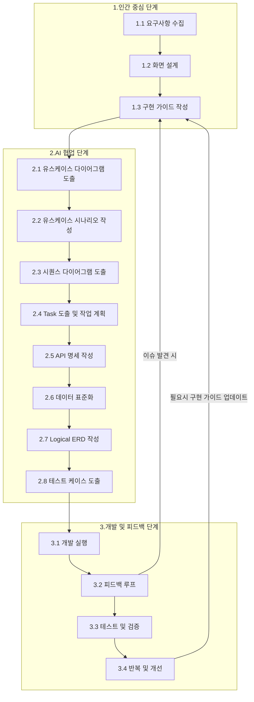
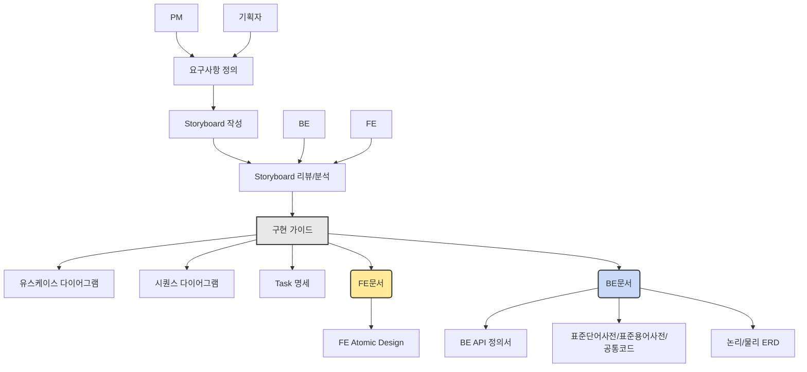

## 1. 개발 방법론

   AI 협업 기반 구현 중심 개발(AICD: AI-Collaborative Implementation-Driven Development) 방법론

---

## 2. 구현 프로세스

---

## 3. 특징

- 구현 가이드 중심: 추상적인 요구사항이나 유스케이스보다 구체적인 구현 가이드를 먼저 작성

- FE/BE 협업 명확화: 프론트엔드와 백엔드의 책임과 상호작용을 명확히 구분

- AI 협업 최적화: AI가 이해하고 활용할 수 있는 형태로 정보 구조화

- 문서 자동 생성: 구현 가이드를 기반으로 다양한 산출물을 AI를 통해 자동 생성

## 4. 분석 절차

## 5. 구현 가이드

 순수 방법론보다는 실무 지향적 접근법에 가깝게 작성하는 방법론

### 5.1 구성요소 설명

- 사전조건 (Preconditions) :

  * 특정 유스케이스가 실행되기 전에 반드시 충족되어야 하는 조건을 기술합니다.

  * 시스템이 정상적으로 작동하기 위한 상태나 환경을 정의합니다.

- 기본 시나리오 (Basic Flow) :

  * 유스케이스의 정상적인 흐름을 기술합니다.

  * 사용자가 목표를 달성하기 위해 수행하는 단계별 절차를 설명하며, 성공적인 결과를 도출하는 과정을 포함합니다.

- 대안 시나리오 (Alternative Flow) :

  * 기본 시나리오에서 벗어난 흐름을 기술합니다.

  * 사용자가 다른 선택을 하거나, 시스템이 다른 방식으로 응답해야 하는 경우를 다룹니다.

- 사후 조건 (Postconditions) :

  * 유스케이스가 종료된 후 시스템이 가져야 할 상태를 정의합니다.

  * 성공적으로 완료된 경우와 실패한 경우 모두 포함될 수 있습니다.

- 예외 (Exceptions) :

  * 유스케이스 실행 중 발생할 수 있는 오류나 문제 상황을 기술합니다.

  * 예외 상황에 대한 처리 방법도 포함됩니다.

- 기술적 세부사항 (Technical Details) :

  * 유스케이스에서 설명하는 기능을 구현하거나 설계하는 데 필요한 구체적인 기술적 정보를 포함해야 합니다.

  * 개발자, 시스템 설계자, 또는 기술적 의사결정을 내리는 사람들을 대상으로 하며, 시스템이 어떻게 동작하는지를 이해하고 구현할 수 있도록 돕는 역할을 합니다.

### 5.2 기본 시나리오와 대안 시나리오를 구분하는 노하우

- 기본 시나리오와 대안 시나리오의 차이점 이해

  * 기본 시나리오: 시스템이 정상적으로 작동하며, 사용자가 원하는 목표를 달성하는 가장 일반적이고 이상적인 흐름입니다.

  * 대안 시나리오: 기본 시나리오에서 벗어난 흐름으로, 사용자의 선택, 입력 오류, 시스템 장애 등으로 인해 발생하는 예외적 상황이나 다른 경로를 다룹니다.

### 5.3 구분하기 위한 주요 기준

- 정상적인 목표 달성 여부:

  * 사용자가 시스템을 통해 목표를 성공적으로 달성할 수 있는 과정이라면 기본 시나리오에 포함됩니다.

  * 목표 달성이 실패하거나 다른 경로로 이어지는 경우는 대안 시나리오로 간주됩니다.

- 입력값과 조건의 정상 여부:

  * 정상적인 입력값과 조건(예: 올바른 아이디와 비밀번호)이 충족될 경우 기본 시나리오에 해당합니다.

  * 비정상적인 입력값(예: 공백, 잘못된 형식 등)이나 조건 미충족은 대안 시나리오로 처리합니다.

- 시스템의 의도된 처리 흐름:

  * 시스템이 설계된 대로 동작하여 사용자의 요청을 처리하는 경우 기본 시나리오입니다.

  * 설계된 흐름에서 벗어나거나 추가적인 처리가 필요한 경우 대안 시나리오로 분류됩니다.

- 사용자 선택의 다양성:

  * 사용자가 특정 기능(예: 언어 변경, 테마 변경 등)을 선택하면서 발생하는 흐름은 대안 시나리오로 간주됩니다.

  * 단, 선택한 기능이 필수적인 과정이라면 기본 시나리오에 포함될 수 있습니다.

### 5.4 실무에서 활용할 수 있는 팁

- "정상 vs 예외" 체크

  * 유스케이스의 각 단계에서 다음 질문을 던져보세요:

      - "이 단계가 정상적으로 작동하면 목표 달성이 가능한가?" → 그렇다면 기본 시나리오.

      - "이 단계에서 문제가 발생하거나 다른 경로로 이동해야 하는가?" → 그렇다면 대안 시나리오.

- 이벤트와 결과 매핑

  * 각 이벤트(사용자 행동 또는 시스템 반응)에 대해 결과를 매핑해보세요:

      - 결과가 성공적이고 예상된 흐름이라면 기본 시나리오입니다.

      - 결과가 실패하거나 예상치 못한 상황이라면 대안 시나리오입니다.

- 사용자 관점 고려

  * 사용자가 경험하는 관점에서 "일반적으로 기대되는 행동"은 기본 시나리오에 포함하고, "예외적 상황"은 대안 시나리오로 분류합니다.