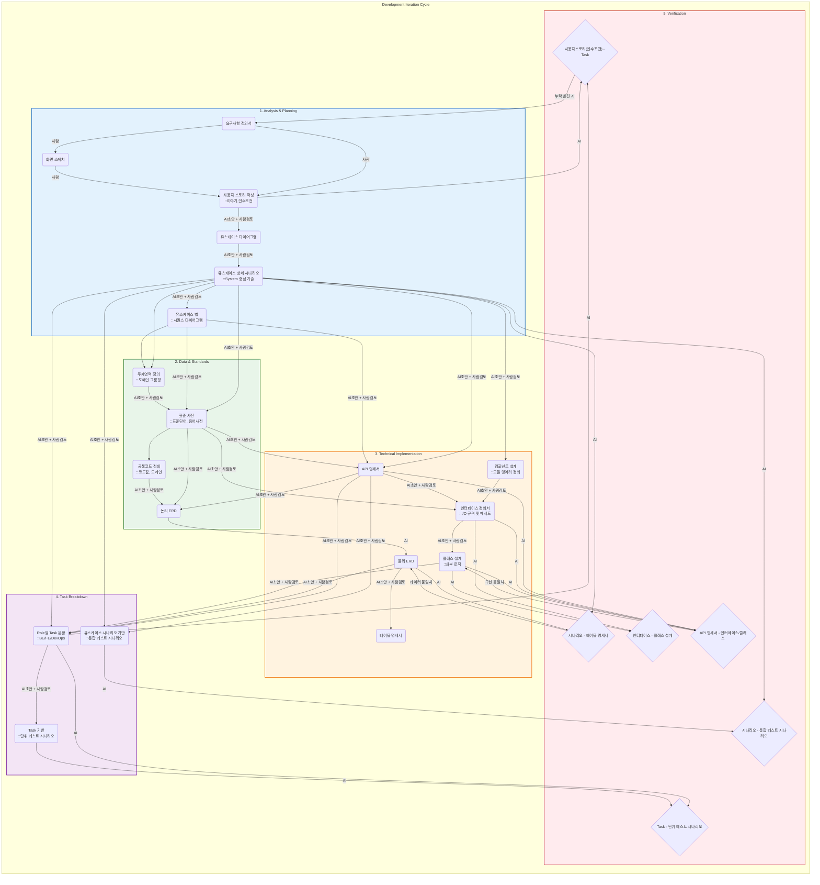

## 1. 개발 방법론

   AI 협업 기반 구현 중심 개발(AICD: AI-Collaborative Implementation-Driven Development) 방법론으로써 AI 협업 그라운드 룰(Ground Rule)을 준수하여 구현합니다.

---

## 2. 구현 프로세스



---

## 3. 분석 절차


## 4. 문서 코드 분류

|분류|구분|고유번호코드|규칙(예시)|
|---|---|---|---|
|분석|요구사항 (Requirement)|REQ|
||요구사항 기능||REQ-F-001|
||요구사항 비기능||REQ-N-001|
||상세 요구사항||REQ-001|
||화면 스케치(UI Draft)|UID|UID-001|
||사용자 스토리 카드 (User Story Card)|USC|USC-001|
||유스케이스 다이어그램 (Usecase Diagram)|UCD|UCD-001|
||유스케이스||UCD-001-01|
||유스케이스 상세||UCD-001-01|
||시퀀스 다이어그램 (Sequence Diagram)|SQD|SQD-001|
|설계|컴포넌트 다이어그램 (Component Diagram)|COD|COD-001|
||컴포넌트 상세||COD-001-01|
||인터페이스 명세서 (Interface Definition)|IFD|IFD-001|
||클래스 다이어그램 (Class Diagram)|CLD|CLD-001|
||클래스 상세||CLD-001-01|
||화면 디자인 (Screen Design)|SCD|SCD-001|
||데이터 표준화 (단어/용어/도메인)(Data Dictionary)|DIC|DIC-001|
||공통코드 (Common Code)|CCD|CCD-001|
||데이블 명세서 (Table Definition)|TBL|TBL-001|
||API 명세 (API Definition)|API|API-001|
||작업 티켓 (TSK)|TSK||
||Frontend 작업 티켓||TSK-FE-001|
||Backend 작업 티켓||TSK-BE-001|
|테스트|단위테스트 시나리오 (Unit Tesst Scenario)|UTS|UTS-001|
||통합테스트 시나리오 (Integration Test Scenario)|ITS|ITS-001|

## 5. 문서 작성 방법

### 5.1 요구사항 정의서

#### 5.1.1 기능

  * 각 기능별로 섹션을 구분하여 작성합니다.
  * 각 섹션은 다음 항목을 포함합니다:
    - 요구사항 아이디: 고유한 식별자 (예: REQ-001, REQ-002)
    - 화면: 해당 기능의 화면 이미지 참조 (예: )
    - 요구사항 내용: 기능의 상세 설명
      * 기능이 수행하는 작업을 명확히 기술합니다.
      * 입력 항목, 출력 항목, 상태 정의를 상세히 기술합니다.
      * 제약사항 및 비즈니스 규칙을 명시합니다.
      * 관련 요구사항은 `@REQ-XXX` 형식으로 참조합니다.
      * 공통 요구사항은 `@common/common_spec.md#REQ-XXX` 형식으로 참조합니다.
  * 예시 구조:

    ```markdown
    ## 기능명
    - 요구사항 아이디 : REQ-001
    - 화면 : 
    - 요구사항 내용 :
        - 주요 기능 설명
        - 입력 항목:
            - 항목명: 설명 및 제약사항
        - 출력 항목:
            - 항목명: 설명 및 상태 정의
        - 제약사항:
            - 특정 조건에서의 제한사항
    ```

  * 상위 그룹/컨테이너 섹션:
    * 여러 하위 요구사항을 묶는 상위 섹션의 경우 요구사항 아이디를 생략할 수 있습니다.
    * 이는 단순히 관련 요구사항들을 그룹화하는 목적이며, 독립적인 기능 요구사항이 아닙니다.
    * 예시:

      ```markdown
      ## 설정 창
      - 화면 : 

      ### 전송정보
      - 요구사항 아이디 : REQ-006
      - 화면 :
      - 요구사항 내용 :
          - 입력항목 설명...

      ### 원격서버 설정
      - 요구사항 아이디 : REQ-007
      - 화면 :
      - 요구사항 내용 :
          - 설정 내용...
      ```

    * 상위 그룹에도 독립적인 기능 요구사항이 있다면 요구사항 아이디를 부여합니다.

#### 5.1.2 비기능

  * 성능, 보안, 사용성 등 기능 외 요구사항을 기술합니다.
  * 예시:
    - 보안: 접속 정보는 암호화하여 저장한다.
    - 사용성: 경로 입력은 읽기전용으로 처리한다.
    - 데이터 무결성: 설정명은 유일해야 한다.
    - 시스템 제약: 활성화 상태인 설정은 삭제가 불가능하도록 제한한다.

### 5.2 사용자 스토리 카드

* **사용자 스토리(User Story)**는 복잡한 요구사항 정의서를 대신하여, **"우리가 이 기능을 왜, 누구를 위해 만드는가?"**를 가장 직관적으로 설명하는 도구입니다.
* 추상적인 요구사항이나 유스케이스보다 구체적인 사용자 스토리를 먼저 작성합니다.

#### 5.2.1 사용자 스토리의 구조 (3C)

사용자 스토리는 단순히 글만 쓰는 게 아니라, **Card(카드), Conversation(대화), Confirmation(확인)**이라는 3단계 개념을 포함합니다.

보통 물리적인 포스트잇이나 Jira 티켓의 **앞면**과 **뒷면**으로 구분해서 이해하면 가장 빠릅니다.

* **앞면: 이야기 (Card)**
  * "누가, 무엇을, 왜" 원하는지 한 문장으로 정리합니다.
  * **양식:**
    - **As a** (누가 - 역할)
    - **I want to** (무엇을 - 기능)
    - **So that** (왜 - 가치/목적)
  * **예시:**
    - **[누가]** 잠재 고객으로서
    - **[무엇을]** 이메일로 회원가입을 하고 싶다.
    - **[왜]** 내 개인 정보를 안전하게 보호받으며 서비스를 이용하기 위해서.

* **뒷면: 인수 조건 (Confirmation / Acceptance Criteria)**
  * **"핵심 조건"**들이 적히는 곳입니다. 이 조건이 충족되어야 "이 스토리는 개발이 끝났다(Done)"라고 말할 수 있습니다.
  * 기능이 구체적으로 어떻게 동작해야 하는지, 제약사항은 무엇인지 기술합니다.
  * **예시:**
    1. 아이디는 이메일 형식(`@`, `.`)을 검증해야 한다.
    2. 비밀번호는 영문/숫자/특수문자 조합 10자리 이상이어야 한다.
    3. 이미 가입된 이메일이면 안내 메시지와 로그인 버튼을 노출한다.
    4. 가입 완료 즉시 환영 메일이 발송되어야 한다.

#### 5.2.2 좋은 사용자 스토리의 조건 (INVEST 원칙)

AI에게 스토리를 평가해달라고 할 때 이 기준을 쓰면 좋습니다.

1. **I**ndependent (독립적인가?): 다른 스토리 없이 혼자 개발 가능한가?
2. **N**egotiable (협상 가능한가?): 무조건적인 명령이 아니라, 개발자와 대화하며 디테일을 바꿀 수 있는가?
3. **V**aluable (가치 있는가?): 사용자에게 이득이 되는가?
4. **E**stimatable (추정 가능한가?): 개발자가 "이거 3일 걸려요"라고 견적을 낼 수 있는 크기인가?
5. **S**mall (작은가?): 2주(스프린트) 안에 개발할 수 있을 만큼 작아야 함. (너무 크면 쪼개야 함)
6. **T**estable (테스트 가능한가?): **인수 조건(뒷면)이 명확해서 테스트를 통과했는지 알 수 있는가?**

#### 5.2.3 AI와 함께 사용자 스토리 만들기 (실전 프롬프트)

막연한 요구사항을 던져주고 **"INVEST 원칙에 맞는 사용자 스토리와 인수 조건을 써줘"**라고 하면 AI가 기가 막히게 작성해 줍니다.

* **입력 예시 (사람):**
  > "우리 서비스에 '비밀번호 찾기' 기능이 필요해. 보안이 중요하고 이메일로 링크를 보내주는 방식이면 좋겠어."

* **AI 프롬프트 (요청):**
  > "위 요구사항을 바탕으로 개발자가 바로 작업할 수 있는 **사용자 스토리**를 작성해줘.
  > 1. `As a`, `I want to`, `So that` 형식을 지킬 것.
  > 2. **인수 조건(Acceptance Criteria)**을 4가지 이상 구체적으로 명시해줘 (엣지 케이스 포함)."

* **출력 결과 예시 (AI):**
  > **[사용자 스토리]**
  > * **As a** 비밀번호를 잊어버린 회원으로서
  > * **I want to** 가입한 이메일로 비밀번호 재설정 링크를 받고 싶다.
  > * **So that** 고객센터에 연락하지 않고 스스로 계정에 다시 접근하기 위해서.
  >
  > **[인수 조건]**
  > 1. 가입되지 않은 이메일을 입력해도 보안을 위해 "메일이 발송되었습니다"라고 동일하게 표시해야 한다. (해킹 방지)
  > 2. 재설정 링크는 10분 동안만 유효해야 한다.
  > 3. 새 비밀번호는 이전 비밀번호와 달라야 한다.
  > 4. 메일 발송에 실패하면 사용자에게 "잠시 후 다시 시도해주세요" 알림을 띄운다.

#### 5.2.4 사용자 스토리의 가치

* 사용자 스토리는 **"개발자와 대화하기 위한 초대장"**입니다.
  * **앞면(3C):** 우리의 목표와 가치 (방향성)
  * **뒷면(인수조건):** 구현해야 할 구체적인 규칙 (나중에 테스트 케이스가 됨)
* 사용자 스토리의 **'뒷면'**을 얼마나 꼼꼼하게 AI와 함께 정의하느냐가 나중에 상세 시나리오와 테스트 케이스의 품질을 결정합니다.
* FE/BE 협업 명확화: 프론트엔드와 백엔드의 책임과 상호작용을 명확히 구분
* AI 협업 최적화: AI가 이해하고 활용할 수 있는 형태로 정보 구조화
* 문서 자동 생성: 사용자 스토리를 기반으로 5단계 프로세스(분석 및 기획 → 데이터 및 표준 → 기술 구현 설계 → Task 분할 → 검증)의 다양한 산출물을 AI를 통해 자동 생성

#### 5.2.5 사용자 스토리 작성 가이드

* 요구사항 정의서를 기반으로 사용자 스토리를 작성합니다.
* 각 기능별 요구사항을 사용자 관점의 스토리로 변환합니다.
* 요구사항 아이디와 사용자 스토리 아이디를 매핑하여 추적성을 확보합니다.

##### 5.2.5.1 작성 구조

각 사용자 스토리는 다음 구조로 작성합니다:

```markdown
## [번호]. [사용자 스토리 명]

> 참조: `@REQ-XXX` (요구사항 아이디)

### Story Card (3C)

- **As a** [역할]
- **I want to** [기능/목표]
- **So that** [가치/이유]

### Acceptance Criteria (인수 조건)

1. [인수 조건 1]
2. [인수 조건 2]
...
```

##### 5.2.5.2 요구사항 정의서 → 사용자 스토리 변환 방법

* **요구사항 아이디 매핑**
  * 각 사용자 스토리는 해당하는 요구사항 아이디를 참조합니다.
  * 형식: `> 참조: @REQ-001`
  * 여러 요구사항을 참조하는 경우: `> 참조: @REQ-001, @REQ-002`

* **Story Card 작성**
  * **As a (역할)**: 요구사항 정의서에서 사용자 역할을 파악합니다.
    * 예: "시스템 관리자", "일반 사용자", "운영자"
  * **I want to (기능)**: 요구사항 내용의 핵심 기능을 사용자 목표로 변환합니다.
    * UI 액션이 아닌 사용자 목표 중심으로 작성합니다.
    * 예: "SFTP 설정 목록을 조회하고 싶다" (O)
    * 예: "조회 버튼을 클릭하고 싶다" (X)
  * **So that (가치)**: 요구사항의 목적과 가치를 명확히 기술합니다.
    * 사용자가 이 기능을 통해 얻고자 하는 이익을 기술합니다.

* **Acceptance Criteria 작성**
  * 요구사항 내용의 세부 사항을 인수 조건으로 변환합니다.
  * 입력 항목, 출력 항목, 상태 정의, 제약사항을 구체적으로 기술합니다.
  * 각 인수 조건은 테스트 가능하도록 작성합니다.
  * 제약사항과 비즈니스 규칙을 명확히 포함합니다.

##### 5.2.5.3 작성 예시

**요구사항 정의서 예시:**

```markdown
## 목록
- 요구사항 아이디 : REQ-001
- 화면 : 
- 요구사항 내용 :
    - 송수신 설정 내용을 조회 한다.
    - 인바운드 / 아웃바운드 목록을 구분하여 화면에 보여준다.
    - 목록: 상태 / 설정명 / 원격서버 / 원격경로 / 로컬 경로 / 모드 / 활성화 여부 / 작업
        - 상태: 중지 / 오류 / 실행
        - 활성화 여부: 활성화 / 비활성화
        - 작업: 수정 / 삭제
```

**변환된 사용자 스토리:**

```markdown
## 1. SFTP 설정 목록 조회

> 참조: `@REQ-001`

### Story Card (3C)

- **As a** 시스템 관리자로서
- **I want to** SFTP 송수신 설정 목록을 인바운드/아웃바운드로 구분하여 조회하고 싶다.
- **So that** 현재 등록된 모든 SFTP 연동 설정의 상태를 한눈에 파악하고 관리할 수 있기 위해서.

### Acceptance Criteria (인수 조건)

1. 화면에 인바운드(원격→로컬)와 아웃바운드(로컬→원격) 설정 목록이 구분되어 표시되어야 한다.
2. 각 설정 항목에는 다음 정보가 표시되어야 한다:
   - 상태 (중지/오류/실행)
   - 설정명
   - 원격서버
   - 원격경로
   - 로컬 경로
   - 모드 (복사/이동)
   - 활성화 여부 (활성화/비활성화)
   - 작업 버튼 (수정/삭제)
3. 상태 표시 규칙:
   - **중지**: 연동이 중지된 상태
   - **오류**: 원격지 접속 장애 등 문제 발생 시
   - **실행**: 정상적으로 연동 중인 상태
4. 활성화 여부가 "활성화"인 설정은 SFTP 동작이 수행되고, "비활성화"인 설정은 동작하지 않아야 한다.
5. 데이터가 없을 경우 빈 목록 상태를 표시해야 한다.
```

##### 5.2.5.4 작성 시 주의사항

* **요구사항 완전성**: 모든 요구사항이 사용자 스토리로 변환되었는지 확인합니다.
* **역할 일관성**: 동일한 기능을 사용하는 사용자 역할이 일관되게 정의되어야 합니다.
* **목표 중심**: UI 액션이 아닌 사용자 목표를 중심으로 작성합니다.
* **인수 조건 구체성**: 각 인수 조건은 테스트 가능하도록 구체적으로 작성합니다.
* **제약사항 포함**: 요구사항의 제약사항과 비즈니스 규칙을 인수 조건에 반드시 포함합니다.
* **참조 관계**: 관련된 요구사항은 참조 관계로 명확히 표시합니다.

### 5.3 유스케이스 다이어그램

* 사용자 스토리를 기반으로 시스템의 기능 구조와 사용자 목표를 시각화하는 다이어그램입니다.
* PlantUML 형식으로 작성하며, 액터, Use Case, 관계(Include/Extend), 제약사항을 포함합니다.

#### 5.3.1 기본 구성 요소

* **액터 (Actor)**
  * 시스템과 상호작용하는 사용자 역할을 나타냅니다.
  * 사용자 스토리의 "As a" 부분에서 추출합니다.
  * 형식: `actor "액터명" as Alias` (예: `actor "시스템 관리자" as Admin`)

* **Use Case**
  * 사용자가 시스템을 통해 달성하려는 목표를 나타냅니다.
  * 사용자 스토리의 "I want to" 부분을 Use Case로 변환합니다.
  * UI 액션이 아닌 비즈니스 목표를 중심으로 작성합니다.
  * 형식: `usecase "UCD-001-01\nUse Case 이름" as UCD_001_01` (Use Case 원 안에 ID 표시, 별칭은 언더스코어 형식 사용)
  * 메인 Use Case와 공통/보조 Use Case로 구분합니다.

* **시스템 경계**
  * 모든 Use Case를 `rectangle "시스템명" { }`로 감쌉니다.
  * 시스템의 범위를 명확히 정의합니다.

#### 5.3.2 Use Case 도출 방법

* **메인 Use Case**
  * 각 사용자 스토리 1개 = 메인 Use Case 1개 (기본 원칙)
  * CRUD 작업은 각각 별도의 Use Case로 분리합니다.
  * 예: "SFTP 설정 목록 조회", "SFTP 설정 추가", "SFTP 설정 수정", "SFTP 설정 삭제"

* **공통/보조 Use Case**
  * 여러 Use Case에서 공통으로 사용되는 기능을 별도 Use Case로 분리합니다.
  * 검증 기능: "설정명 중복 검증", "입력값 유효성 검증"
  * 보안 기능: "접속 정보 암호화", "비밀번호 암호화 저장"
  * 상태 확인: "활성화 상태 확인"
  * 공통 UI 컴포넌트: 여러 스토리에서 공통으로 사용되는 UI 컴포넌트

#### 5.3.3 관계 정의

* **액터와 Use Case 연결**
  * 액터가 직접 수행하는 메인 Use Case만 실선 화살표(`-->`)로 연결합니다.
  * 형식: `Admin --> UCD_001_01` (PlantUML 별칭은 언더스코어 형식 사용)
  * 공통/보조 Use Case는 액터와 직접 연결하지 않습니다.

* **Include 관계 (`<<include>>`)**
  * **정의**: 필수적으로 수행되어야 하는 하위 작업
  * **기본 개념**: 하나의 유스케이스가 다른 유스케이스의 행동(behavior)을 자신의 행동 시퀀스 안에 포함하는 것을 의미합니다. 서브루틴(subroutine)과 유사한 개념으로, 여러 유스케이스에서 공통적으로 발생하는 행동을 반복해서 기술하는 것을 피하기 위해 사용합니다. 포함된 유스케이스는 그 자체로는 온전한 유스케이스가 아닐 수도 있지만, 이를 포함하는 기본 유스케이스(Base Use Case)에게는 필요한 부분입니다.
  * **특징**:
    - 기본 유스케이스는 포함된 유스케이스를 명시적으로 통합합니다.
    - 포함된 유스케이스는 대개 그 자체만으로는 독립적으로 사용될 수 없는 동작의 단위인 경우가 많습니다.
    - 기본 유스케이스의 특정 위치에 포함된 유스케이스의 행동이 삽입됩니다.
  * **판단 기준**: "항상 수행된다", "필수로 수행된다"는 의미
  * **예시**:
    - 설정 추가 → 설정명 중복 검증 (항상 검증 필요)
    - 설정 저장 → 입력값 유효성 검증 (항상 검증 필요)
    - 설정 저장 → 접속 정보 암호화 (저장 시 항상 암호화)
    - 설정 수정 → 활성화 상태 확인 (수정 전 필수 확인)
    - 온라인 주식 거래 시스템에서 '보안 세션(secure session)' 유스케이스와 '거래 수행(make trade)' 유스케이스가 모두 '비밀번호 검증(validate password)' 유스케이스를 포함할 수 있습니다.
  * **표기법**: `UCD_001_03 ..> UCD_001_08 : <<include>>` (점선 화살표, PlantUML 별칭은 언더스코어 형식 사용)
    - 기본(포함하는) 유스케이스에서 대상(포함되는) 유스케이스로 향하는 점선 화살표를 그리며, 화살표 위에 `«include»`라는 키워드를 표시합니다.
  * **참고**: PlantUML 코드에서는 언더스코어 형식(`UCD_001_03`)을 사용하고, 문서에서는 실제 Use Case ID 형식(`UCD-001-03`)을 사용합니다.

* **Extend 관계 (`<<extend>>`)**
  * **정의**: 선택적이거나 조건부로 수행되는 동작
  * **기본 개념**: 기본 유스케이스(Base Use Case)에 증분적인(incremental) 행동이나 선택적인 기능을 추가할 때 사용합니다. `include` 관계를 반대 방향에서 본 것과 유사합니다. 확장은 기본 유스케이스에 스스로를 추가하는 형태입니다. 주로 초기 기능이 정의된 후 나중에 모듈식으로 기능을 추가하거나, 선택적인 기능을 표현할 때 사용됩니다.
  * **특징**:
    - **기본 유스케이스의 완결성**: 기본 유스케이스는 확장이 없더라도 그 자체로 유효하고 온전한 유스케이스여야 합니다. 반면 확장 유스케이스는 그 자체로는 행동 시퀀스로 나타날 수 없는 조각인 경우가 많습니다.
    - **확장 지점 (Extension Points)**: 확장이 일어나는 기본 유스케이스 내의 특정 위치를 '확장 지점'이라고 합니다.
    - **조건 (Condition)**: 대부분의 경우 확장 관계에는 조건이 붙습니다. 제어 흐름이 확장 지점에 도달했을 때 해당 조건이 참(true)인 경우에만 확장이 실행됩니다.
  * **판단 기준**: "선택적으로 수행된다", "조건에 따라 수행된다"는 의미
  * **예시**:
    - 설정 추가 → SFTP 연결 테스트 (사용자가 선택적으로 실행)
    - 설정 수정 → SFTP 연결 테스트 (사용자가 선택적으로 실행)
    - '주식 거래(trade stocks)'라는 기본 유스케이스가 있고, 계좌에 현금이 부족할 때 대출을 받아 주식을 사는 '신용 거래(margin trading)'가 이를 확장할 수 있습니다. 이때 추가적인 행동은 구매 비용을 잔고와 비교하는 지점에서 삽입됩니다.
  * **표기법**: `UCD_001_03 ..> UCD_001_12 : <<extend>>` (점선 화살표, PlantUML 별칭은 언더스코어 형식 사용)
    - 확장(Extension) 유스케이스에서 기본(Base) 유스케이스로 향하는 점선 화살표를 그리며, 화살표 위에 `«extend»`라는 키워드를 표시합니다.
  * **참고**: PlantUML 코드에서는 언더스코어 형식(`UCD_001_03`)을 사용하고, 문서에서는 실제 Use Case ID 형식(`UCD-001-03`)을 사용합니다.

* **Include와 Extend의 주요 차이점 및 가이드라인**
  * **방향성**: `include`는 기본 유스케이스가 포함되는 유스케이스를 가리키지만, `extend`는 확장 유스케이스가 기본 유스케이스를 가리킵니다.
  * **필수 여부**: `include`는 포함된 행동이 (매번 실행되지 않더라도) 시스템 구성의 필수적인 부분임을 암시합니다. 반면, `extend`는 추가된 행동이 없더라도 시스템이 의미가 있음을 암시합니다.
  * **사용 목적**:
    - 여러 상황에서 유용할 수 있는 잘 정의된 행동 조각이 있다면 별도의 유스케이스로 정의하고 `include`를 사용하십시오.
    - 선택적인 기능이나 예외 상황 등을 처리하기 위해 의미 있는 유스케이스에 기능을 추가하고 싶다면 `extend`를 사용하십시오.
  * **요약**: 두 관계 모두 유스케이스의 행동을 더 작은 조각으로 나누는 데 사용되지만, `include`는 공통된 부분을 재사용하기 위한 것이고, `extend`는 선택적이거나 추가적인 기능을 덧붙이기 위한 것입니다.

#### 5.3.4 제약사항 시각화

* Acceptance Criteria에서 제약사항을 식별합니다.
  * "~할 수 없음", "~해야 함", "~필수", "~제한" 등의 표현
  * 비즈니스 규칙 및 제약 조건
  * 상태에 따른 제약 (예: 활성화 상태일 때 수정 불가)

* 제약사항이 있는 Use Case에 `note`를 첨부합니다.
  * 형식: `note right of UCD_001_04` ... `end note` (PlantUML 별칭은 언더스코어 형식 사용)
  * 또는: `note left of`, `note top of`, `note bottom of`
  * 제약사항을 명확하고 간결하게 작성합니다.

* **예시**:
  ```plantuml
  note right of UCD_001_04
    **제약사항:**
    활성화 상태인 설정은
    수정할 수 없음
  end note
  ```

#### 5.3.5 PlantUML 작성 형식

* **기본 구조**:
  ```plantuml
  @startuml [다이어그램-이름]
  !theme plain
  skinparam packageStyle rectangle
  skinparam usecase {
    BackgroundColor #E1F5FE
    BorderColor #01579B
  }

  actor "액터명" as Alias

  rectangle "시스템명" {
    ' 메인 유스케이스
    usecase "UCD-001-01\nUse Case 이름" as UCD_001_01

    ' 공통/보조 유스케이스
    usecase "UCD-001-02\n공통 Use Case" as UCD_001_02

    ' 액터와 메인 유스케이스 연결
    Alias --> UCD_001_01

    ' Include 관계
    UCD_001_01 ..> UCD_001_02 : <<include>>

    ' Extend 관계
    UCD_001_01 ..> UCD_001_03 : <<extend>>

    ' 제약사항 노트
    note right of UCD_001_01
      제약사항 내용
    end note
  }

  @enduml
  ```

* **작성 순서**:
  1. 메인 Use Case 정의
  2. 공통/보조 Use Case 정의
  3. 액터와 메인 Use Case 연결
  4. Include 관계 정의
  5. Extend 관계 정의
  6. 제약사항 노트 추가

* **명명 규칙**:
  * 유스케이스 다이어그램은 순차적으로 번호를 부여합니다 (UCD-001, UCD-002, ...)
  * 다이어그램 내의 각 Use Case는 다이어그램 ID를 참조하여 순번을 부여합니다 (UCD-001-01, UCD-001-02, ...)
  * Use Case 원 안에 ID를 표시하려면 이름에 `\n`으로 줄바꿈하여 ID를 포함: `"UCD-001-01\nUse Case 이름"` (하이픈 유지)
  * PlantUML 별칭은 하이픈을 언더스코어로 변환하여 사용: `as UCD_001_01` (큰따옴표 없이 사용)
  * 모든 텍스트는 한국어로 작성합니다

#### 5.3.6 작성 시 주의사항

* **사용자 목표 중심**: UI 액션이 아닌 사용자 목표를 Use Case로 표현합니다.
  * 좋은 예: "SFTP 설정 추가"
  * 나쁜 예: "추가 버튼 클릭"

* **Include vs Extend 구분**:
  * **Include**: "항상 수행된다" → 필수 관계
  * **Extend**: "선택적으로 수행된다" → 선택적 관계
  * 혼동 방지: "~할 수 있다"는 표현이 있어도, 실제로는 필수인지 선택인지 맥락을 파악합니다

* **공통 기능 식별**: 여러 Use Case에서 반복되는 기능은 공통 Use Case로 분리합니다.

* **Acceptance Criteria 분석**: 각 스토리의 Acceptance Criteria를 분석하여 관계와 제약사항을 도출합니다.

* **참조 관계 추적**: "스토리 3 (SFTP 설정 창) 참조" 같은 참조 관계를 따라가며 완전한 Use Case를 파악합니다.


### 5.4 유스케이스 상세 시나리오

* 유스케이스 다이어그램의 각 Use Case에 대한 상세한 시나리오를 작성합니다.
* 사용자 스토리와 유스케이스 다이어그램을 기반으로 시스템 중심의 상세 흐름을 기술합니다.
* 개발자가 구현할 수 있도록 구체적이고 명확하게 작성합니다.

#### 5.4.1 작성 구조

각 유스케이스 상세 시나리오는 다음 구조로 작성합니다:

```markdown
## [UC ID]. [유스케이스 명]

- **UC ID**: UCD-001-01 (유스케이스 다이어그램 내의 Use Case ID)
- **UC명**: [유스케이스 이름]
- **관련 액터**: [액터명]
- **목표**: [사용자 목표]
- **사전조건**: [시스템이 정상 작동하기 위한 상태나 환경]
- **사후조건**: [유스케이스 종료 후 시스템 상태]
- **발생빈도**: [상/중/하]

### 기본 흐름 (Basic Flow)

1. [단계 1]
2. [단계 2]
...

### 대안 흐름 (Alternative Flow)

A1. [대안 흐름 1]
A2. [대안 흐름 2]
...

### 예외 흐름 (Exception Flow)

E1. [예외 상황 1]
E2. [예외 상황 2]
...
```

#### 5.4.2 구성요소 설명

* **UC ID**
  * 유스케이스 다이어그램 내의 Use Case ID를 사용합니다.
  * 형식: `UCD-001-01` (유스케이스 다이어그램 ID - Use Case 순번)
  * Use Case 상세는 해당 Use Case와 동일한 ID를 사용합니다.
  * 예: Use Case `UCD-001-01`의 상세 시나리오도 `UCD-001-01`을 사용

* **사전조건 (Preconditions)**
  * 특정 유스케이스가 실행되기 전에 반드시 충족되어야 하는 조건을 기술합니다.
  * 시스템이 정상적으로 작동하기 위한 상태나 환경을 정의합니다.
  * 예: "사용자가 로그인되어 있어야 함", "설정 정보가 존재해야 함"

* **기본 흐름 (Basic Flow)**
  * 유스케이스의 정상적인 흐름을 기술합니다.
  * 사용자가 목표를 달성하기 위해 수행하는 단계별 절차를 설명하며, 성공적인 결과를 도출하는 과정을 포함합니다.
  * 각 단계는 번호로 구분하며, 사용자 행동과 시스템 응답을 명확히 구분합니다.

* **대안 흐름 (Alternative Flow)**
  * 기본 시나리오에서 벗어난 흐름을 기술합니다.
  * 사용자가 다른 선택을 하거나, 시스템이 다른 방식으로 응답해야 하는 경우를 다룹니다.
  * 기본 흐름의 특정 단계에서 분기되는 경우 해당 단계 번호를 참조합니다.
  * 예: "A1. 3단계에서 사용자가 취소 버튼을 선택한 경우"

* **예외 흐름 (Exception Flow)**
  * 유스케이스 실행 중 발생할 수 있는 오류나 문제 상황을 기술합니다.
  * 예외 상황에 대한 처리 방법도 포함됩니다.
  * 기본 흐름의 특정 단계에서 발생하는 예외를 해당 단계 번호를 참조하여 기술합니다.
  * 예: "E1. 5단계에서 검증 실패 시"

* **사후조건 (Postconditions)**
  * 유스케이스가 종료된 후 시스템이 가져야 할 상태를 정의합니다.
  * 성공적으로 완료된 경우와 실패한 경우 모두 포함될 수 있습니다.

* **기술적 세부사항 (Technical Details)**
  * 유스케이스에서 설명하는 기능을 구현하거나 설계하는 데 필요한 구체적인 기술적 정보를 포함합니다.
  * 개발자, 시스템 설계자, 또는 기술적 의사결정을 내리는 사람들을 대상으로 하며, 시스템이 어떻게 동작하는지를 이해하고 구현할 수 있도록 돕는 역할을 합니다.

#### 5.4.3 기본 흐름과 대안 흐름 구분 방법

* **기본 흐름과 대안 흐름의 차이점**
  * 기본 흐름: 시스템이 정상적으로 작동하며, 사용자가 원하는 목표를 달성하는 가장 일반적이고 이상적인 흐름입니다.
  * 대안 흐름: 기본 시나리오에서 벗어난 흐름으로, 사용자의 선택, 입력 오류, 시스템 장애 등으로 인해 발생하는 예외적 상황이나 다른 경로를 다룹니다.

* **구분 기준**
  * **정상적인 목표 달성 여부**
    * 사용자가 시스템을 통해 목표를 성공적으로 달성할 수 있는 과정이라면 기본 흐름에 포함됩니다.
    * 목표 달성이 실패하거나 다른 경로로 이어지는 경우는 대안 흐름으로 간주됩니다.
  * **입력값과 조건의 정상 여부**
    * 정상적인 입력값과 조건(예: 올바른 아이디와 비밀번호)이 충족될 경우 기본 흐름에 해당합니다.
    * 비정상적인 입력값(예: 공백, 잘못된 형식 등)이나 조건 미충족은 대안 흐름으로 처리합니다.
  * **시스템의 의도된 처리 흐름**
    * 시스템이 설계된 대로 동작하여 사용자의 요청을 처리하는 경우 기본 흐름입니다.
    * 설계된 흐름에서 벗어나거나 추가적인 처리가 필요한 경우 대안 흐름으로 분류됩니다.
  * **사용자 선택의 다양성**
    * 사용자가 특정 기능(예: 언어 변경, 테마 변경 등)을 선택하면서 발생하는 흐름은 대안 흐름으로 간주됩니다.
    * 단, 선택한 기능이 필수적인 과정이라면 기본 흐름에 포함될 수 있습니다.

* **실무 활용 팁**
  * **"정상 vs 예외" 체크**
    * 유스케이스의 각 단계에서 다음 질문을 던져보세요:
      * "이 단계가 정상적으로 작동하면 목표 달성이 가능한가?" → 그렇다면 기본 흐름.
      * "이 단계에서 문제가 발생하거나 다른 경로로 이동해야 하는가?" → 그렇다면 대안 흐름.
  * **이벤트와 결과 매핑**
    * 각 이벤트(사용자 행동 또는 시스템 반응)에 대해 결과를 매핑해보세요:
      * 결과가 성공적이고 예상된 흐름이라면 기본 흐름입니다.
      * 결과가 실패하거나 예상치 못한 상황이라면 대안 흐름입니다.
  * **사용자 관점 고려**
    * 사용자가 경험하는 관점에서 "일반적으로 기대되는 행동"은 기본 흐름에 포함하고, "예외적 상황"은 대안 흐름으로 분류합니다.

#### 5.4.4 작성 예시

```markdown
## UCD-001-01. SFTP 설정 목록 조회

- **UC ID**: UCD-001-01
- **UC명**: SFTP 설정 목록 조회
- **관련 액터**: 시스템 관리자
- **목표**: SFTP 송수신 설정 목록을 인바운드/아웃바운드로 구분하여 조회
- **사전조건**:
  - 시스템 관리자가 로그인되어 있어야 함
  - SFTP 설정 관리 화면에 접근 가능해야 함
- **사후조건**:
  - 설정 목록이 화면에 표시됨
- **발생빈도**: 상

### 기본 흐름 (Basic Flow)

1. 시스템 관리자가 SFTP 설정 관리 메뉴를 선택한다.
2. 시스템이 설정 목록 조회 API를 호출한다.
3. 시스템이 인바운드와 아웃바운드 설정을 구분하여 조회한다.
4. 시스템이 각 설정의 상태, 설정명, 원격서버, 원격경로, 로컬 경로, 모드, 활성화 여부를 조회한다.
5. 시스템이 조회된 설정 목록을 화면에 표시한다.

### 대안 흐름 (Alternative Flow)

A1. 3단계에서 설정 데이터가 없는 경우
  - A1.1. 시스템이 빈 목록 상태를 화면에 표시한다.
  - A1.2. 유스케이스를 종료한다.

### 예외 흐름 (Exception Flow)

E1. 2단계에서 API 호출 실패 시
  - E1.1. 시스템이 "설정 목록을 불러오는데 실패했습니다" 오류 메시지를 표시한다.
  - E1.2. 유스케이스를 종료한다.
```

#### 5.4.5 작성 시 주의사항

* **사용자 스토리 기반**: 사용자 스토리의 Acceptance Criteria를 기반으로 상세 시나리오를 작성합니다.
* **시스템 중심 기술**: 사용자 관점이 아닌 시스템이 어떻게 동작하는지 중심으로 기술합니다.
* **단계별 명확성**: 각 단계는 명확하고 구체적으로 작성하여 개발자가 구현할 수 있도록 합니다.
* **흐름 구분 명확성**: 기본 흐름, 대안 흐름, 예외 흐름을 명확히 구분합니다.
* **참조 관계**: 유스케이스 다이어그램의 Use Case ID와 일치시켜 추적성을 확보합니다.

### 5.5 표준 사전

* 표준 사전은 데이터베이스 구축 시 일관된 용어와 도메인, 코드를 정의하기 위한 표준화 작업입니다.
* 유스케이스 상세 시나리오와 시퀀스 다이어그램을 기반으로 데이터 표준을 수립합니다.
* 공공데이터베이스 표준화 관리 매뉴얼의 기준을 준수합니다.

#### 5.5.1 주제영역 정의

주제영역은 데이터의 큰 그림을 그리기 위해 가장 먼저 정의되며, 표준코드와 테이블 설계 시 도메인 그룹핑을 위해 사용됩니다.

**주제영역 정의:**

표준코드 작성 및 테이블 설계 시 주제영역을 구분하여 관리합니다.

* **주제영역 명명 규칙**:
  * **기초데이터**: Basic → B
  * **업무영역**: 업무영역별로 겹치지 않게 영문으로 만들고 앞글자를 따서 사용
    * 예: User → U, Order → O, Payment → P 등
* **주제영역 코드 형식**: 영문 앞자리 1자만 사용
  * 예: B (기초데이터)
  * 예: S (SFTP 설정), U (User), O (Order), P (Payment) 등
* **활용**:
  * Phase 2에서 정의한 주제영역은 공통코드 정의 시 사용
  * Phase 3 기술 구현 설계(Technical Implementation) 단계의 물리 ERD 및 테이블 설계 시에도 동일한 주제영역을 사용하여 테이블을 주제영역별로 구분

**주제영역사전 작성 형식:**

주제영역사전은 다음 열을 포함하는 마크다운 테이블 형식으로 작성합니다:

| 번호 | 주제영역코드 | 주제영역명 | 주제영역영문명 | 주제영역설명 |
|------|------------|----------|-------------|----------|
| 1 | B | 기초데이터 | Basic Data | 시스템 전반에서 공통으로 사용되는 기초 데이터를 관리하는 주제영역 |
| 2 | S | SFTP 설정 | SFTP Configuration | SFTP 설정 관련 데이터를 관리하는 주제영역 |
| 3 | U | 사용자 | User | 사용자 관련 데이터를 관리하는 주제영역 |

#### 5.5.2 표준 사전 개요

표준 사전은 다음 4가지 요소로 구성됩니다:

* **표준단어**: 업무용어에 기반한 최소단위의 명사형 단어
* **표준용어**: 표준단어와 표준도메인의 조합으로 생성된 업무적 용어
* **표준도메인**: 데이터의 값이 공통으로 갖는 데이터 형식과 값의 영역 표준
* **표준코드**: 업무를 간소하게 처리할 수 있도록 단순하고 유일성이 보장된 코드

**구성 요소 간의 관계:**

```
표준용어 = 표준단어(조합) + 표준도메인
표준코드 = 표준용어를 준수하여 부여
```

**AICD 개발 프로세스에서의 활용 시점:**

* Phase 2 (Data & Standards) 단계에서 수행
* **순서**: 주제영역 정의 → 표준 사전(표준단어/용어/도메인) → 공통코드 정의 → 논리 ERD 작성
* 유스케이스 상세 시나리오와 시퀀스 다이어그램 분석 후 데이터 표준 수립
* 논리 ERD 작성 전에 표준 사전을 정의하여 일관된 데이터 모델링 수행

**문서 코드 분류:**

* SUB: 주제영역 (Subject Area)
* DIC: 데이터 표준화 (단어/용어/도메인)
* CCD: 공통코드

#### 5.5.3 표준단어

표준단어는 여러 기관에서 상이하게 사용하는 단어들 가운데 대표가 되는 표준단어를 선정하고 관리항목을 정의하는 것을 의미합니다.

**표준단어 관리항목:**

* 표준단어명: 공통표준단어에 대한 한글명 (필수)
* 단어영문명: 공통표준단어에 대한 영문전체명(full name) (필수)
* 단어영문약어명: 공통표준단어에 대한 영문약어명 (필수)
* 단어설명: 공통표준단어에 대한 정의 및 설명 (필수)
* 형식단어여부: 해당 표준단어가 도메인 특성을 지닌 형식단어(분류어)인지의 여부 (필수)
* 도메인분류명: 형식단어인 경우 해당되는 표준도메인의 분류명 (조건부)
* 이음동의어목록: 해당 표준단어에 대한 이음동의어 목록 (선택)
* 금칙어목록: 해당 표준단어에 대한 금칙어 목록 (선택)

**표준단어 정의 절차:**

1. **단어 분할**: 명사인 최소단위의 단어로 분할
   * 예시: '이메일수신동의여부' → '이메일' / '수신' / '동의' / '여부'로 분할

2. **형식단어 도출**: 데이터도메인 기준의 단어로, 데이터도메인 또는 업무도메인(분류어)의 단어 도출
   * 예시: '가입일자' → 형식단어: '일자'

3. **대표단어 선정**: 분할된 단어를 기준으로 단어 의미와 사용빈도수를 고려하여 대표성을 지니는 단어로 선정

**표준단어명 정의 기준:**

* 사용문자는 한글, 영문 및 숫자로 구성하며 영문자는 대문자만을 사용
* 단어는 명사형으로 정의하고 동사, 접속사, 복수표시, 소유격 형태는 사용하지 않음
* 단어는 띄어쓰기를 하지 않음
* 특수문자(/, _, -, +, (, ))는 사용하지 않음
* 기관명 또는 긴 단어 등은 축약해서 사용하지 않음(약어 사용금지)
* 동음이의어는 원칙적으로 허용하지 않음
* 복합어(합성어 및 파생어)와 단일어가 있는 경우 복합어를 우선 선택

**대표단어 선정 기준 (우선순위):**

1. 국립국어원에서 규정한 표준어
2. 기술·산업 표준에서 통용되는 단어
3. 법령·지침에서 정의하는 단어
4. 다기관 사용빈도 높은 단어
5. 국립국어원 '다듬은 말'

**영문약어명 정의 기준:**

* 국내외 표준으로 사용하는 영문약어인 경우 해당 약어를 준용
* IT 용어, 경제 용어, 고유 명사는 해당 영문약어를 준용
* 길이는 최대 6자리 이하(가급적 4자리 이내)로 정의
* 공통표준단어영문명의 첫 번째 로마자 이외의 모음을 제거하고 각 음절의 대표자음을 사용하여 구성
* 두 개의 자음이 연속할 경우, 가급적 한 개의 자음은 생략하는 형태로 기재
* 첫 자가 모음인 경우 첫 자를 그대로 유지함
* 숫자가 영문약어에 반드시 필요한 경우, 가급적 영문화 하거나 영문 뒤로 위치함
* 한글명칭에 대한 영문명이 4자 이내인 경우는 영문명을 영문약어로 그대로 사용할 수 있음
* 한글의 발음을 영문으로 표기한 단어는 사용하지 않는 것이 원칙이나, 한글단어가 순수한 한글이거나 영문으로 변환 가능한 단어가 존재하지 않을 경우에는 예외적으로 허용함
* 일반적이거나 자주 사용되는 영문약어는 관용어의 기준을 적용하여 생성함
* 단어에 따라 가독성을 높일 수 있도록 다음의 기준들을 참조하여 정의함
  1. 영문 단어 앞자리로 축약
  2. 첫 글자와 마지막 글자 조합
  3. 글자 사이의 특징 있는 자음 조합
* 영문약어는 유일성을 유지하는 것이 원칙이나, 동일한 영문명(Full Name)을 쓰는 것이 타당하다고 판단되는 이음동의어의 경우는 예외적으로 허용함
* 영문정식명에 조사(a, of, to 등)가 있는 경우 생략하여 약어를 구성할 수 있음

**표준단어사전 작성 형식:**

표준단어사전은 다음 열을 포함하는 마크다운 테이블 형식으로 작성합니다:

| 번호 | 공통표준단어명 | 공통표준단어영문약어명 | 공통표준단어 영문명 | 공통표준단어 설명 | 형식단어여부 | 공통표준도메인분류명 | 이음동의어 목록 | 금칙어 목록 |
|------|--------------|-------------------|------------------|----------------|------------|------------------|-------------|------------|
| 1 | 파일 | FILE | File | 컴퓨터에 저장된 데이터의 집합 | N | - | - | 화일 |
| 2 | 구매 | PRCHS | Purchase | 물건을 돈을 주고 사는 행위 | N | - | 구입, 매입 | - |
| 3 | 생년월일 | BRDT | Birth Date | 사람이 태어난 날짜 | Y | 연월일 | - | - |

**작성 시 주의사항:**
- 이음동의어 목록과 금칙어 목록은 여러 개일 경우 쉼표(',')로 구분하여 작성
- 해당 없을 경우 "-"로 표기

#### 5.5.4 표준용어

표준용어는 표준단어와 표준도메인을 이용하여 업무적 용어로 생성하며, 생성된 표준용어는 기관표준용어 및 DB표준용어, 데이터베이스 구축 시 사용됩니다.

**표준용어의 활용:**

* **표준용어명**: 엔터티의 속성명(논리명)인 애트리뷰트명에 사용
* **표준용어영문약어명**: 테이블 컬럼명(물리명)으로 사용
* **도메인 속성**: 실제 데이터 값의 형식(데이터 타입, 길이, 저장·표현형식 등) 및 범위를 명확히 관리

**표준용어 관리항목:**

* 표준용어명: 모든 기관에서 공통적으로 사용하는 공통표준용어의 한글명 (필수)
* 용어영문약어명: 공통표준용어의 영문명을 축약하는 약어 (필수)
* 용어설명: 공통표준용어에 대한 내용을 구체적으로 설명 (필수)
* 표준도메인명: 데이터의 형식과 공통표준용어가 갖는 공통적인 특성을 그룹화 (필수)
* 허용값: 해당 공통표준도메인이 가질 수 있는 최대·최소값이나 유효값 (선택)
* 저장형식: 해당 공통표준도메인의 데이터 값을 저장하는 형식 (필수)
* 표현형식: 해당 도메인의 데이터 값을 표현하는 형식 (필수)
* 행정표준코드명: 행정표준코드에 해당하는 경우 해당 행정표준코드의 명 (조건부)
* 소관기관명: 해당 용어를 생성 및 관리하는 주체인 기관명 (조건부)

**표준용어 정의 절차:**

1. **표준용어 생성**: 등록된 공통표준단어 및 공통표준도메인으로만 구성
   * 공통표준용어는 업무단어와 형식단어의 조합으로 생성
   * 형식단어는 필수적으로 포함되어야 함

2. **표준용어 관리항목 정의**: 생성된 용어를 대상으로 세부적인 관리항목을 정의

**표준용어명 정의 기준:**

* 용어를 구성하는 단어는 가급적 6개 이하로 조합하여 구성
* 용어를 생성하기 위한 단어 선택 시 복합어(합성어 및 파생어)와 단일어가 있는 경우 복합어를 우선 선택
* **표준용어 한글명은 표준단어를 공백(' ')으로 구분하여 작성** (예: "생성 일자", "교부 기관 코드")
* 특수문자는 사용하지 않음
* 용어는 한글사용을 권장하며, 불가피한 경우 숫자와 영문사용을 허용
* 하나의 컬럼이 다수의 의미를 갖지 않도록 사용함을 원칙으로 함
* 용어명에 특정 부서명을 사용하지 않음
* 코드성 용어인 경우, 반드시 업무단어(수식어) + '코드'를 붙여 정의
* 용어명의 마지막 단어는 형식단어여부가 'Y'인 단어로 구성되어야 함

**영문약어명 정의 기준:**

* 단어의 영문약어를 결합하여 생성하되 "_"(밑줄문자, Underscore)를 사용
* 다른 특수문자의 사용은 금지
* DBMS의 특성을 고려하여 길이는 30자("_"포함)를 초과하지 않도록 함
* 형식: `단어1_단어2_단어3`
* 예시: `계약 종료 일자` → `CTRT_END_YMD`

**표준용어사전 작성 형식:**

표준용어사전은 표준단어사전의 단어들을 조합하여 용어를 만들고, 다음 열을 포함하는 마크다운 테이블 형식으로 작성합니다:

| 번호 | 공동표준용어명 | 공동표준용어설명 | 공통표준용어영문약어명 | 공통표준도메인명 | 허용값 | 저장 형식 | 표현 형식 | 행정표준코드명 | 소관기관명 | 용어 이음동의어 목록 |
|------|-------------|---------------|------------------|--------------|--------|---------|---------|------------|----------|-----------------|
| 1 | 생성 일자 | 데이터가 생성된 날짜 | CRT_YMD | 연월일C8 | - | YYYYMMDD | YYYY-MM-DD | - | - | - |
| 2 | 교부 기관 코드 | 문서를 교부한 기관의 코드 | DTBN_INST_CD | 코드C7 | - | 7자리 문자 | - | - | - | - |
| 3 | 건축 면적 | 건물의 건축면적 | BDAR | 면적N19,9 | - | 9999999999.999999999 | 9,999,999,999.999999999 | - | - | - |

**작성 시 주의사항:**
* 표준단어사전의 단어들을 조합하여 생성
* **공동표준용어명은 표준단어를 공백(' ')으로 구분하여 작성** (예: "생성 일자", "교부 기관 코드")
* 공통표준용어영문약어명은 30자 이내로 작성
* 허용값, 행정표준코드명, 소관기관명, 용어 이음동의어 목록은 해당 없을 경우 "-"로 표기
* 용어 이음동의어 목록은 여러 개일 경우 쉼표(',')로 구분하여 작성

#### 5.5.5 표준도메인

표준도메인은 공통표준용어 구성 시 용어 끝의 형식단어(분류어)를 사용하여 정의되며, 공통표준용어 구성 시 용어의 의미를 명확히 하고 해당 속성이 가질 수 있는 데이터 형식(타입, 길이 등)의 일관성을 확보할 수 있게 합니다.

**표준도메인 관리항목:**

* 도메인그룹명: 표준도메인의 상위 구분 (필수)
* 도메인분류명: 표준도메인의 세부 구분 (필수)
* 도메인명: "표준도메인분류명 + 데이터 타입 + 길이(선택)" 형태로 정의 (필수)
* 도메인설명: 해당 표준도메인에 대한 정의 및 설명 (필수)
* 데이터타입: 해당 표준도메인이 가지는 데이터 타입 (필수)
* 데이터길이: 해당 표준도메인이 가지는 데이터 값의 길이 (필수)
* 소수점길이: 해당 표준도메인의 데이터 값이 가질 수 있는 소수점 이하의 최대 자릿수 (조건부)
* 저장형식: 해당 표준도메인의 데이터 값을 저장하는 형식 (필수)
* 표현형식: 해당 표준도메인의 데이터 값을 표현하는 형식 (필수)
* 단위: 해당 표준도메인의 데이터 값을 측정하는 단위 (선택)
* 허용값: 해당 표준도메인이 가질 수 있는 최대·최소값이나 유효값 (선택)

**표준도메인 정의 절차:**

1. **형식단어 그룹명 정의**: 형식단어들을 분석하여 공통적인 데이터의 형식 및 속성에 따라 공통표준도메인그룹명을 정의

2. **도메인분류명 및 도메인명 정의**: 특정되는 데이터의 형식 및 속성을 대상으로 공통표준도메인분류명 및 공통표준도메인명을 정의

3. **도메인 관리항목 정의**: 도출된 공통표준도메인명에 대하여 데이터 타입, 길이, 저장·표현형식 등 세부적인 관리항목을 정의

4. **공통코드 매핑**: 코드성 데이터 요소(상태, 여부, 코드 등)에 해당하는 표준도메인은 해당 공통코드와 매핑하여 관리
   * 표준도메인사전에 "공통코드 구분" 컬럼을 추가하여 매핑 정보 표시
   * 예: 상태C10 도메인 → S01(상태 코드), 여부C1 도메인 → S03(활성화여부 코드)
   * 표준도메인과 공통코드는 상호 참조 가능하도록 양방향 매핑 관리

**도메인명 정의 형식:**

* 형식: `도메인분류명 + 데이터타입 + 길이(선택)`
* 예시: `연도C4`, `연월C6`, `연월일C8`
* 소수점이 있을 경우: `경도N13,10`, `위도N12,10`, `면적N19,9`

**표준도메인사전 작성 형식:**

표준도메인사전은 다음 열을 포함하는 마크다운 테이블 형식으로 작성합니다:

| 번호 | 공통표준도메인그룹명 | 공통표준도메인분류명 | 공통표준도메인명 | 공통표준도메인설명 | 데이터타입 | 데이터길이 | 데이터소수점길이 | 저장형식 | 표현형식 | 단위 | 허용값 | 공통코드 구분 |
|------|---------------------|-------------------|----------------|------------------|----------|-----------|--------------|---------|---------|------|--------|------------|
| 1 | 금액 | 가격 | 가격N9,2 | 물건이 지니고 있는 가치를 돈으로 나타낸 것 | NUMERIC | 9 | 2 | 9999999.99 | 9,999,999.99 | 원 | - | - |
| 2 | 날짜/시간 | 시분 | 시분C4 | 특정한 시간을 시(00~23), 분(00~59)까지 정하여 문자형 데이터로 표현한 것 | CHAR | 4 | - | HH24MI | HH:MI | - | HH: 00~23, MI: 00~59 | - |
| 3 | 상태 | 상태 | 상태C10 | 상태에 대한 표준도메인 | CHAR | 10 | - | 10자리 문자 | 10자리 문자 | - | - | S01 |
| 4 | 여부 | 여부 | 여부C1 | 여부에 대한 표준도메인 | CHAR | 1 | - | Y/N | Y/N | - | - | S03 |
| 5 | 코드 | 코드 | 코드C10 | 코드에 대한 표준도메인 | CHAR | 10 | - | 10자리 문자 | 10자리 문자 | - | - | S02, S04 |

**작성 시 주의사항:**
* 데이터소수점길이, 단위, 허용값은 해당 없을 경우 "-"로 표기
* **공통코드 구분**: 코드성 데이터 요소(상태, 여부, 코드 등)에 해당하는 표준도메인은 해당 공통코드 구분을 표시 (예: 상태C10 → S01, 여부C1 → S03, 코드C10 → S02, S04)
  * 해당 없을 경우 "-"로 표기
  * 여러 공통코드 구분이 연결된 경우 쉼표로 구분하여 표시 (예: S02, S04)

**데이터 타입:**

* **문자형**: CHAR(고정길이), VARCHAR(가변길이)
* **숫자형**: NUMERIC, NUMBER, INT, INTEGER 등
* **날짜형**: DATETIME, DATE

**저장형식 및 표현형식:**

* **저장형식**: 데이터베이스에 데이터가 어떻게 저장될지를 정의
  * 예시: `1999년 9월` → `YYYYMM` (199909)
  * 원칙적으로 데이터의 표현을 위한 특수문자 등은 배제하고, 원본 데이터만을 저장

* **표현형식**: 데이터베이스에 저장한 데이터를 외부의 화면, 어플리케이션 등에 표현할 때의 형식
  * 예시: `1999년 9월` → `YYYY-MM` (1999-09)
  * 날짜 외의 숫자는 "9", 영문은 "A", 한글은 "가", 16진수는 "f"로 표기

**작성 예시:**

| 도메인그룹명 | 도메인분류명 | 도메인명 | 데이터타입 | 데이터길이 | 저장형식 | 표현형식 |
|------------|------------|---------|-----------|-----------|---------|---------|
| 날짜/시간 | 연월일 | 연월일C8 | CHAR | 8 | YYYYMMDD | YYYY-MM-DD |
| 번호 | 주민등록번호 | 주민등록번호C13 | CHAR | 13 | 13자리 문자 | 999999-9999999 |
| 금액 | 금액 | 금액N15 | NUMERIC | 15 | 999999999999999 | 9,999,999,999,999 |

#### 5.5.6 공통코드

공통코드는 업무의 단순화 및 유일성 보장을 위해 정의되며, 「행정기관의 코드표준화 추진지침」의 행정표준코드를 준수하여야 합니다.

**주제영역 활용:**

공통코드 정의 시 5.5.1에서 정의한 주제영역을 사용하여 코드를 분류합니다.

**공통코드 관리항목:**

* 공통코드 구분: 공통코드를 구분하기 위한 코드 (필수)
  * 생성 규칙: 주제영역코드 + 시리얼 번호(두 자리)
  * 주제영역코드는 영문 앞자리 1자만 사용 (B, S, U 등)
  * 시리얼 번호는 해당 주제영역 내에서 순차적으로 01부터 시작하여 부여
  * 예: B01 (기초데이터), S01 (SFTP 설정), U01 (User)
* 한글코드명: 표준용어를 준수하여 부여할 표준코드의 한글명 (필수)
* 영문코드명: 표준용어를 준수하여 부여할 표준코드의 영문명 (필수)
* 데이터타입: 코드 값을 표현하기 위한 데이터 타입 (필수)
  * **표준도메인명에 매핑된 표준도메인의 데이터타입을 사용**: 공통코드는 표준도메인과 매핑되므로, 표준도메인의 데이터타입을 그대로 사용
  * 예: 여부C1 (CHAR) → CHAR, 상태C10 (CHAR) → CHAR, 코드C10 (CHAR) → CHAR
  * 표준도메인과 공통코드의 데이터타입 일관성 유지
* 데이터길이: 코드 값을 표현하기 위한 데이터의 최대 길이 (필수)
  * **표준도메인명에 매핑된 표준도메인의 데이터길이를 사용**: 공통코드는 표준도메인과 매핑되므로, 표준도메인의 데이터길이를 그대로 사용
  * 예: 여부C1 (길이 1) → 1, 상태C10 (길이 10) → 10, 코드C10 (길이 10) → 10
  * 표준도메인과 공통코드의 데이터길이 일관성 유지
* 코드값: 해당 코드가 가질 수 있는 허용 가능한 값의 집합이나 범위 (필수)
* 코드값의미: 대상 코드값의 의미 (필수)
* 표준도메인명: 해당 공통코드가 사용하는 표준도메인명 (필수)
  * 코드성 데이터 요소에 해당하는 표준도메인과 매핑
  * 예: 상태 코드 → 상태C10, 활성화여부 코드 → 여부C1, 모드 코드 → 코드C10
  * **중요**: 공통코드의 데이터타입과 데이터길이는 표준도메인명에 매핑된 표준도메인의 데이터타입과 데이터길이를 반드시 사용해야 함

**공통코드 정의 절차:**

1. **공통코드 구분 생성**: 5.5.1에서 정의한 주제영역 중 해당 코드에 적합한 주제영역을 선택하여 공통코드 구분을 생성
   * 주제영역코드는 영문 앞글자 1자만 사용 (B, S, U 등)
   * 공통코드 구분은 주제영역코드 + 시리얼 번호(두 자리) 형식으로 생성
   * 각 주제영역 내에서 시리얼 번호를 01부터 순차적으로 부여
   * 예: 기초데이터 → B01, SFTP 설정 → S01, User → U01

2. **신규코드 생성**: 업무담당자가 코드가 필요한 업무를 사전 분석하고, 해당 주제영역을 결정

3. **행정표준코드 확인**: 행정표준코드 내에 해당 코드가 존재하는지 확인 후, 최대한 행정표준코드를 사용
   * 행정표준코드관리시스템: https://www.code.go.kr/

4. **기관표준코드 정의**: 행정표준코드에 존재하지 않는 것이 확인되면, 기관의 업무담당자는 기관표준에 의거하여 표준코드를 정의하고 주제영역 코드를 부여

5. **표준도메인 매핑**: 코드성 데이터 요소에 해당하는 표준도메인과 매핑하여 관리
   * 공통코드사전에 "표준도메인명" 컬럼을 추가하여 매핑 정보 표시
   * 예: 상태 코드 → 상태C10, 활성화여부 코드 → 여부C1, 모드 코드 → 코드C10
   * 표준도메인과 공통코드는 상호 참조 가능하도록 양방향 매핑 관리
   * **중요**: 공통코드의 데이터타입과 데이터길이는 표준도메인명에 매핑된 표준도메인의 데이터타입과 데이터길이를 반드시 사용해야 함
     * 예: 여부C1 (CHAR, 1) → 공통코드도 CHAR, 1 사용
     * 예: 상태C10 (CHAR, 10) → 공통코드도 CHAR, 10 사용
     * 예: 코드C10 (CHAR, 10) → 공통코드도 CHAR, 10 사용

6. **검토 및 승인**: 표준코드 정의 후, 내부 관련자의 검토 및 승인이 이루어진 후, 최종적으로 기관DB에 적용

7. **기타 코드값 정의**: 업무코드 값을 정의한 후, 기타성 코드 정의가 필요한 경우는 코드값과 동일한 데이터타입·데이터길이에 의거하여 기타 코드값(ex. 'zz', '99' 등)을 부여

**공통코드사전 작성 형식:**

공통코드사전은 다음 열을 포함하는 마크다운 테이블 형식으로 작성합니다:

| 순번 | 공통코드 구분 | 한글코드명 | 영문코드명 | 데이터타입 | 데이터길이 | 코드값 | 코드값의미 | 표준도메인명 |
|-----------|-----------|-----------|-----------|-----------|--------|-----------|------------|------------|
| 1 | B01 | 성별 코드 | SEX_CD | CHAR | 1 | F | 여자 | 코드C10 |
| 2 | B01 | 성별 코드 | SEX_CD | CHAR | 1 | M | 남자 | 코드C10 |
| 3 | B01 | 기관 코드 | INST_CD | CHAR | 7 | 1741000 | 행정안전부 | 코드C10 |
| 4 | S01 | 상태 코드 | STAT_CD | CHAR | 4 | STOP | 중지 | 상태C10 |
| 5 | S01 | 상태 코드 | STAT_CD | CHAR | 3 | ERR | 오류 | 상태C10 |
| 6 | S01 | 상태 코드 | STAT_CD | CHAR | 3 | RUN | 실행 | 상태C10 |
| 7 | S02 | 모드 코드 | MODE_CD | CHAR | 4 | COPY | 복사 | 코드C10 |
| 8 | S02 | 모드 코드 | MODE_CD | CHAR | 4 | MOVE | 이동 | 코드C10 |
| 9 | S03 | 활성화여부 코드 | ACTV_YN | CHAR | 1 | Y | 활성화 | 여부C1 |
| 10 | S03 | 활성화여부 코드 | ACTV_YN | CHAR | 1 | N | 비활성화 | 여부C1 |

**공통코드 구분 생성 규칙:**
* 공통코드 구분 = 주제영역코드 + 시리얼 번호(두 자리)
* 주제영역코드는 영문 앞자리 1자만 사용 (B, S, U 등)
* 시리얼 번호는 해당 주제영역 내에서 각 코드 그룹(영문코드명 기준)별로 순차적으로 01부터 시작하여 부여
* 각 코드 그룹(영문코드명)마다 시리얼 번호가 증가함
* 예: B01, B02, B03 (기초데이터), S01(상태 코드), S02(모드 코드), S03(활성화여부 코드) (SFTP 설정)

#### 5.5.7 작성 시 주의사항

* **공통표준 우선 적용**: 모든 공공기관은 기관표준과 DB표준을 정의할 경우, 행정안전부가 범정부 차원에서 제공하는 공통표준을 우선적으로 적용하여야 합니다.

* **일관성 유지**: 범정부 차원에서 정의한 공통표준은 공공기관이 구축하여 운영 중인 모든 공공데이터베이스에 일관되게 적용하는 것을 원칙으로 합니다.

* **기존 표준 사전과의 중복 검토**: 표준 사전 작성 시 기존 표준 사전과의 중복을 검토하여야 합니다. 이음동의어는 공통표준단어 정의 단계에서 미리 식별·관리하여 이음동의어로 인한 공통표준용어명의 중복을 사전에 확인 및 방지할 수 있습니다.

* **행정표준코드 참조**: 표준코드 정의 시 행정표준코드관리시스템(https://www.code.go.kr/)을 통해 범정부 차원의 정의된 코드가 있는지를 확인 후, 코드가 존재할 경우 행정표준코드를 우선 적용하여야 합니다.

* **데이터 길이 기준**: 바이트(Byte) 단위의 길이로 한글은 2바이트 기준으로 작성합니다. 데이터베이스의 캐릭터셋(Character Set)에 따라서 한글이 3byte로 처리(UTF-8 등)될 경우도 있으나, 가장 일반적인 형태의 캐릭터셋(EUC-KR 등)을 기준으로 작성합니다.

* **저장형식과 표현형식 구분**: 저장형식은 데이터베이스에 데이터가 어떻게 저장될지를 정의하는 것으로, 원본 데이터만을 저장할 수 있도록 형식을 작성합니다. 표현형식은 데이터베이스에 저장한 데이터를 외부의 화면, 어플리케이션 등에 표현할 때의 형식으로, 기관 업무 및 사용자마다 선호하는 표현방식이 다를 수 있습니다.

* **AICD 개발 프로세스에서의 활용**: 표준 사전은 Phase 2 (Data & Standards) 단계에서 유스케이스 상세 시나리오와 시퀀스 다이어그램 분석 후 데이터 표준을 수립하고, 논리 ERD 작성 전에 정의하여 일관된 데이터 모델링을 수행합니다.

**용어 선정 시 고려사항:**

표준용어를 선정할 때 다음 사항을 고려합니다:

* **프로세스 데이터 요소**: 업무 프로세스에 필요한 주요 데이터 요소를 포함
* **사용자 정보**: 사용자 식별, 인증, 권한 관련 용어를 포함
* **시스템 로그 및 보안**: 시스템 로그, 보안 관련 용어를 고려
* **업무 도메인 특성**: 해당 업무 도메인의 특성을 반영한 용어 선정
* **데이터 연계**: 다른 시스템과의 데이터 연계 시 필요한 용어 고려
* **시간 정보**: 생성일시, 수정일시, 삭제일시 등 시간 관련 용어
* **상태 정보**: 데이터의 상태를 나타내는 용어 (사용여부, 활성화여부, 승인여부 등)

**참고 문서:**

* 상세 가이드: `.cursor/references/docs/표준사전-작성-가이드.md`
* Cursor Rule: `.cursor/rules/standard-dictionary.mdc`
* 행정표준코드관리시스템: https://www.code.go.kr/

