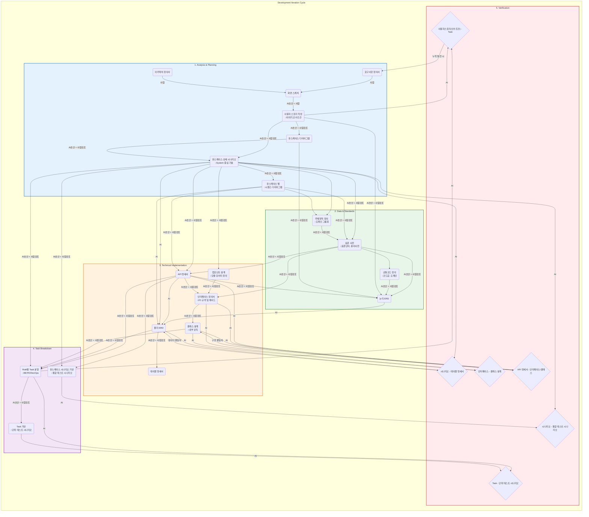
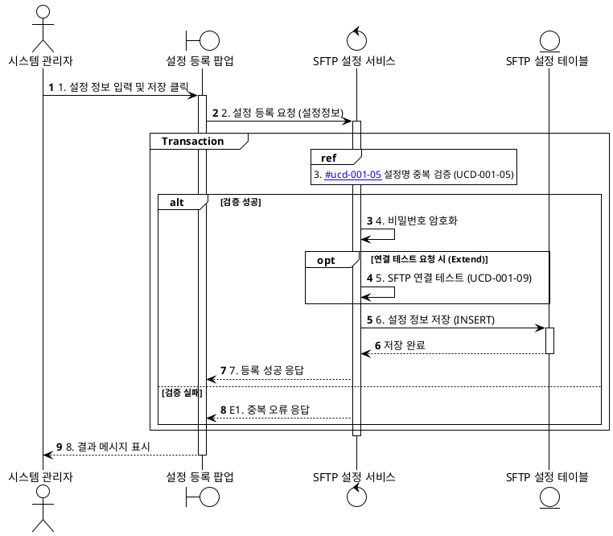

## 1. 개발 방법론

   AI 협업 기반 구현 중심 개발(AICD: AI-Collaborative Implementation-Driven Development) 방법론으로써 AI 협업 그라운드 룰(Ground Rule)을 준수하여 구현합니다.

---

## 2. 구현 프로세스


```mermaid

graph TD
    %% 스타일 정의
    classDef phase1 fill:#e3f2fd,stroke:#1565c0,stroke-width:2px;
    classDef phase2 fill:#e8f5e9,stroke:#2e7d32,stroke-width:2px;
    classDef phase3 fill:#fff3e0,stroke:#ef6c00,stroke-width:2px;
    classDef phase4 fill:#f3e5f5,stroke:#7b1fa2,stroke-width:2px;
    classDef phase5 fill:#ffebee,stroke:#c62828,stroke-width:2px;

    %% 메인 순환 루프 시작
    subgraph Loop [Development Iteration Cycle]
        direction TB

        %% Phase 1: 기획 및 분석 (Analysis & Planning)
        subgraph P1 [1. Analysis & Planning]
            P1A(요구사항 정의서) -- "사람" --> P1X(화면 스케치)

            P1F(아키텍처 정의서) -- "사람" --> P1X(화면 스케치)

            %% 사용자 스토리 & 유스케이스
            P1X -- "AI초안 + 사람" --> P1B(사용자 스토리 작성<br/>::이야기,인수조건)
            P1B -- "AI초안 + 사람검토" --> P1C(유스케이스 다이어그램)

            %% 상세 시나리오 (설계의 앵커)
            P1B & P1C -- "AI초안 + 사람검토" --> P1D(유스케이스 상세 시나리오<br/>::System 중심 기술)

            %% 시퀀스 다이어그램
            P1D -- "AI초안 + 사람검토" --> P1E(유스케이스 별<br/>::시퀀스 다이어그램)
        end

        %% Phase 2: 데이터 및 표준 (Data & Standards)
        subgraph P2 [2. Data & Standards]
            direction TB
            %% 주제영역이 가장 먼저 정의됨 (데이터의 큰 그림)
            P1D & P1E --> P2C(주제영역 정의<br/>::도메인 그룹핑)

            P1D & P1E & P2C -- "AI초안 + 사람검토" --> P2A(표준 사전<br/>::표준단어, 용어사전)

            %% 공통코드 정의 (표준의 일부로서 ERD보다 선행)
            P2A --> P2D(공통코드 정의<br/>::코드값, 도메인)

            P2A & P2D & P1B & P1C -- "AI초안 + 사람검토" --> P2B(논리 ERD)
        end

        %% Phase 3: 기술 구현 설계 (Technical Design)
        subgraph P3 [3. Technical Implementation]
            %% 외부 인터페이스
            P1D & P1E & P2A -- "AI초안 + 사람검토" --> P3A(API 명세서)
            P3A -- "AI초안 + 사람검토" --> P2B

            %% DB 물리 설계
            P2B & P3A & P1D & P1E -- "AI" --> P3B(물리 ERD)
            P3B -- "AI초안 + 사람검토" --> P3C(테이블 명세서)

            %% 내부 구조 설계 (Top-Down)
            P1D -- "AI초안 + 사람검토" --> P3D(컴포넌트 설계<br/>::모듈 덩어리 정의)
            P3D & P3A  & P2A -- "AI초안 + 사람검토" --> P3F(인터페이스 정의서<br/>::I/O 규격 및 메서드)
            P3F -- "AI초안 + 사람검토" --> P3E(클래스 설계<br/>::내부 로직)
        end

        %% Phase 4: 구현 준비 및 태스크 (Implementation Prep)
        subgraph P4 [4. Task Breakdown]
            %% 설계가 다 끝난 후 Task 분할 (입력값: 시나리오, API, 테이블, 클래스)
            P1D & P3A & P3B & P3E -- "AI초안 + 사람검토" --> P4A(Role별 Task 분할<br/>::BE/FE/DevOps)
            P4A -- "AI초안 + 사람검토" --> P4B(Task 기반<br/>::단위 테스트 시나리오)

            %% QA 통합 테스트 설계
            P1D & P3A -- "AI초안 + 사람검토" --> P4D(유스케이스 시나리오 기반<br/>::통합 테스트 시나리오)
        end

        %% Phase 5: 검증 및 피드백 (Verification)
        subgraph P5 [5. Verification]
            %% 기획 정합성
            P1B & P4A -- "AI" --> P5A{"사용자스토리(인수조건) - Task"}
            %% 테스트 커버리지
            P4A & P4B -- "AI" --> P5B{"Task - 단위 테스트 시나리오"}
            %% 데이터 정합성
            P1D & P3B -- "AI" --> P5C{"시나리오 - 테이블 명세서"}
            %% 기능 완결성
            P1D & P4D -- "AI" --> P5D{"시나리오 - 통합 테스트 시나리오"}

            %% 설계 준수 여부 (내부)
            P3F & P3E -- "AI" --> P5E{"인터페이스 - 클래스 설계"}
            %% API 계약 준수 여부 (외부)
            P3A & P3F & P3E -- "AI" --> P5F{"API 명세서 - 인터페이스/클래스"}
        end

    end

    %% 스타일 적용
    P1:::phase1
    P2:::phase2
    P3:::phase3
    P4:::phase4
    P5:::phase5

    %% 피드백 루프 (Feedback Loop)
    P5A -- "누락 발견 시" --> P1A
    P5C -- "데이터 불일치" --> P3B
    P5F -- "구현 불일치" --> P3E
```

## 3. AI 협업 그라운드 룰 (AI Collaboration Ground Rules)

AICD 방법론은 AI와 사람의 R&R을 명확히 구분하여 개발 속도와 품질을 동시에 확보하는 것을 목표로 합니다.

### 3.1 기본 원칙 (Principles)

1.  **AI Generated, Human Verified**: AI는 초안(Draft) 생성을 전담하고, 사람은 맥락(Context) 검증과 최종 승인(Approval)을 담당합니다.
2.  **Iterative Refinement**: `Draft` → `Review` → `Feedback` → `Refinement` 루프를 통해 완성도를 높입니다.
3.  **Traceability**: 모든 AI 산출물은 근거 문서(Source)와 결과물(Output) 간의 추적성이 확보되어야 합니다.

### 3.2 협업 워크플로우 (Workflow)

모든 개발 단계는 다음의 표준 워크플로우를 따릅니다.

1.  **Input**: 이전 단계 산출물 및 프롬프트 입력
2.  **Drafting (AI)**: 요구사항에 따른 초안 생성
3.  **Review (Human)**: 비즈니스 정합성 및 기술적 실행 가능성 검토
4.  **Refinement**: 피드백 반영 및 수정 (AI 재작성 또는 사람 직접 수정)
5.  **Approval**: 최종 승인 및 다음 단계 진행

### 3.3 Phase별 R&R 매트릭스

각 단계별 AI와 사람의 역할은 다음과 같습니다.

| Phase | AI Role (Drafting) | Human Role (Review & Decision) |
| :--- | :--- | :--- |
| **Phase 1: 기획/분석** | • 사용자 스토리 초안 생성<br>• 유스케이스 다이어그램/시나리오 작성<br>• 시퀀스 다이어그램 생성 | • 요구사항/화면 스케치 정의<br>• 비즈니스 로직/예외 케이스 검증<br>• 누락 기능 식별 |
| **Phase 2: 데이터/표준** | • 표준 사전(단어/용어/도메인) 추출<br>• 공통코드 식별<br>• 논리 ERD 초안 생성 | • 주제영역 정의 및 표준 적합성 검토<br>• 데이터 무결성/비즈니스 규칙 검증<br>• 행정표준코드 적용 여부 결정 |
| **Phase 3: 기술 구현** | • API/인터페이스 명세서 생성<br>• 물리 ERD 변환 (Naming/Type)<br>• 컴포넌트/클래스 설계 초안 | • 아키텍처/기술 스택 결정<br>• 성능/보안/확장성 검토<br>• 물리적 최적화 (인덱스/파티셔닝) |
| **Phase 4: Task 분할** | • Role별 Task 분할 및 일정 추정<br>• 단위/통합 테스트 시나리오 생성 | • 우선순위 조정 및 일정 확정<br>• 테스트 커버리지/엣지 케이스 점검<br>• 리소스 할당 적절성 검토 |
| **Phase 5: 검증** | • 산출물 간 정합성 체크 (Cross-Check)<br>• 추적성 매트릭스 업데이트 | • 최종 품질 승인 (Quality Gate)<br>• 결함 조치 지시<br>• 배포 의사결정 |

### 3.4 프롬프트 표준 가이드 (Prompt Standards)

AI 산출물의 품질 균일화를 위해 다음 표준 템플릿을 사용하여 프롬프트를 작성합니다.

#### 3.4.1 표준 프롬프트 템플릿

| 항목 | 설명 | 작성 예시 |
| :--- | :--- | :--- |
| **Role** | AI에게 부여할 페르소나 | `당신은 시니어 백엔드 개발자이자 DB 아키텍트입니다.` |
| **Context** | 작업의 배경 및 입력 데이터 | `첨부된 '요구사항정의서.md'를 기반으로 작업해주세요.` |
| **Task** | 수행해야 할 구체적 지시 | `요구사항을 분석하여 테이블 명세서를 작성하세요.` |
| **Constraints** | 준수해야 할 제약조건 | `파일명은 snake_case로 하고, 표준용어사전을 준수하세요.` |
| **Output Format** | 결과물의 형식 | `마크다운 테이블 형식으로 출력하고, DDL 스크립트를 포함하세요.` |

#### 3.4.2 프롬프트 작성 예시

**Case: 사용자 스토리 생성**

> **Role**: 당신은 애자일 프로덕트 오너입니다.
> **Context**: `REQ-001.md`의 요구사항을 분석해주세요.
> **Task**: 개발자가 작업 가능한 수준의 사용자 스토리를 작성하세요.
> **Constraints**:
> 1. INVEST 원칙을 준수할 것
> 2. 인수 조건(AC)을 3개 이상 포함할 것
> **Output**: Markdown 리스트 형식

### 3.5 산출물 품질 점검 기준 (Checklist)

AI 협업 산출물은 다음 기준을 만족해야 합니다.

* [ ] **표준 준수**: 정의된 표준 사전, 명명 규칙(Naming Convention)을 따르고 있는가?
* [ ] **완전성**: 요청한 모든 항목이 누락 없이 포함되었는가? (Hold/TBD 항목 확인)
* [ ] **일관성**: 이전 단계의 산출물과 모순되는 내용은 없는가?
* [ ] **실행 가능성**: 실제 구현 가능하며 기술적 제약사항을 위배하지 않는가?
---

## 4. 문서 코드 분류

|분류|구분|고유번호코드|규칙(예시)|
|---|---|---|---|
|분석|요구사항 (Requirement)|REQ|
||요구사항 기능||REQ-F-001|
||요구사항 비기능||REQ-N-001|
||상세 요구사항||REQ-F-001|
||화면 스케치(UI Draft)|UID|UID-001|
||사용자 스토리 카드 (User Story Card)|USC|USC-001|
||유스케이스 다이어그램 (Usecase Diagram)|UCD|UCD-001|
||유스케이스 상세||UCD-001-01|
||시퀀스 다이어그램 (Sequence Diagram)|SQD|SQD-001|
||외부/내부 시스템 인터페이스 (External/Internal System Interface)|IFS|IFS-001|
|설계|컴포넌트 명세서 (Component Specification)|CMP|CMP-001|
||인터페이스 명세서 (Interface Specification)|IFC|IFC-001|
||오퍼레이션 (Operation)||IFC-001-01|
||클래스 다이어그램 (Class Diagram)|CLD|CLD-001|
||클래스 상세||CLD-001-01|
||화면 디자인 (Screen Design)|SCD|SCD-001|
||데이터 표준화 (단어/용어/도메인)(Data Dictionary)|DIC|DIC-001|
||공통코드 (Common Code)|CCD|CCD-001|
||테이블 명세서 (Table Definition)|TBL|TBL-001|
||작업 티켓 (TSK)|TSK||
||Frontend 작업 티켓||TSK-FE-001|
||Backend 작업 티켓||TSK-BE-001|
|테스트|단위테스트 시나리오 (Unit Test Scenario)|UTS|UTS-001|
||통합테스트 시나리오 (Integration Test Scenario)|ITS|ITS-001|

## 5. 문서 작성 방법

### 5.1 요구사항 정의서

#### 5.1.1 기능

  * 각 기능별로 섹션을 구분하여 작성합니다.
  * 각 섹션은 다음 항목을 포함합니다:
    - 요구사항 아이디: 고유한 식별자 (기능 요구사항: REQ-F-001, REQ-F-002, 비기능 요구사항: REQ-N-001)
    - 화면: 해당 기능의 화면 이미지 참조 (예: )
    - 요구사항 내용: 기능의 상세 설명
      * 기능이 수행하는 작업을 명확히 기술합니다.
      * 입력 항목, 출력 항목, 상태 정의를 상세히 기술합니다.
      * 제약사항 및 비즈니스 규칙을 명시합니다.
      * 관련 요구사항은 `@REQ-F-XXX` (기능), `@REQ-N-XXX` (비기능) 형식으로 참조합니다.
      * 공통 요구사항은 `@common/common_spec.md#REQ-F-XXX` 또는 `@common/common_spec.md#REQ-N-XXX` 형식으로 참조합니다.
  * 예시 구조:

    ```markdown
    ## 기능명
    - 요구사항 아이디 : REQ-F-001
    - 화면 : 
    - 요구사항 내용 :
        - 주요 기능 설명
        - 입력 항목:
            - 항목명: 설명 및 제약사항
        - 출력 항목:
            - 항목명: 설명 및 상태 정의
        - 제약사항:
            - 특정 조건에서의 제한사항
    ```

  * 상위 그룹/컨테이너 섹션:
    * 여러 하위 요구사항을 묶는 상위 섹션의 경우 요구사항 아이디를 생략할 수 있습니다.
    * 이는 단순히 관련 요구사항들을 그룹화하는 목적이며, 독립적인 기능 요구사항이 아닙니다.
    * 예시:

      ```markdown
      ## 설정 창
      - 화면 : 

      ### 전송정보
      - 요구사항 아이디 : REQ-F-006
      - 화면 :
      - 요구사항 내용 :
          - 입력항목 설명...

      ### 원격서버 설정
      - 요구사항 아이디 : REQ-F-007
      - 화면 :
      - 요구사항 내용 :
          - 설정 내용...
      ```

    * 상위 그룹에도 독립적인 기능 요구사항이 있다면 요구사항 아이디를 부여합니다.

#### 5.1.2 비기능

  * 성능, 보안, 사용성 등 기능 외 요구사항을 기술합니다.
  * 예시:
    - 보안: 접속 정보는 암호화하여 저장한다.
    - 사용성: 경로 입력은 읽기전용으로 처리한다.
    - 데이터 무결성: 설정명은 유일해야 한다.
    - 시스템 제약: 활성화 상태인 설정은 삭제가 불가능하도록 제한한다.

### 5.2 사용자 스토리 카드

* 사용자 스토리(User Story)는 복잡한 요구사항 정의서를 대신하여, "우리가 이 기능을 왜, 누구를 위해 만드는가?"를 가장 직관적으로 설명하는 도구입니다.
* 추상적인 요구사항이나 유스케이스보다 구체적인 사용자 스토리를 먼저 작성합니다.

#### 5.2.1 사용자 스토리의 구조 (3C)

사용자 스토리는 단순히 글만 쓰는 게 아니라, **Card(카드), Conversation(대화), Confirmation(확인)**이라는 3단계 개념을 포함합니다.

보통 물리적인 포스트잇이나 Jira 티켓의 **앞면**과 **뒷면**으로 구분해서 이해하면 가장 빠릅니다.

* **앞면: 이야기 (Card)**
  * "누가, 무엇을, 왜" 원하는지 한 문장으로 정리합니다.
  * **양식:**
    - **As a** (누가 - 역할)
    - **I want to** (무엇을 - 기능)
    - **So that** (왜 - 가치/목적)
  * **예시:**
    - **[누가]** 잠재 고객으로서
    - **[무엇을]** 이메일로 회원가입을 하고 싶다.
    - **[왜]** 내 개인 정보를 안전하게 보호받으며 서비스를 이용하기 위해서.

* **뒷면: 인수 조건 (Confirmation / Acceptance Criteria)**
  * "핵심 조건"들이 적히는 곳입니다. 이 조건이 충족되어야 "이 스토리는 개발이 끝났다(Done)"라고 말할 수 있습니다.
  * 기능이 구체적으로 어떻게 동작해야 하는지, 제약사항은 무엇인지 기술합니다.
  * **예시:**
    1. 아이디는 이메일 형식(`@`, `.`)을 검증해야 한다.
    2. 비밀번호는 영문/숫자/특수문자 조합 10자리 이상이어야 한다.
    3. 이미 가입된 이메일이면 안내 메시지와 로그인 버튼을 노출한다.
    4. 가입 완료 즉시 환영 메일이 발송되어야 한다.

#### 5.2.2 좋은 사용자 스토리의 조건 (INVEST 원칙)

AI에게 스토리를 평가해달라고 할 때 이 기준을 쓰면 좋습니다.

1. **I**ndependent (독립적인가?): 다른 스토리 없이 혼자 개발 가능한가?
2. **N**egotiable (협상 가능한가?): 무조건적인 명령이 아니라, 개발자와 대화하며 디테일을 바꿀 수 있는가?
3. **V**aluable (가치 있는가?): 사용자에게 이득이 되는가?
4. **E**stimatable (추정 가능한가?): 개발자가 "이거 3일 걸려요"라고 견적을 낼 수 있는 크기인가?
5. **S**mall (작은가?): 2주(스프린트) 안에 개발할 수 있을 만큼 작아야 함. (너무 크면 쪼개야 함)
6. **T**estable (테스트 가능한가?): **인수 조건(뒷면)이 명확해서 테스트를 통과했는지 알 수 있는가?**

#### 5.2.3 AI와 함께 사용자 스토리 만들기 (실전 프롬프트)

막연한 요구사항을 던져주고 **"INVEST 원칙에 맞는 사용자 스토리와 인수 조건을 써줘"**라고 하면 AI가 기가 막히게 작성해 줍니다.

* **입력 예시 (사람):**
  > "우리 서비스에 '비밀번호 찾기' 기능이 필요해. 보안이 중요하고 이메일로 링크를 보내주는 방식이면 좋겠어."

* **AI 프롬프트 (요청):**
  > "위 요구사항을 바탕으로 개발자가 바로 작업할 수 있는 **사용자 스토리**를 작성해줘.
  > 1. `As a`, `I want to`, `So that` 형식을 지킬 것.
  > 2. **인수 조건(Acceptance Criteria)**을 4가지 이상 구체적으로 명시해줘 (엣지 케이스 포함)."

* **출력 결과 예시 (AI):**
  > **[사용자 스토리]**
  > * **As a** 비밀번호를 잊어버린 회원으로서
  > * **I want to** 가입한 이메일로 비밀번호 재설정 링크를 받고 싶다.
  > * **So that** 고객센터에 연락하지 않고 스스로 계정에 다시 접근하기 위해서.
  >
  > **[인수 조건]**
  > 1. 가입되지 않은 이메일을 입력해도 보안을 위해 "메일이 발송되었습니다"라고 동일하게 표시해야 한다. (해킹 방지)
  > 2. 재설정 링크는 10분 동안만 유효해야 한다.
  > 3. 새 비밀번호는 이전 비밀번호와 달라야 한다.
  > 4. 메일 발송에 실패하면 사용자에게 "잠시 후 다시 시도해주세요" 알림을 띄운다.

#### 5.2.4 사용자 스토리의 가치

* 사용자 스토리는 **"개발자와 대화하기 위한 초대장"**입니다.
  * **앞면(3C):** 우리의 목표와 가치 (방향성)
  * **뒷면(인수조건):** 구현해야 할 구체적인 규칙 (나중에 테스트 케이스가 됨)
* 사용자 스토리의 **'뒷면'**을 얼마나 꼼꼼하게 AI와 함께 정의하느냐가 나중에 상세 시나리오와 테스트 케이스의 품질을 결정합니다.
* FE/BE 협업 명확화: 프론트엔드와 백엔드의 책임과 상호작용을 명확히 구분
* AI 협업 최적화: AI가 이해하고 활용할 수 있는 형태로 정보 구조화
* 문서 자동 생성: 사용자 스토리를 기반으로 5단계 프로세스(분석 및 기획 → 데이터 및 표준 → 기술 구현 설계 → Task 분할 → 검증)의 다양한 산출물을 AI를 통해 자동 생성

#### 5.2.5 사용자 스토리 작성 가이드

* 요구사항 정의서를 기반으로 사용자 스토리를 작성합니다.
* 각 기능별 요구사항을 사용자 관점의 스토리로 변환합니다.
* 요구사항 아이디와 사용자 스토리 아이디를 매핑하여 추적성을 확보합니다.

##### 5.2.5.1 작성 구조

각 사용자 스토리는 다음 구조로 작성합니다:

```markdown
## [번호]. [사용자 스토리 명]

> 참조: `@REQ-F-XXX` 또는 `@REQ-N-XXX` (요구사항 아이디)

### Story Card (3C)

- **As a** [역할]
- **I want to** [기능/목표]
- **So that** [가치/이유]

### Acceptance Criteria (인수 조건)

1. [인수 조건 1]
2. [인수 조건 2]
...
```

##### 5.2.5.2 요구사항 정의서 → 사용자 스토리 변환 방법

* **요구사항 아이디 매핑**
  * 각 사용자 스토리는 해당하는 요구사항 아이디를 참조합니다.
  * 형식: `> 참조: @REQ-F-001` (기능), `> 참조: @REQ-N-001` (비기능)
  * 여러 요구사항을 참조하는 경우: `> 참조: @REQ-F-001, @REQ-F-002` 또는 `> 참조: @REQ-F-001, @REQ-N-001`

* **Story Card 작성**
  * **As a (역할)**: 요구사항 정의서에서 사용자 역할을 파악합니다.
    * 예: "시스템 관리자", "일반 사용자", "운영자"
  * **I want to (기능)**: 요구사항 내용의 핵심 기능을 사용자 목표로 변환합니다.
    * UI 액션이 아닌 사용자 목표 중심으로 작성합니다.
    * 예: "SFTP 설정 목록을 조회하고 싶다" (O)
    * 예: "조회 버튼을 클릭하고 싶다" (X)
  * **So that (가치)**: 요구사항의 목적과 가치를 명확히 기술합니다.
    * 사용자가 이 기능을 통해 얻고자 하는 이익을 기술합니다.

* **Acceptance Criteria 작성**
  * 요구사항 내용의 세부 사항을 인수 조건으로 변환합니다.
  * 입력 항목, 출력 항목, 상태 정의, 제약사항을 구체적으로 기술합니다.
  * 각 인수 조건은 테스트 가능하도록 작성합니다.
  * 제약사항과 비즈니스 규칙을 명확히 포함합니다.

##### 5.2.5.3 작성 예시

**요구사항 정의서 예시:**

```markdown
## 목록
- 요구사항 아이디 : REQ-F-001
- 화면 : 
- 요구사항 내용 :
    - 송수신 설정 내용을 조회 한다.
    - 인바운드 / 아웃바운드 목록을 구분하여 화면에 보여준다.
    - 목록: 상태 / 설정명 / 원격서버 / 원격경로 / 로컬 경로 / 모드 / 활성화 여부 / 작업
        - 상태: 중지 / 오류 / 실행
        - 활성화 여부: 활성화 / 비활성화
        - 작업: 수정 / 삭제
```

**변환된 사용자 스토리:**

```markdown
## 1. SFTP 설정 목록 조회

> 참조: `@REQ-F-001`

### Story Card (3C)

- **As a** 시스템 관리자로서
- **I want to** SFTP 송수신 설정 목록을 인바운드/아웃바운드로 구분하여 조회하고 싶다.
- **So that** 현재 등록된 모든 SFTP 연동 설정의 상태를 한눈에 파악하고 관리할 수 있기 위해서.

### Acceptance Criteria (인수 조건)

1. 화면에 인바운드(원격→로컬)와 아웃바운드(로컬→원격) 설정 목록이 구분되어 표시되어야 한다.
2. 각 설정 항목에는 다음 정보가 표시되어야 한다:
   - 상태 (중지/오류/실행)
   - 설정명
   - 원격서버
   - 원격경로
   - 로컬 경로
   - 모드 (복사/이동)
   - 활성화 여부 (활성화/비활성화)
   - 작업 버튼 (수정/삭제)
3. 상태 표시 규칙:
   - **중지**: 연동이 중지된 상태
   - **오류**: 원격지 접속 장애 등 문제 발생 시
   - **실행**: 정상적으로 연동 중인 상태
4. 활성화 여부가 "활성화"인 설정은 SFTP 동작이 수행되고, "비활성화"인 설정은 동작하지 않아야 한다.
5. 데이터가 없을 경우 빈 목록 상태를 표시해야 한다.
```

##### 5.2.5.4 작성 시 주의사항

* **요구사항 완전성**: 모든 요구사항이 사용자 스토리로 변환되었는지 확인합니다.
* **역할 일관성**: 동일한 기능을 사용하는 사용자 역할이 일관되게 정의되어야 합니다.
* **목표 중심**: UI 액션이 아닌 사용자 목표를 중심으로 작성합니다.
* **인수 조건 구체성**: 각 인수 조건은 테스트 가능하도록 구체적으로 작성합니다.
* **제약사항 포함**: 요구사항의 제약사항과 비즈니스 규칙을 인수 조건에 반드시 포함합니다.
* **참조 관계**: 관련된 요구사항은 참조 관계로 명확히 표시합니다.

#### 5.2.6 요구사항-사용자 스토리 추적표 (Req-to-Story Map)

요구사항 정의서의 모든 항목이 빠짐없이 사용자 스토리로 변환되었는지 검증하기 위해 **요구사항-사용자 스토리 추적표**를 작성합니다. 이 표는 요구사항과 사용자 스토리 간의 N:N 관계를 한눈에 파악할 수 있게 하며, 누락된 요구사항이나 근거 없는 스토리를 식별하는 데 사용됩니다.

**작성 원칙:**
* 모든 요구사항(REQ)은 하나 이상의 사용자 스토리(USC)에 매핑되어야 합니다.
* 모든 사용자 스토리(US)는 하나 이상의 요구사항(REQ)을 근거로 해야 합니다.
* 매핑되지 않은 항목이 있다면 누락되었거나 불필요한 기능인지 재검토해야 합니다.

**요구사항-사용자 스토리 추적표 양식:**

| 기능 그룹 | 요구사항 (Requirement) | | 사용자 스토리 (User Story) | | 검증 |
|:---:|:---:|:---|:---:|:---|:---|
| **분류** | **ID** | **요구사항명** | **ID** | **스토리명** | **비고** |
| **SFTP 관리** | REQ-F-001 | 송수신 설정 조회 | USC-001 | SFTP 설정 목록 조회 | 1:1 매핑 |
| | REQ-F-002 | 송수신 설정 등록 | USC-002 | SFTP 설정 추가 | N:1 매핑<br/>(여러 요구사항 → 하나의 스토리) |
| | REQ-F-003 | 원격 서버 정보 입력 | USC-002 | SFTP 설정 추가 | |
| | REQ-F-004 | 로컬 경로 설정 | USC-002 | SFTP 설정 추가 | |
| | REQ-F-002 | 송수신 설정 등록 | USC-003 | SFTP 설정 수정 | 1:N 매핑<br/>(하나의 요구사항 → 여러 스토리) |
| **사용자** | REQ-F-101 | 사용자 로그인 | USC-101 | 관리자 로그인 | 1:1 매핑 |
| **보안** | REQ-N-001 | 비밀번호 암호화 | USC-101 | 관리자 로그인 | 비기능 요구사항 반영 |
| | REQ-N-001 | 비밀번호 암호화 | USC-002 | SFTP 설정 추가 | (접속정보 암호화) |

* **기능 그룹**: 관련된 요구사항과 스토리를 기능 단위로 묶어 가독성을 높입니다.
* **ID**: 문서 코드 규칙(REQ-F, REQ-N, USC 등)을 준수하여 작성합니다.
* **검증/비고**:
    * **1:1**: 요구사항 하나가 하나의 스토리로 명확히 변환됨
    * **N:1**: 여러 세부 요구사항이 하나의 스토리(기능)에서 구현됨
    * **1:N**: 하나의 요구사항(예: 공통 기능, 비기능)이 여러 스토리에 영향을 줌

* **ID**: 각 문서의 고유 식별자 (REQ-F-XXX, REQ-N-XXX, USC-XXX)
* **검증/비고**: 매핑 관계(1:1, 1:N, N:1)나 특이사항을 기록하여 추적성을 확보합니다.

### 5.3 유스케이스 다이어그램

* 사용자 스토리를 기반으로 시스템의 기능 구조와 사용자 목표를 시각화하는 다이어그램입니다.
* PlantUML 형식으로 작성하며, 액터, Use Case, 관계(Include/Extend), 제약사항을 포함합니다.

#### 5.3.1 기본 구성 요소

* **액터 (Actor)**
  * 시스템과 상호작용하는 사용자 역할을 나타냅니다.
  * 사용자 스토리의 "As a" 부분에서 추출합니다.
  * 형식: `actor "액터명" as Alias` (예: `actor "시스템 관리자" as Admin`)

* **Use Case**
  * 사용자가 시스템을 통해 달성하려는 목표를 나타냅니다.
  * 사용자 스토리의 "I want to" 부분을 Use Case로 변환합니다.
  * UI 액션이 아닌 비즈니스 목표를 중심으로 작성합니다.
  * 형식: `usecase "UCD-001-01\nUse Case 이름" as UCD_001_01` (Use Case 원 안에 ID 표시, 별칭은 언더스코어 형식 사용)
  * 메인 Use Case와 공통/보조 Use Case로 구분합니다.

* **시스템 경계**
  * 모든 Use Case를 `rectangle "시스템명" { }`로 감쌉니다.
  * 시스템의 범위를 명확히 정의합니다.

#### 5.3.2 Use Case 도출 방법

* **메인 Use Case**
  * 각 사용자 스토리 1개 = 메인 Use Case 1개 (기본 원칙)
  * CRUD 작업은 각각 별도의 Use Case로 분리합니다.
  * 예: "SFTP 설정 목록 조회", "SFTP 설정 추가", "SFTP 설정 수정", "SFTP 설정 삭제"

* **공통/보조 Use Case**
  * 여러 Use Case에서 공통으로 사용되는 기능을 별도 Use Case로 분리합니다.
  * 검증 기능: "설정명 중복 검증", "입력값 유효성 검증"
  * 보안 기능: "접속 정보 암호화", "비밀번호 암호화 저장"
  * 상태 확인: "활성화 상태 확인"
  * 공통 UI 컴포넌트: 여러 스토리에서 공통으로 사용되는 UI 컴포넌트

#### 5.3.3 관계 정의

* **액터와 Use Case 연결**
  * 액터가 직접 수행하는 메인 Use Case만 실선 화살표(`-->`)로 연결합니다.
  * 형식: `Admin --> UCD_001_01` (PlantUML 별칭은 언더스코어 형식 사용)
  * 공통/보조 Use Case는 액터와 직접 연결하지 않습니다.

* **Include 관계 (`<<include>>`)**
  * **정의**: 필수적으로 수행되어야 하는 하위 작업
  * **기본 개념**: 하나의 유스케이스가 다른 유스케이스의 행동(behavior)을 자신의 행동 시퀀스 안에 포함하는 것을 의미합니다. 서브루틴(subroutine)과 유사한 개념으로, 여러 유스케이스에서 공통적으로 발생하는 행동을 반복해서 기술하는 것을 피하기 위해 사용합니다. 포함된 유스케이스는 그 자체로는 온전한 유스케이스가 아닐 수도 있지만, 이를 포함하는 기본 유스케이스(Base Use Case)에게는 필요한 부분입니다.
  * **특징**:
    - 기본 유스케이스는 포함된 유스케이스를 명시적으로 통합합니다.
    - 포함된 유스케이스는 대개 그 자체만으로는 독립적으로 사용될 수 없는 동작의 단위인 경우가 많습니다.
    - 기본 유스케이스의 특정 위치에 포함된 유스케이스의 행동이 삽입됩니다.
  * **판단 기준**: "항상 수행된다", "필수로 수행된다"는 의미
  * **예시**:
    - 설정 추가 → 설정명 중복 검증 (항상 검증 필요)
    - 설정 저장 → 입력값 유효성 검증 (항상 검증 필요)
    - 설정 저장 → 접속 정보 암호화 (저장 시 항상 암호화)
    - 설정 수정 → 활성화 상태 확인 (수정 전 필수 확인)
    - 온라인 주식 거래 시스템에서 '보안 세션(secure session)' 유스케이스와 '거래 수행(make trade)' 유스케이스가 모두 '비밀번호 검증(validate password)' 유스케이스를 포함할 수 있습니다.
  * **표기법**: `UCD_001_03 ..> UCD_001_08 : <<include>>` (점선 화살표, PlantUML 별칭은 언더스코어 형식 사용)
    - 기본(포함하는) 유스케이스에서 대상(포함되는) 유스케이스로 향하는 점선 화살표를 그리며, 화살표 위에 `«include»`라는 키워드를 표시합니다.
  * **참고**: PlantUML 코드에서는 언더스코어 형식(`UCD_001_03`)을 사용하고, 문서에서는 실제 Use Case ID 형식(`UCD-001-03`)을 사용합니다.

* **Extend 관계 (`<<extend>>`)**
  * **정의**: 선택적이거나 조건부로 수행되는 동작
  * **기본 개념**: 기본 유스케이스(Base Use Case)에 증분적인(incremental) 행동이나 선택적인 기능을 추가할 때 사용합니다. `include` 관계를 반대 방향에서 본 것과 유사합니다. 확장은 기본 유스케이스에 스스로를 추가하는 형태입니다. 주로 초기 기능이 정의된 후 나중에 모듈식으로 기능을 추가하거나, 선택적인 기능을 표현할 때 사용됩니다.
  * **특징**:
    - **기본 유스케이스의 완결성**: 기본 유스케이스는 확장이 없더라도 그 자체로 유효하고 온전한 유스케이스여야 합니다. 반면 확장 유스케이스는 그 자체로는 행동 시퀀스로 나타날 수 없는 조각인 경우가 많습니다.
    - **확장 지점 (Extension Points)**: 확장이 일어나는 기본 유스케이스 내의 특정 위치를 '확장 지점'이라고 합니다.
    - **조건 (Condition)**: 대부분의 경우 확장 관계에는 조건이 붙습니다. 제어 흐름이 확장 지점에 도달했을 때 해당 조건이 참(true)인 경우에만 확장이 실행됩니다.
  * **판단 기준**: "선택적으로 수행된다", "조건에 따라 수행된다"는 의미
  * **예시**:
    - 설정 추가 → SFTP 연결 테스트 (사용자가 선택적으로 실행)
    - 설정 수정 → SFTP 연결 테스트 (사용자가 선택적으로 실행)
    - '주식 거래(trade stocks)'라는 기본 유스케이스가 있고, 계좌에 현금이 부족할 때 대출을 받아 주식을 사는 '신용 거래(margin trading)'가 이를 확장할 수 있습니다. 이때 추가적인 행동은 구매 비용을 잔고와 비교하는 지점에서 삽입됩니다.
  * **표기법**: `UCD_001_03 ..> UCD_001_12 : <<extend>>` (점선 화살표, PlantUML 별칭은 언더스코어 형식 사용)
    - 확장(Extension) 유스케이스에서 기본(Base) 유스케이스로 향하는 점선 화살표를 그리며, 화살표 위에 `«extend»`라는 키워드를 표시합니다.
  * **참고**: PlantUML 코드에서는 언더스코어 형식(`UCD_001_03`)을 사용하고, 문서에서는 실제 Use Case ID 형식(`UCD-001-03`)을 사용합니다.

* **Include와 Extend의 주요 차이점 및 가이드라인**
  * **방향성**: `include`는 기본 유스케이스가 포함되는 유스케이스를 가리키지만, `extend`는 확장 유스케이스가 기본 유스케이스를 가리킵니다.
  * **필수 여부**: `include`는 포함된 행동이 (매번 실행되지 않더라도) 시스템 구성의 필수적인 부분임을 암시합니다. 반면, `extend`는 추가된 행동이 없더라도 시스템이 의미가 있음을 암시합니다.
  * **사용 목적**:
    - 여러 상황에서 유용할 수 있는 잘 정의된 행동 조각이 있다면 별도의 유스케이스로 정의하고 `include`를 사용하십시오.
    - 선택적인 기능이나 예외 상황 등을 처리하기 위해 의미 있는 유스케이스에 기능을 추가하고 싶다면 `extend`를 사용하십시오.
  * **요약**: 두 관계 모두 유스케이스의 행동을 더 작은 조각으로 나누는 데 사용되지만, `include`는 공통된 부분을 재사용하기 위한 것이고, `extend`는 선택적이거나 추가적인 기능을 덧붙이기 위한 것입니다.

#### 5.3.4 제약사항 시각화

* Acceptance Criteria에서 제약사항을 식별합니다.
  * "~할 수 없음", "~해야 함", "~필수", "~제한" 등의 표현
  * 비즈니스 규칙 및 제약 조건
  * 상태에 따른 제약 (예: 활성화 상태일 때 수정 불가)

* 제약사항이 있는 Use Case에 `note`를 첨부합니다.
  * 형식: `note right of UCD_001_04` ... `end note` (PlantUML 별칭은 언더스코어 형식 사용)
  * 또는: `note left of`, `note top of`, `note bottom of`
  * 제약사항을 명확하고 간결하게 작성합니다.

* **예시**:
  ```plantuml
  note right of UCD_001_04
    **제약사항:**
    활성화 상태인 설정은
    수정할 수 없음
  end note
  ```

#### 5.3.5 PlantUML 작성 형식

* **기본 구조**:
  ```plantuml
  @startuml [다이어그램-이름]
  !theme plain
  skinparam packageStyle rectangle
  skinparam usecase {
    BackgroundColor #E1F5FE
    BorderColor #01579B
  }

  actor "액터명" as Alias

  rectangle "시스템명" {
    ' 메인 유스케이스
    usecase "UCD-001-01\nUse Case 이름" as UCD_001_01

    ' 공통/보조 유스케이스
    usecase "UCD-001-02\n공통 Use Case" as UCD_001_02

    ' 액터와 메인 유스케이스 연결
    Alias --> UCD_001_01

    ' Include 관계
    UCD_001_01 ..> UCD_001_02 : <<include>>

    ' Extend 관계
    UCD_001_01 ..> UCD_001_03 : <<extend>>

    ' 제약사항 노트
    note right of UCD_001_01
      제약사항 내용
    end note
  }

  @enduml
  ```

* **작성 순서**:
  1. 메인 Use Case 정의
  2. 공통/보조 Use Case 정의
  3. 액터와 메인 Use Case 연결
  4. Include 관계 정의
  5. Extend 관계 정의
  6. 제약사항 노트 추가

* **명명 규칙**:
  * 유스케이스 다이어그램은 순차적으로 번호를 부여합니다 (UCD-001, UCD-002, ...)
  * 다이어그램 내의 각 Use Case는 다이어그램 ID를 참조하여 순번을 부여합니다 (UCD-001-01, UCD-001-02, ...)
  * Use Case 원 안에 ID를 표시하려면 이름에 `\n`으로 줄바꿈하여 ID를 포함: `"UCD-001-01\nUse Case 이름"` (하이픈 유지)
  * PlantUML 별칭은 하이픈을 언더스코어로 변환하여 사용: `as UCD_001_01` (큰따옴표 없이 사용)
  * 모든 텍스트는 한국어로 작성합니다

#### 5.3.6 작성 시 주의사항

* **사용자 목표 중심**: UI 액션이 아닌 사용자 목표를 Use Case로 표현합니다.
  * 좋은 예: "SFTP 설정 추가"
  * 나쁜 예: "추가 버튼 클릭"

* **Include vs Extend 구분**:
  * **Include**: "항상 수행된다" → 필수 관계
  * **Extend**: "선택적으로 수행된다" → 선택적 관계
  * 혼동 방지: "~할 수 있다"는 표현이 있어도, 실제로는 필수인지 선택인지 맥락을 파악합니다

* **공통 기능 식별**: 여러 Use Case에서 반복되는 기능은 공통 Use Case로 분리합니다.

* **Acceptance Criteria 분석**: 각 스토리의 Acceptance Criteria를 분석하여 관계와 제약사항을 도출합니다.

* **참조 관계 추적**: "스토리 3 (SFTP 설정 창) 참조" 같은 참조 관계를 따라가며 완전한 Use Case를 파악합니다.

#### 5.3.7 유스케이스 검증 및 관계 정의 (Verification & Relationships)

유스케이스 모델의 완전성을 검증하기 위해 두 가지 관점의 표를 작성합니다.
1. **요구사항/스토리 추적성**: 사용자 스토리와의 매핑을 통해 기능 누락을 방지
2. **관계 명세**: 유스케이스 간의 포함(Include) 및 확장(Extend) 관계를 명확히 정의하여 복잡한 로직을 구조화

##### 5.3.7.1 유스케이스-사용자 스토리 추적표 (UCD-to-Story Map)

유스케이스 다이어그램의 각 Use Case가 어떤 사용자 스토리, 요구사항을 기반으로 하는지 추적합니다.

**유스케이스-사용자 스토리 추적표 양식:**

| 기능 그룹 | 유스케이스 (Use Case) | | 사용자 스토리 (User Story) | | 검증 |
|:---:|:---:|:---|:---:|:---|:---|
| **분류** | **ID** | **유스케이스명** | **ID** | **스토리명** | **비고** |
| **SFTP 관리** | UCD-001-01 | SFTP 설정 조회 | USC-001 | SFTP 설정 목록 조회 | 1:1 매핑 |
| | UCD-001-02 | SFTP 설정 추가 | USC-002 | SFTP 설정 추가 | 1:1 매핑 |
| | UCD-001-03 | SFTP 설정 수정 | USC-003 | SFTP 설정 수정 | 1:1 매핑 |
| | UCD-001-04 | SFTP 설정 삭제 | USC-004 | SFTP 설정 삭제 | 1:1 매핑 |
| **공통** | UCD-001-05 | 설정명 중복 검증 | USC-002 | SFTP 설정 추가 | <<include>> 포함 관계 |
| | | | USC-003 | SFTP 설정 수정 | |

##### 5.3.7.2 유스케이스 관계 정의서 (UCD-to-UCD Map)

유스케이스 간의 포함(Include) 및 확장(Extend) 관계를 다이어그램뿐만 아니라 표 형태로 명세하여, 개발 시 공통 로직 호출이나 예외 처리 흐름을 놓치지 않도록 합니다.

**작성 원칙:**
* 다이어그램에 표현된 모든 화살표(관계)는 이 표에 정의되어야 합니다.
* 공통 기능으로 분리된 Use Case가 어디서 호출되는지 명확히 합니다.

**유스케이스 관계 정의서 양식:**

| 구분 | 기준 유스케이스 (Base) | | 관계 | 대상 유스케이스 (Target) | | 설명 |
|:---:|:---:|:---|:---:|:---:|:---|:---|
| **Type** | **ID** | **유스케이스명** | **화살표** | **ID** | **유스케이스명** | **조건/사유** |
| **Include** | UCD-001-02 | SFTP 설정 추가 | -->> | UCD-001-05 | 설정명 중복 검증 | 저장 전 필수 검증 |
| **Include** | UCD-001-03 | SFTP 설정 수정 | -->> | UCD-001-05 | 설정명 중복 검증 | 수정 시 명칭 변경할 경우 |
| **Include** | UCD-001-02 | SFTP 설정 추가 | -->> | UCD-001-06 | 입력값 유효성 검증 | 저장 전 필수 검증 (모든 입력 필드) |
| **Include** | UCD-001-02 | SFTP 설정 추가 | -->> | UCD-001-07 | 접속 정보 암호화 | 저장 시 항상 암호화 수행 |
| **Include** | UCD-001-03 | SFTP 설정 수정 | -->> | UCD-001-10 | 활성화 상태 확인 | 수정 전 활성화 상태인지 확인 (활성화 시 수정 불가) |
| **Extend** | UCD-001-01 | SFTP 설정 조회 | <<-- | UCD-001-08 | 엑셀 다운로드 | (선택) 목록 내보내기 버튼 클릭 시 |
| **Extend** | UCD-001-02 | SFTP 설정 추가 | <<-- | UCD-001-09 | 연결 테스트 | (선택) 저장 전 연결 확인 시도 |
| **Extend** | UCD-001-03 | SFTP 설정 수정 | <<-- | UCD-001-09 | 연결 테스트 | (선택) 수정 후 연결 확인 시도 |
| **Extend** | UCD-001-04 | SFTP 설정 삭제 | <<-- | UCD-001-11 | 삭제 확인 다이얼로그 | (조건부) 활성화 상태인 경우에만 확인 다이얼로그 표시 |

**관계 패턴 설명:**

* **Include (포함)**: 기준 UC 실행 시 **반드시** 실행되는 공통 로직
  * **검증 패턴**: 입력값 검증, 중복 검증, 유효성 검증 등
  * **보안 패턴**: 암호화, 인증, 권한 확인 등
  * **상태 확인 패턴**: 활성화 상태 확인, 사용 가능 여부 확인 등
* **Extend (확장)**: 기준 UC 실행 중 **특정 조건**에서만 실행되는 선택/추가 로직
  * **사용자 선택 패턴**: 사용자가 버튼을 클릭하거나 옵션을 선택한 경우
  * **조건부 실행 패턴**: 특정 상태나 조건이 만족될 때만 실행
  * **예외 처리 패턴**: 예외 상황 발생 시 추가 처리
* **관계 없음**: 독립적으로 실행되는 메인 Use Case는 관계 정의서에 포함하지 않습니다. (예: UCD-001-01 SFTP 설정 조회는 다른 UC를 포함하거나 확장하지 않는 경우)

**작성 시 주의사항:**

* 모든 Include 관계는 기본 흐름(Basic Flow)에 반영되어야 합니다.
* 모든 Extend 관계는 대안 흐름(Alternative Flow) 또는 특정 조건이 명시된 단계에 반영되어야 합니다.
* 관계 정의서에 없는 관계는 다이어그램에도 표현하지 않아야 합니다.
* 공통 Use Case가 여러 곳에서 Include되는 경우, 각 Include 관계를 별도 행으로 작성합니다.

### 5.4 유스케이스 상세 시나리오

* 유스케이스 다이어그램의 각 Use Case에 대한 상세한 시나리오를 작성합니다.
* 사용자 스토리와 유스케이스 다이어그램을 기반으로 시스템 중심의 상세 흐름을 기술합니다.
* 개발자가 구현할 수 있도록 구체적이고 명확하게 작성합니다.

#### 5.4.1 작성 구조

각 유스케이스 상세 시나리오는 다음 구조로 작성합니다:

```markdown
## [UC ID]. [유스케이스 명]

- **UC ID**: UCD-001-01 (유스케이스 다이어그램 내의 Use Case ID)
- **UC명**: [유스케이스 이름]
- **관련 액터**: [액터명]
- **목표**: [사용자 목표]
- **사전조건**: [시스템이 정상 작동하기 위한 상태나 환경]
- **사후조건**: [유스케이스 종료 후 시스템 상태]
- **발생빈도**: [상/중/하]

### 기본 흐름 (Basic Flow)

1. [단계 1]
2. [단계 2]
...

### 대안 흐름 (Alternative Flow)

A1. [대안 흐름 1]
A2. [대안 흐름 2]
...

### 예외 흐름 (Exception Flow)

E1. [예외 상황 1]
E2. [예외 상황 2]
...
```

#### 5.4.2 구성요소 설명

* **UC ID**
  * 유스케이스 다이어그램 내의 Use Case ID를 사용합니다.
  * 형식: `UCD-001-01` (유스케이스 다이어그램 ID - Use Case 순번)
  * Use Case 상세는 해당 Use Case와 동일한 ID를 사용합니다.
  * 예: Use Case `UCD-001-01`의 상세 시나리오도 `UCD-001-01`을 사용

* **사전조건 (Preconditions)**
  * 특정 유스케이스가 실행되기 전에 반드시 충족되어야 하는 조건을 기술합니다.
  * 시스템이 정상적으로 작동하기 위한 상태나 환경을 정의합니다.
  * 예: "사용자가 로그인되어 있어야 함", "설정 정보가 존재해야 함"

* **기본 흐름 (Basic Flow)**
  * 유스케이스의 정상적인 흐름을 기술합니다.
  * 사용자가 목표를 달성하기 위해 수행하는 단계별 절차를 설명하며, 성공적인 결과를 도출하는 과정을 포함합니다.
  * 각 단계는 번호로 구분하며, 사용자 행동과 시스템 응답을 명확히 구분합니다.

* **대안 흐름 (Alternative Flow)**
  * 기본 시나리오에서 벗어난 흐름을 기술합니다.
  * 사용자가 다른 선택을 하거나, 시스템이 다른 방식으로 응답해야 하는 경우를 다룹니다.
  * 기본 흐름의 특정 단계에서 분기되는 경우 해당 단계 번호를 참조합니다.
  * 예: "A1. 3단계에서 사용자가 취소 버튼을 선택한 경우"

* **예외 흐름 (Exception Flow)**
  * 유스케이스 실행 중 발생할 수 있는 오류나 문제 상황을 기술합니다.
  * 예외 상황에 대한 처리 방법도 포함됩니다.
  * 기본 흐름의 특정 단계에서 발생하는 예외를 해당 단계 번호를 참조하여 기술합니다.
  * 예: "E1. 5단계에서 검증 실패 시"

* **사후조건 (Postconditions)**
  * 유스케이스가 종료된 후 시스템이 가져야 할 상태를 정의합니다.
  * 성공적으로 완료된 경우와 실패한 경우 모두 포함될 수 있습니다.

* **기술적 세부사항 (Technical Details)**
  * 유스케이스에서 설명하는 기능을 구현하거나 설계하는 데 필요한 구체적인 기술적 정보를 포함합니다.
  * 개발자, 시스템 설계자, 또는 기술적 의사결정을 내리는 사람들을 대상으로 하며, 시스템이 어떻게 동작하는지를 이해하고 구현할 수 있도록 돕는 역할을 합니다.

#### 5.4.3 기본 흐름과 대안 흐름 구분 방법

* **기본 흐름과 대안 흐름의 차이점**
  * 기본 흐름: 시스템이 정상적으로 작동하며, 사용자가 원하는 목표를 달성하는 가장 일반적이고 이상적인 흐름입니다.
  * 대안 흐름: 기본 시나리오에서 벗어난 흐름으로, 사용자의 선택, 입력 오류, 시스템 장애 등으로 인해 발생하는 예외적 상황이나 다른 경로를 다룹니다.

* **구분 기준**
  * **정상적인 목표 달성 여부**
    * 사용자가 시스템을 통해 목표를 성공적으로 달성할 수 있는 과정이라면 기본 흐름에 포함됩니다.
    * 목표 달성이 실패하거나 다른 경로로 이어지는 경우는 대안 흐름으로 간주됩니다.
  * **입력값과 조건의 정상 여부**
    * 정상적인 입력값과 조건(예: 올바른 아이디와 비밀번호)이 충족될 경우 기본 흐름에 해당합니다.
    * 비정상적인 입력값(예: 공백, 잘못된 형식 등)이나 조건 미충족은 대안 흐름으로 처리합니다.
  * **시스템의 의도된 처리 흐름**
    * 시스템이 설계된 대로 동작하여 사용자의 요청을 처리하는 경우 기본 흐름입니다.
    * 설계된 흐름에서 벗어나거나 추가적인 처리가 필요한 경우 대안 흐름으로 분류됩니다.
  * **사용자 선택의 다양성**
    * 사용자가 특정 기능(예: 언어 변경, 테마 변경 등)을 선택하면서 발생하는 흐름은 대안 흐름으로 간주됩니다.
    * 단, 선택한 기능이 필수적인 과정이라면 기본 흐름에 포함될 수 있습니다.

* **실무 활용 팁**
  * **"정상 vs 예외" 체크**
    * 유스케이스의 각 단계에서 다음 질문을 던져보세요:
      * "이 단계가 정상적으로 작동하면 목표 달성이 가능한가?" → 그렇다면 기본 흐름.
      * "이 단계에서 문제가 발생하거나 다른 경로로 이동해야 하는가?" → 그렇다면 대안 흐름.
  * **이벤트와 결과 매핑**
    * 각 이벤트(사용자 행동 또는 시스템 반응)에 대해 결과를 매핑해보세요:
      * 결과가 성공적이고 예상된 흐름이라면 기본 흐름입니다.
      * 결과가 실패하거나 예상치 못한 상황이라면 대안 흐름입니다.
  * **사용자 관점 고려**
    * 사용자가 경험하는 관점에서 "일반적으로 기대되는 행동"은 기본 흐름에 포함하고, "예외적 상황"은 대안 흐름으로 분류합니다.

#### 5.4.4 작성 예시

```markdown
## UCD-001-01. SFTP 설정 목록 조회

- **UC ID**: UCD-001-01
- **UC명**: SFTP 설정 목록 조회
- **관련 액터**: 시스템 관리자
- **목표**: SFTP 송수신 설정 목록을 인바운드/아웃바운드로 구분하여 조회
- **사전조건**:
  - 시스템 관리자가 로그인되어 있어야 함
  - SFTP 설정 관리 화면에 접근 가능해야 함
- **사후조건**:
  - 설정 목록이 화면에 표시됨
- **발생빈도**: 상

### 기본 흐름 (Basic Flow)

1. 시스템 관리자가 SFTP 설정 관리 메뉴를 선택한다.
2. 시스템이 설정 목록 조회 API를 호출한다.
3. 시스템이 인바운드와 아웃바운드 설정을 구분하여 조회한다.
4. 시스템이 각 설정의 상태, 설정명, 원격서버, 원격경로, 로컬 경로, 모드, 활성화 여부를 조회한다.
5. 시스템이 조회된 설정 목록을 화면에 표시한다.

### 대안 흐름 (Alternative Flow)

A1. 3단계에서 설정 데이터가 없는 경우
  - A1.1. 시스템이 빈 목록 상태를 화면에 표시한다.
  - A1.2. 유스케이스를 종료한다.

### 예외 흐름 (Exception Flow)

E1. 2단계에서 API 호출 실패 시
  - E1.1. 시스템이 "설정 목록을 불러오는데 실패했습니다" 오류 메시지를 표시한다.
  - E1.2. 유스케이스를 종료한다.
```

#### 5.4.5 작성 시 주의사항

* **사용자 스토리 기반**: 사용자 스토리의 Acceptance Criteria를 기반으로 상세 시나리오를 작성합니다.
* **시스템 중심 기술**: 사용자 관점이 아닌 시스템이 어떻게 동작하는지 중심으로 기술합니다.
* **단계별 명확성**: 각 단계는 명확하고 구체적으로 작성하여 개발자가 구현할 수 있도록 합니다.
* **흐름 구분 명확성**: 기본 흐름, 대안 흐름, 예외 흐름을 명확히 구분합니다.
* **참조 관계**: 유스케이스 다이어그램의 Use Case ID와 일치시켜 추적성을 확보합니다.

#### 5.4.6 유스케이스 시나리오 관계 검증 (Scenario Verification & Cross-References)

유스케이스 다이어그램에서 정의된 관계(Include, Extend)가 상세 시나리오의 **단계(Step)**에 명확히 반영되어야 합니다. 이를 누락하면 개발 시 공통 로직 호출이나 예외 처리가 무시될 수 있습니다.

##### 1. 관계 표현 표기법 (Notation)

상세 시나리오 작성 시, 다른 유스케이스를 참조할 때는 대괄호 `[ ]`와 관계 유형을 명시하여 흐름을 추적할 수 있게 합니다.

* **Include (포함)**: 기본 흐름의 특정 단계에서 **필수적으로** 실행됨을 명시합니다.
  * 표기: `[Include: UC-ID. 유스케이스명]`
  * 위치: **기본 흐름(Basic Flow)** 내 해당 단계
* **Extend (확장)**: 특정 조건 만족 시 실행되는 **선택적** 흐름임을 명시합니다.
  * 표기: `[Extend: UC-ID. 유스케이스명]`
  * 위치: **대안 흐름(Alternative Flow)** 또는 **특정 조건**이 명시된 단계

##### 2. 로직 제어 표기법 (Logic Control Notation)

시나리오의 복잡한 흐름과 비즈니스 로직을 명확하게 표현하기 위해 다음의 표준 제어 구문을 사용합니다.

| 구문 (Keywords) | 의미 및 용도 | 사용 예시 |
| :--- | :--- | :--- |
| **IF ... THEN ... ELSE** | **조건 분기**: 특정 조건에 따라 흐름이 나뉠 때 | `IF [재고 부족] THEN [알림 발송] ELSE [주문 진행]` |
| **CASE ... WHEN** | **다중 분기**: 3개 이상의 케이스로 나뉠 때 | `CASE [결제 수단] WHEN [카드]: ..., WHEN [계좌]: ...` |
| **FOR EACH** | **반복 처리**: 목록이나 배열의 각 항목을 순회할 때 | `FOR EACH [장바구니 상품]: 재고 확인 및 가격 계산 수행` |
| **WHILE / DO UNTIL** | **조건 반복**: 특정 조건이 만족될 때까지 반복할 때 | `WHILE [파일 전송 중]: 진행률 표시 업데이트` |
| **IN PARALLEL** | **동시 수행**: 두 가지 이상의 작업이 동시에 일어날 때 | `IN PARALLEL: [이메일 발송] AND [SMS 발송]` |
| **VALIDATE** | **유효성 검증**: 데이터나 상태의 정합성을 검사할 때 | `VALIDATE [비밀번호 복잡도 규칙]` |
| **TIMEOUT (WITHIN)** | **시간 제한**: 특정 시간 내에 응답이 와야 할 때 | `WAIT FOR [응답] WITHIN [30초]. IF TIMEOUT THEN [재시도]` |

##### 3. 작성 예시 (Cross-Reference Example)

**관계 정의서(5.3.7.2)에 다음과 같이 정의된 경우:**

| Type | 기준 UC | 대상 UC | 조건/사유 |
| :--- | :--- | :--- | :--- |
| **Include** | UCD-001-02 (SFTP 설정 추가) | UCD-001-05 (설정명 중복 검증) | 저장 전 필수 검증 |
| **Extend** | UCD-001-02 (SFTP 설정 추가) | UCD-001-09 (연결 테스트) | (선택) 저장 전 연결 확인 시도 |

**상세 시나리오에는 다음과 같이 관계가 명시되어야 합니다:**

**UCD-001-02. SFTP 설정 추가** 시나리오 예시:

```markdown
### 기본 흐름 (Basic Flow)

1. 관리자가 '설정 추가' 버튼을 클릭한다.
2. 시스템이 설정 등록 팝업을 표시한다.
3. 관리자가 설정 정보를 입력하고 '저장'을 클릭한다.
4. **시스템이 설정명의 중복 여부를 검증한다. [Include: UCD-001-05. 설정명 중복 검증]**
   (여기서 UCD-001-05의 시나리오가 실행됨)
5. 검증이 성공하면 시스템이 설정 정보를 저장한다.
...

### 대안 흐름 (Alternative Flow)

A1. 3단계에서 관리자가 '연결 테스트' 버튼을 클릭한 경우
  - A1.1. **시스템이 입력된 정보로 접속을 시도한다. [Extend: UCD-001-09. 연결 테스트]**
  - A1.2. 결과를 팝업으로 표시하고 대기 상태로 돌아간다.
```

##### 4. 관계 검증 체크리스트 (Verification Checklist)

시나리오 작성이 완료되면 **5.3.7의 추적표 및 관계 정의서**를 기준으로 다음 항목을 검증하여 정합성을 확보합니다.

| 검증 항목 | 설명 | 확인 방법 |
| :--- | :--- | :--- |
| **관계 정의 확인** | **5.3.7.2 관계 정의서**에 모든 관계가 정의되었는가? | 다이어그램의 화살표가 관계 정의서에 빠짐없이 기록되었는지 선행 확인 |
| **Include 정합성** | **관계 정의서**의 Include 항목이 시나리오에 있는가? | 관계 정의서의 Include 대상이 **기본 흐름**에 `[Include: ...]`로 명시되었는지 확인 |
| **Extend 정합성** | **관계 정의서**의 Extend 항목이 시나리오에 있는가? | 관계 정의서의 Extend 대상이 **대안 흐름**에 `[Extend: ...]`로 명시되었는지 확인 |
| **ID 추적성** | **5.3.7.1 추적표**에 정의된 ID를 사용하는가? | 시나리오의 UC ID와 참조 ID가 추적표와 일치하는지 확인 |
| **흐름 연결** | 참조된 UC의 사후조건(Post-condition)이 현재 단계와 이어지는가? | 호출된 UC 종료 후, 현재 시나리오의 다음 단계 진행이 논리적인지 확인 |

### 5.5 시퀀스 다이어그램 (Sequence Diagram)

* 시퀀스 다이어그램은 유스케이스 상세 시나리오의 흐름을 객체 간의 상호작용(Interaction)으로 시각화한 문서입니다.
* 상세 시나리오 작성 후, 클래스 설계 및 인터페이스 정의 전 단계에서 작성하여 로직의 검증과 객체 역할 분리를 수행합니다.

#### 5.5.1 상세 시나리오와의 관계 (Scenario Mapping)

유스케이스 상세 시나리오의 각 요소는 시퀀스 다이어그램의 다음 요소로 매핑됩니다.

* **Actor**: 시퀀스 다이어그램의 `Actor` Lifeline으로 표현
* **System**: 시스템은 역할에 따라 다음 3가지 Lifeline으로 세분화됩니다.
  * `Boundary` (View): 화면, UI, 외부 시스템 인터페이스
  * `Control` (Controller/Service): 비즈니스 로직, 흐름 제어
  * `Entity` (Repository/DB): 데이터 저장소, 도메인 객체
* **기본 흐름 (Basic Flow)**: 다이어그램의 주요 실행 경로(Main Sequence)로 표현됩니다.
* **대안 흐름 (Alternative Flow)**: `opt` (단일 조건) 또는 `alt` (다중 조건) Fragment로 표현됩니다.
* **Include 참조**: `ref` Fragment로 표현하여 다른 시퀀스 다이어그램을 참조합니다.

#### 5.5.2 PlantUML 작성 표기법

PlantUML을 사용하여 시퀀스 다이어그램을 코드로 관리하며, 다음의 표준 표기법을 준수합니다.

* **Lifeline 정의**:
  ```plantuml
  actor "사용자" as User
  boundary "화면/UI" as View
  control "API/Service" as Ctrl
  entity "DB/Repository" as DB
  ```

* **Interaction Fragment**:
  * **참조 (Include)**:
    ```plantuml
    ref over Ctrl : [[link UCD-001-05]] 설정명 중복 검증
    ```
  * **분기 (Alternate/Option)**:
    ```plantuml
    alt 성공
        Ctrl --> View : 성공 메시지
    else 실패
        Ctrl --> View : 에러 메시지
    end
    ```
  * **반복 (Loop)**:
    ```plantuml
    loop 모든 항목에 대해
        Ctrl -> DB : 저장
    end
    ```

#### 5.5.3 작성 예시

**UCD-001-02. SFTP 설정 추가** 시나리오를 시퀀스 다이어그램으로 표현한 예시입니다.


```plantuml
@startuml SQD-001-02
!theme plain
autonumber

actor "시스템 관리자" as Admin
boundary "설정 등록 팝업" as Popup
control "SFTP 설정 서비스" as Service
entity "SFTP 설정 테이블" as DB

Admin -> Popup : 1. 설정 정보 입력 및 저장 클릭
activate Popup

Popup -> Service : 2. 설정 등록 요청 (설정정보)
activate Service

group Transaction
    ' Include 참조 (설정명 중복 검증)
    ref over Service : 3. [[#ucd-001-05]] 설정명 중복 검증 (UCD-001-05)

    alt 검증 성공
        Service -> Service : 4. 비밀번호 암호화

        opt 연결 테스트 요청 시 (Extend)
            Service -> Service : 5. SFTP 연결 테스트 (UCD-001-09)
        end

        Service -> DB : 6. 설정 정보 저장 (INSERT)
        activate DB
        DB --> Service : 저장 완료
        deactivate DB

        Service --> Popup : 7. 등록 성공 응답
    else 검증 실패
        Service --> Popup : E1. 중복 오류 응답
    end
end
deactivate Service

Popup --> Admin : 8. 결과 메시지 표시
deactivate Popup
@enduml
```

#### 5.5.4 시퀀스 다이어그램 관계 정의서 (SQD-to-SQD Map)

유스케이스 관계 정의서와 유사하게, 시퀀스 다이어그램 간의 포함(Include/Ref) 및 확장(Extend/Alt) 관계를 표 형태로 명세합니다. 이는 상세 로직 설계 시 다른 다이어그램 참조나 분기 처리를 누락하지 않도록 합니다.

**작성 양식:**

| 구분 | 기준 SQD (Base) |대상 SQD (Target) | 참조 방식 (Ref) | 비고 (Condition) |
| :---: | :---: | :---: | :---: | :--- |
| **Type** | **ID** | **ID** | **PlantUML Syntax** | **설명** |
| **Ref** | SQD-001-02 | SQD-001-05 | `ref over Service` | 설정명 중복 검증 (필수) |
| **Ref** | SQD-001-02 | SQD-001-09 | `opt` + `ref over Service` | 연결 테스트 (선택) |

* **Ref (참조)**: `ref` 키워드를 사용하여 다른 시퀀스 다이어그램을 호출하는 경우 작성합니다.

#### 5.5.5 시나리오-시퀀스 다이어그램 추적표 (Scenario-to-SQD Map)

유스케이스 상세 시나리오의 각 단계(Step)가 시퀀스 다이어그램의 메시지/인터랙션으로 정확히 구현되었는지 1:1로 매핑하여 검증합니다. 시나리오의 흐름이 실제 설계에 누락 없이 반영되었는지 확인하는 핵심 수단입니다.

**작성 양식:**

| 시나리오 단계 | 시나리오 내용 | SQD 메시지 번호 | SQD 인터랙션 내용 | 검증 |
| :---: | :--- | :---: | :--- | :--- |
| **Step No** | **Description** | **Msg No** | **Interaction** | **비고** |
| 1 | 관리자가 '설정 추가' 버튼 클릭 | 1 | Admin -> View : 버튼 클릭 | |
| 2 | 시스템이 등록 팝업 표시 | - | (View 내부 동작) | View 활성화 |
| 3 | 관리자가 정보 입력 후 저장 클릭 | 2 | View -> Ctrl : 등록 요청 | DTO 전달 확인 |
| 4 | 시스템이 중복 검증 수행 | 3 | Ref: 설정명 중복 검증 | [Include] |
| 5 | (검증 성공) 정보 저장 | 6 | Ctrl -> DB : INSERT | |
| A1.1 | (연결 테스트 클릭 시) 접속 시도 | 5 | Opt: 연결 테스트 | [Extend] |
| E1.1 | (검증 실패) 오류 메시지 표시 | E1 | Ctrl --> View : MSG-ERR-101 | [Exception] |

#### 5.5.6 검증 체크리스트 (Verification Checklist)

작성된 시퀀스 다이어그램은 다음 항목을 기준으로 검증합니다. **5.5.5 시나리오-시퀀스 다이어그램 추적표** 작성을 선행한 후 체크리스트를 수행합니다.

| 검증 항목 | 설명 | 확인 방법 |
| :--- | :--- | :--- |
| **시나리오 일치성** | 상세 시나리오의 모든 단계가 누락 없이 표현되었는가? | **5.5.5 추적표**의 모든 시나리오 단계에 매핑된 SQD 메시지가 존재하는지 확인 |
| **로직 분기 정합성** | 시나리오의 대안(Alt)/예외(Exc) 흐름이 SQD의 `alt`, `opt`로 정확히 표현되었는가? | 추적표에서 Alt/Exc 단계가 SQD의 분기 프래그먼트와 매핑되는지 확인 |
| **객체 책임 분리** | MVC 패턴(View, Control, Model)에 따라 역할이 분리되었는가? | 로직이 View에 있거나, DB가 직접 UI로 응답하지 않는지 확인 |
| **문법 정확성** | PlantUML 문법 오류가 없고 렌더링이 정상적인가? | 미리보기(Preview)를 통해 확인 |
| **참조 정확성** | Include/Extend 된 타 유스케이스를 `ref` 등으로 명확히 참조하는가? | 관계 정의서(5.3.7.2)의 관계가 다이어그램에 반영되었는지 확인 |
| **메시지 표준 준수** | 반환(Return) 메시지나 오류 응답에 정의된 **메시지 코드**를 사용하는가? | 5.6.7 메시지 정의에 따른 코드가 사용되었는지 확인 (예: `MSG-ERR-001`) |


### 5.6 표준 사전

* 표준 사전은 데이터베이스 구축 시 일관된 용어와 도메인, 코드를 정의하기 위한 표준화 작업입니다.
* 유스케이스 상세 시나리오와 시퀀스 다이어그램을 기반으로 데이터 표준을 수립합니다.
* 공공데이터베이스 표준화 관리 매뉴얼의 기준을 준수합니다.

- 용어의 정의

  > 1. **주제영역 (Subject Area)**: DB 테이블을 묶는 기준 (데이터 관점, Noun).
  > 2. **구현 도메인 (Implementation Domain)**: 독립적으로 실행/배포되는 모듈 단위 (행위 관점, Verb).
  > 3. **표준 도메인 (Standard Domain)**: 데이터 타입 (`Char`, `Number` 등).

#### 5.6.1 주제영역 정의

주제영역은 데이터의 큰 그림을 그리기 위해 가장 먼저 정의되며, 표준코드와 테이블 설계 시 도메인 그룹핑을 위해 사용됩니다.

**주제영역 정의:**

표준코드 작성 및 테이블 설계 시 주제영역을 구분하여 관리합니다.

* **주제영역 명명 규칙**:
  * **기초데이터**: Base → BASE
  * **업무영역**: 업무영역별로 겹치지 않게 영문으로 만들고 앞글자를 따서 사용
    * 예: User → USER, Order → ORDER, Payment → PYMT 등
* **주제영역 코드 형식**: 영문 앞자리 1자만 사용
  * 예: B (기초데이터)
  * 예: S (SFTP 설정), U (User), O (Order), P (Payment) 등
* **활용**:
  * Phase 2에서 정의한 주제영역은 공통코드 정의 시 사용
  * Phase 3 기술 구현 설계(Technical Implementation) 단계의 물리 ERD 및 테이블 설계 시에도 동일한 주제영역을 사용하여 테이블을 주제영역별로 구분

**주제영역사전 작성 형식:**

주제영역사전은 다음 열을 포함하는 마크다운 테이블 형식으로 작성합니다:

| 번호 | 주제영역코드 | 주제영역명 | 주제영역영문명 | 주제영역설명 |
|------|------------|----------|-------------|----------|
| 1 | Base | 기초데이터 | Basic Data | 시스템 전반에서 공통으로 사용되는 기초 데이터를 관리하는 주제영역 (공통코드 구분: B01, B02 등) |
| 2 | Sftp | SFTP 설정 | SFTP Configuration | SFTP 설정 관련 데이터를 관리하는 주제영역 (공통코드 구분: S01, S02 등) |
| 3 | User | 사용자 | User | 사용자 관련 데이터를 관리하는 주제영역 (공통코드 구분: U01, U02 등) |

#### 5.6.2 표준 사전 개요

표준 사전은 다음 4가지 요소로 구성됩니다:

* **표준단어**: 업무용어에 기반한 최소단위의 명사형 단어
* **표준용어**: 표준단어와 표준도메인의 조합으로 생성된 업무적 용어
* **표준도메인**: 데이터의 값이 공통으로 갖는 데이터 형식과 값의 영역 표준
* **표준코드**: 업무를 간소하게 처리할 수 있도록 단순하고 유일성이 보장된 코드

**구성 요소 간의 관계:**

```
표준용어 = 표준단어(조합) + 표준도메인
표준코드 = 표준용어를 준수하여 부여
```

**AICD 개발 프로세스에서의 활용 시점:**

* Phase 2 (Data & Standards) 단계에서 수행
* **순서**: 주제영역 정의 → 표준 사전(표준단어/용어/도메인) → 공통코드 정의 → 논리 ERD 작성
* 유스케이스 상세 시나리오와 시퀀스 다이어그램 분석 후 데이터 표준 수립
* 논리 ERD 작성 전에 표준 사전을 정의하여 일관된 데이터 모델링 수행

**문서 코드 분류:**

* SUB: 주제영역 (Subject Area)
* DIC: 데이터 표준화 (단어/용어/도메인)
* CCD: 공통코드

#### 5.6.3 표준단어

표준단어는 여러 기관에서 상이하게 사용하는 단어들 가운데 대표가 되는 표준단어를 선정하고 관리항목을 정의하는 것을 의미합니다.

**표준단어 관리항목:**

* 표준단어명: 공통표준단어에 대한 한글명 (필수)
* 단어영문명: 공통표준단어에 대한 영문전체명(full name) (필수)
* 단어영문약어명: 공통표준단어에 대한 영문약어명 (필수)
* 단어설명: 공통표준단어에 대한 정의 및 설명 (필수)
* 형식단어여부: 해당 표준단어가 도메인 특성을 지닌 형식단어(분류어)인지의 여부 (필수)
* 도메인분류명: 형식단어인 경우 해당되는 표준도메인의 분류명 (조건부)
* 이음동의어목록: 해당 표준단어에 대한 이음동의어 목록 (선택)
* 금칙어목록: 해당 표준단어에 대한 금칙어 목록 (선택)

**표준단어 정의 절차:**

1. **단어 분할**: 명사인 최소단위의 단어로 분할
   * 예시: '이메일수신동의여부' → '이메일' / '수신' / '동의' / '여부'로 분할

2. **형식단어 도출**: 데이터도메인 기준의 단어로, 데이터도메인 또는 업무도메인(분류어)의 단어 도출
   * 예시: '가입일자' → 형식단어: '일자'

3. **대표단어 선정**: 분할된 단어를 기준으로 단어 의미와 사용빈도수를 고려하여 대표성을 지니는 단어로 선정

**표준단어명 정의 기준:**

* 사용문자는 한글, 영문 및 숫자로 구성하며 영문자는 대문자만을 사용
* 단어는 명사형으로 정의하고 동사, 접속사, 복수표시, 소유격 형태는 사용하지 않음
* 단어는 띄어쓰기를 하지 않음
* 특수문자(/, _, -, +, (, ))는 사용하지 않음
* 기관명 또는 긴 단어 등은 축약해서 사용하지 않음(약어 사용금지)
* 동음이의어는 원칙적으로 허용하지 않음
* 복합어(합성어 및 파생어)와 단일어가 있는 경우 복합어를 우선 선택

**대표단어 선정 기준 (우선순위):**

1. 국립국어원에서 규정한 표준어
2. 기술·산업 표준에서 통용되는 단어
3. 법령·지침에서 정의하는 단어
4. 다기관 사용빈도 높은 단어
5. 국립국어원 '다듬은 말'

**영문약어명 정의 기준:**

* 국내외 표준으로 사용하는 영문약어인 경우 해당 약어를 준용
* IT 용어, 경제 용어, 고유 명사는 해당 영문약어를 준용
* 길이는 최대 6자리 이하(가급적 4자리 이내)로 정의
* 공통표준단어영문명의 첫 번째 로마자 이외의 모음을 제거하고 각 음절의 대표자음을 사용하여 구성
* 두 개의 자음이 연속할 경우, 가급적 한 개의 자음은 생략하는 형태로 기재
* 첫 자가 모음인 경우 첫 자를 그대로 유지함
* 숫자가 영문약어에 반드시 필요한 경우, 가급적 영문화 하거나 영문 뒤로 위치함
* 한글명칭에 대한 영문명이 4자 이내인 경우는 영문명을 영문약어로 그대로 사용할 수 있음
* 한글의 발음을 영문으로 표기한 단어는 사용하지 않는 것이 원칙이나, 한글단어가 순수한 한글이거나 영문으로 변환 가능한 단어가 존재하지 않을 경우에는 예외적으로 허용함
* 일반적이거나 자주 사용되는 영문약어는 관용어의 기준을 적용하여 생성함
* 단어에 따라 가독성을 높일 수 있도록 다음의 기준들을 참조하여 정의함
  1. 영문 단어 앞자리로 축약
  2. 첫 글자와 마지막 글자 조합
  3. 글자 사이의 특징 있는 자음 조합
* 영문약어는 유일성을 유지하는 것이 원칙이나, 동일한 영문명(Full Name)을 쓰는 것이 타당하다고 판단되는 이음동의어의 경우는 예외적으로 허용함
* 영문정식명에 조사(a, of, to 등)가 있는 경우 생략하여 약어를 구성할 수 있음

**표준단어사전 작성 형식:**

표준단어사전은 다음 열을 포함하는 마크다운 테이블 형식으로 작성합니다:

| 번호 | 공통표준단어명 | 공통표준단어영문약어명 | 공통표준단어 영문명 | 공통표준단어 설명 | 형식단어여부 | 공통표준도메인분류명 | 이음동의어 목록 | 금칙어 목록 |
|------|--------------|-------------------|------------------|----------------|------------|------------------|-------------|------------|
| 1 | 파일 | FILE | File | 컴퓨터에 저장된 데이터의 집합 | N | - | - | 화일 |
| 2 | 구매 | PRCHS | Purchase | 물건을 돈을 주고 사는 행위 | N | - | 구입, 매입 | - |
| 3 | 생년월일 | BRDT | Birth Date | 사람이 태어난 날짜 | Y | 연월일 | - | - |

**작성 시 주의사항:**
- 이음동의어 목록과 금칙어 목록은 여러 개일 경우 쉼표(',')로 구분하여 작성
- 해당 없을 경우 "-"로 표기

#### 5.6.4 표준용어

표준용어는 표준단어와 표준도메인을 이용하여 업무적 용어로 생성하며, 생성된 표준용어는 기관표준용어 및 DB표준용어, 데이터베이스 구축 시 사용됩니다.

**표준용어의 활용:**

* **표준용어명**: 엔터티의 속성명(논리명)인 애트리뷰트명에 사용
* **표준용어영문약어명**: 테이블 컬럼명(물리명)으로 사용
* **도메인 속성**: 실제 데이터 값의 형식(데이터 타입, 길이, 저장·표현형식 등) 및 범위를 명확히 관리

**표준용어 관리항목:**

* 표준용어명: 모든 기관에서 공통적으로 사용하는 공통표준용어의 한글명 (필수)
* 용어영문약어명: 공통표준용어의 영문명을 축약하는 약어 (필수)
* 용어설명: 공통표준용어에 대한 내용을 구체적으로 설명 (필수)
* 표준도메인명: 데이터의 형식과 공통표준용어가 갖는 공통적인 특성을 그룹화 (필수)
* 허용값: 해당 공통표준도메인이 가질 수 있는 최대·최소값이나 유효값 (선택)
* 저장형식: 해당 공통표준도메인의 데이터 값을 저장하는 형식 (필수)
* 표현형식: 해당 도메인의 데이터 값을 표현하는 형식 (필수)
* 행정표준코드명: 행정표준코드에 해당하는 경우 해당 행정표준코드의 명 (조건부)
* 소관기관명: 해당 용어를 생성 및 관리하는 주체인 기관명 (조건부)

**표준용어 정의 절차:**

1. **표준용어 생성**: 등록된 공통표준단어 및 공통표준도메인으로만 구성
   * 공통표준용어는 업무단어와 형식단어의 조합으로 생성
   * 형식단어는 필수적으로 포함되어야 함

2. **표준용어 관리항목 정의**: 생성된 용어를 대상으로 세부적인 관리항목을 정의

**표준용어명 정의 기준:**

* 용어를 구성하는 단어는 가급적 6개 이하로 조합하여 구성
* 용어를 생성하기 위한 단어 선택 시 복합어(합성어 및 파생어)와 단일어가 있는 경우 복합어를 우선 선택
* **표준용어 한글명은 표준단어를 공백(' ')으로 구분하여 작성** (예: "생성 일자", "교부 기관 코드")
* 특수문자는 사용하지 않음
* 용어는 한글사용을 권장하며, 불가피한 경우 숫자와 영문사용을 허용
* 하나의 컬럼이 다수의 의미를 갖지 않도록 사용함을 원칙으로 함
* 용어명에 특정 부서명을 사용하지 않음
* 코드성 용어인 경우, 반드시 업무단어(수식어) + '코드'를 붙여 정의
* 용어명의 마지막 단어는 형식단어여부가 'Y'인 단어로 구성되어야 함

**영문약어명 정의 기준:**

* 단어의 영문약어를 결합하여 생성하되 "_"(밑줄문자, Underscore)를 사용
* 다른 특수문자의 사용은 금지
* DBMS의 특성을 고려하여 길이는 30자("_"포함)를 초과하지 않도록 함
* 형식: `단어1_단어2_단어3`
* 예시: `계약 종료 일자` → `CTRT_END_YMD`

**표준용어사전 작성 형식:**

표준용어사전은 표준단어사전의 단어들을 조합하여 용어를 만들고, 다음 열을 포함하는 마크다운 테이블 형식으로 작성합니다:

| 번호 | 공통표준용어명 | 공통표준용어설명 | 공통표준용어영문약어명 | 공통표준도메인명 | 허용값 | 저장 형식 | 표현 형식 | 행정표준코드명 | 소관기관명 | 용어 이음동의어 목록 |
|------|-------------|---------------|------------------|--------------|--------|---------|---------|------------|----------|-----------------|
| 1 | 생성 일자 | 데이터가 생성된 날짜 | CRT_YMD | 연월일C8 | - | YYYYMMDD | YYYY-MM-DD | - | - | - |
| 2 | 교부 기관 코드 | 문서를 교부한 기관의 코드 | DTBN_INST_CD | 코드C7 | - | 7자리 문자 | - | - | - | - |
| 3 | 건축 면적 | 건물의 건축면적 | BDAR | 면적N19,9 | - | 9999999999.999999999 | 9,999,999,999.999999999 | - | - | - |

**작성 시 주의사항:**
* 표준단어사전의 단어들을 조합하여 생성
* **공통표준용어명은 표준단어를 공백(' ')으로 구분하여 작성** (예: "생성 일자", "교부 기관 코드")
* 공통표준용어영문약어명은 30자 이내로 작성
* 허용값, 행정표준코드명, 소관기관명, 용어 이음동의어 목록은 해당 없을 경우 "-"로 표기
* 용어 이음동의어 목록은 여러 개일 경우 쉼표(',')로 구분하여 작성

#### 5.6.5 표준도메인

표준도메인은 공통표준용어 구성 시 용어 끝의 형식단어(분류어)를 사용하여 정의되며, 공통표준용어 구성 시 용어의 의미를 명확히 하고 해당 속성이 가질 수 있는 데이터 형식(타입, 길이 등)의 일관성을 확보할 수 있게 합니다.

**표준도메인 관리항목:**

* 도메인그룹명: 표준도메인의 상위 구분 (필수)
* 도메인분류명: 표준도메인의 세부 구분 (필수)
* 도메인명: "표준도메인분류명 + 데이터 타입 + 길이(선택)" 형태로 정의 (필수)
* 도메인설명: 해당 표준도메인에 대한 정의 및 설명 (필수)
* 데이터타입: 해당 표준도메인이 가지는 데이터 타입 (필수)
* 데이터길이: 해당 표준도메인이 가지는 데이터 값의 길이 (필수)
* 소수점길이: 해당 표준도메인의 데이터 값이 가질 수 있는 소수점 이하의 최대 자릿수 (조건부)
* 저장형식: 해당 표준도메인의 데이터 값을 저장하는 형식 (필수)
* 표현형식: 해당 표준도메인의 데이터 값을 표현하는 형식 (필수)
* 단위: 해당 표준도메인의 데이터 값을 측정하는 단위 (선택)
* 허용값: 해당 표준도메인이 가질 수 있는 최대·최소값이나 유효값 (선택)

**표준도메인 정의 절차:**

1. **형식단어 그룹명 정의**: 형식단어들을 분석하여 공통적인 데이터의 형식 및 속성에 따라 공통표준도메인그룹명을 정의

2. **도메인분류명 및 도메인명 정의**: 특정되는 데이터의 형식 및 속성을 대상으로 공통표준도메인분류명 및 공통표준도메인명을 정의

3. **도메인 관리항목 정의**: 도출된 공통표준도메인명에 대하여 데이터 타입, 길이, 저장·표현형식 등 세부적인 관리항목을 정의

4. **공통코드 매핑**: 코드성 데이터 요소(상태, 여부, 코드 등)에 해당하는 표준도메인은 해당 공통코드와 매핑하여 관리
   * 표준도메인사전에 "공통코드 구분" 컬럼을 추가하여 매핑 정보 표시
   * 예: 상태C10 도메인 → S01(상태 코드), 여부C1 도메인 → S03(활성화여부 코드)
   * 표준도메인과 공통코드는 상호 참조 가능하도록 양방향 매핑 관리

**도메인명 정의 형식:**

* 형식: `도메인분류명 + 데이터타입 + 길이(선택)`
* 예시: `연도C4`, `연월C6`, `연월일C8`
* 소수점이 있을 경우: `경도N13,10`, `위도N12,10`, `면적N19,9`

**표준도메인사전 작성 형식:**

표준도메인사전은 다음 열을 포함하는 마크다운 테이블 형식으로 작성합니다:

| 번호 | 공통표준도메인그룹명 | 공통표준도메인분류명 | 공통표준도메인명 | 공통표준도메인설명 | 데이터타입 | 데이터길이 | 데이터소수점길이 | 저장형식 | 표현형식 | 단위 | 허용값 | 공통코드 구분 |
|------|---------------------|-------------------|----------------|------------------|----------|-----------|--------------|---------|---------|------|--------|------------|
| 1 | 금액 | 가격 | 가격N9,2 | 물건이 지니고 있는 가치를 돈으로 나타낸 것 | NUMERIC | 9 | 2 | 9999999.99 | 9,999,999.99 | 원 | - | - |
| 2 | 날짜/시간 | 시분 | 시분C4 | 특정한 시간을 시(00~23), 분(00~59)까지 정하여 문자형 데이터로 표현한 것 | CHAR | 4 | - | HH24MI | HH:MI | - | HH: 00~23, MI: 00~59 | - |
| 3 | 상태 | 상태 | 상태C10 | 상태에 대한 표준도메인 | CHAR | 10 | - | 10자리 문자 | 10자리 문자 | - | - | S01 |
| 4 | 여부 | 여부 | 여부C1 | 여부에 대한 표준도메인 | CHAR | 1 | - | Y/N | Y/N | - | - | S03 |
| 5 | 코드 | 코드 | 코드C10 | 코드에 대한 표준도메인 | CHAR | 10 | - | 10자리 문자 | 10자리 문자 | - | - | S02, S04 |

**작성 시 주의사항:**
* 데이터소수점길이, 단위, 허용값은 해당 없을 경우 "-"로 표기
* **공통코드 구분**: 코드성 데이터 요소(상태, 여부, 코드 등)에 해당하는 표준도메인은 해당 공통코드 구분을 표시 (예: 상태C10 → S01, 여부C1 → S03, 코드C10 → S02, S04)
  * 해당 없을 경우 "-"로 표기
  * 여러 공통코드 구분이 연결된 경우 쉼표로 구분하여 표시 (예: S02, S04)

**데이터 타입:**

* **문자형**: CHAR(고정길이), VARCHAR(가변길이)
* **숫자형**: NUMERIC, NUMBER, INT, INTEGER 등
* **날짜형**: DATETIME, DATE

**저장형식 및 표현형식:**

* **저장형식**: 데이터베이스에 데이터가 어떻게 저장될지를 정의
  * 예시: `1999년 9월` → `YYYYMM` (199909)
  * 원칙적으로 데이터의 표현을 위한 특수문자 등은 배제하고, 원본 데이터만을 저장

* **표현형식**: 데이터베이스에 저장한 데이터를 외부의 화면, 어플리케이션 등에 표현할 때의 형식
  * 예시: `1999년 9월` → `YYYY-MM` (1999-09)
  * 날짜 외의 숫자는 "9", 영문은 "A", 한글은 "가", 16진수는 "f"로 표기

**작성 예시:**

| 도메인그룹명 | 도메인분류명 | 도메인명 | 데이터타입 | 데이터길이 | 저장형식 | 표현형식 |
|------------|------------|---------|-----------|-----------|---------|---------|
| 날짜/시간 | 연월일 | 연월일C8 | CHAR | 8 | YYYYMMDD | YYYY-MM-DD |
| 번호 | 주민등록번호 | 주민등록번호C13 | CHAR | 13 | 13자리 문자 | 999999-9999999 |
| 금액 | 금액 | 금액N15 | NUMERIC | 15 | 999999999999999 | 9,999,999,999,999 |

#### 5.6.6 공통코드

공통코드는 업무의 단순화 및 유일성 보장을 위해 정의되며, 「행정기관의 코드표준화 추진지침」의 행정표준코드를 준수하여야 합니다.

**주제영역 활용:**

공통코드 정의 시 5.6.1에서 정의한 주제영역을 사용하여 코드를 분류합니다.

**공통코드 관리항목:**

* 공통코드 구분: 공통코드를 구분하기 위한 코드 (필수)
  * 생성 규칙: 주제영역코드 + 시리얼 번호(두 자리)
  * 주제영역코드는 영문 앞자리 1자만 사용 (B, S, U 등)
  * 시리얼 번호는 해당 주제영역 내에서 순차적으로 01부터 시작하여 부여
  * 예: B01 (기초데이터), S01 (SFTP 설정), U01 (User)
* 한글코드명: 표준용어를 준수하여 부여할 표준코드의 한글명 (필수)
* 영문코드명: 표준용어를 준수하여 부여할 표준코드의 영문명 (필수)
* 데이터타입: 코드 값을 표현하기 위한 데이터 타입 (필수)
  * **표준도메인명에 매핑된 표준도메인의 데이터타입을 사용**: 공통코드는 표준도메인과 매핑되므로, 표준도메인의 데이터타입을 그대로 사용
  * 예: 여부C1 (CHAR) → CHAR, 상태C10 (CHAR) → CHAR, 코드C10 (CHAR) → CHAR
  * 표준도메인과 공통코드의 데이터타입 일관성 유지
* 데이터길이: 코드 값을 표현하기 위한 데이터의 최대 길이 (필수)
  * **표준도메인명에 매핑된 표준도메인의 데이터길이를 사용**: 공통코드는 표준도메인과 매핑되므로, 표준도메인의 데이터길이를 그대로 사용
  * 예: 여부C1 (길이 1) → 1, 상태C10 (길이 10) → 10, 코드C10 (길이 10) → 10
  * 표준도메인과 공통코드의 데이터길이 일관성 유지
* 코드값: 해당 코드가 가질 수 있는 허용 가능한 값의 집합이나 범위 (필수)
* 코드값의미: 대상 코드값의 의미 (필수)
* 표준도메인명: 해당 공통코드가 사용하는 표준도메인명 (필수)
  * 코드성 데이터 요소에 해당하는 표준도메인과 매핑
  * 예: 상태 코드 → 상태C10, 활성화여부 코드 → 여부C1, 모드 코드 → 코드C10
  * **중요**: 공통코드의 데이터타입과 데이터길이는 표준도메인명에 매핑된 표준도메인의 데이터타입과 데이터길이를 반드시 사용해야 함

**공통코드 정의 절차:**

1. **공통코드 구분 생성**: 5.6.1에서 정의한 주제영역 중 해당 코드에 적합한 주제영역을 선택하여 공통코드 구분을 생성
   * 주제영역코드는 영문 앞글자 1자만 사용 (B, S, U 등)
   * 공통코드 구분은 주제영역코드 + 시리얼 번호(두 자리) 형식으로 생성
   * 각 주제영역 내에서 시리얼 번호를 01부터 순차적으로 부여
   * 예: 기초데이터 → B01, SFTP 설정 → S01, User → U01

2. **신규코드 생성**: 업무담당자가 코드가 필요한 업무를 사전 분석하고, 해당 주제영역을 결정

3. **행정표준코드 확인**: 행정표준코드 내에 해당 코드가 존재하는지 확인 후, 최대한 행정표준코드를 사용
   * 행정표준코드관리시스템: https://www.code.go.kr/

4. **기관표준코드 정의**: 행정표준코드에 존재하지 않는 것이 확인되면, 기관의 업무담당자는 기관표준에 의거하여 표준코드를 정의하고 주제영역 코드를 부여

5. **표준도메인 매핑**: 코드성 데이터 요소에 해당하는 표준도메인과 매핑하여 관리
   * 공통코드사전에 "표준도메인명" 컬럼을 추가하여 매핑 정보 표시
   * 예: 상태 코드 → 상태C10, 활성화여부 코드 → 여부C1, 모드 코드 → 코드C10
   * 표준도메인과 공통코드는 상호 참조 가능하도록 양방향 매핑 관리
   * **중요**: 공통코드의 데이터타입과 데이터길이는 표준도메인명에 매핑된 표준도메인의 데이터타입과 데이터길이를 반드시 사용해야 함
     * 예: 여부C1 (CHAR, 1) → 공통코드도 CHAR, 1 사용
     * 예: 상태C10 (CHAR, 10) → 공통코드도 CHAR, 10 사용
     * 예: 코드C10 (CHAR, 10) → 공통코드도 CHAR, 10 사용

6. **검토 및 승인**: 표준코드 정의 후, 내부 관련자의 검토 및 승인이 이루어진 후, 최종적으로 기관DB에 적용

7. **기타 코드값 정의**: 업무코드 값을 정의한 후, 기타성 코드 정의가 필요한 경우는 코드값과 동일한 데이터타입·데이터길이에 의거하여 기타 코드값(ex. 'zz', '99' 등)을 부여

**공통코드사전 작성 형식:**

공통코드사전은 다음 열을 포함하는 마크다운 테이블 형식으로 작성합니다:

| 순번 | 공통코드 구분 | 한글코드명 | 영문코드명 | 데이터타입 | 데이터길이 | 코드값 | 코드값의미 | 표준도메인명 |
|-----------|-----------|-----------|-----------|-----------|--------|-----------|------------|------------|
| 1 | B01 | 성별 코드 | SEX_CD | CHAR | 1 | F | 여자 | 코드C10 |
| 2 | B01 | 성별 코드 | SEX_CD | CHAR | 1 | M | 남자 | 코드C10 |
| 3 | B01 | 기관 코드 | INST_CD | CHAR | 7 | 1741000 | 행정안전부 | 코드C10 |
| 4 | S01 | 상태 코드 | STAT_CD | CHAR | 4 | STOP | 중지 | 상태C10 |
| 5 | S01 | 상태 코드 | STAT_CD | CHAR | 3 | ERR | 오류 | 상태C10 |
| 6 | S01 | 상태 코드 | STAT_CD | CHAR | 3 | RUN | 실행 | 상태C10 |
| 7 | S02 | 모드 코드 | MODE_CD | CHAR | 4 | COPY | 복사 | 코드C10 |
| 8 | S02 | 모드 코드 | MODE_CD | CHAR | 4 | MOVE | 이동 | 코드C10 |
| 9 | S03 | 활성화여부 코드 | ACTV_YN | CHAR | 1 | Y | 활성화 | 여부C1 |
| 10 | S03 | 활성화여부 코드 | ACTV_YN | CHAR | 1 | N | 비활성화 | 여부C1 |

**공통코드 구분 생성 규칙:**
* 공통코드 구분 = 주제영역코드 + 시리얼 번호(두 자리)
* 주제영역코드는 영문 앞자리 1자만 사용 (B, S, U 등)
* 시리얼 번호는 해당 주제영역 내에서 각 코드 그룹(영문코드명 기준)별로 순차적으로 01부터 시작하여 부여
* 각 코드 그룹(영문코드명)마다 시리얼 번호가 증가함
* 예: B01, B02, B03 (기초데이터), S01(상태 코드), S02(모드 코드), S03(활성화여부 코드) (SFTP 설정)

#### 5.6.7 메시지(Message) 정의

시스템에서 사용자에게 전달하거나 시스템 간 주고받는 메시지(알림, 오류, 경고 등)를 표준화하여 정의합니다.

**메시지 관리항목:**

* **메시지 코드**: 메시지를 식별하는 유일한 코드 (필수)
* **메시지 구분(Type)**: 메시지의 성격 (정보, 경고, 오류 등) (필수)
* **메시지 내용(한글)**: 사용자에게 표시될 한글 메시지 (필수)
* **메시지 내용(영문)**: 다국어 지원 또는 시스템 로그용 영문 메시지 (선택)
* **조치 방안**: 오류 발생 시 사용자가 취해야 할 행동 가이드 (선택)

**메시지 코드 생성 규칙:**

* 형식: `MSG-{Type}-{Serial}`
* **Type (3자리)**:
  * `INF`: 정보 (Info) - 정상 처리, 안내
  * `WRN`: 경고 (Warning) - 주의 필요, 프로세스 계속 가능하지만 확인 필요
  * `ERR`: 오류 (Error) - 프로세스 중단, 시스템/비즈니스 오류
  * `CFM`: 확인 (Confirm) - 사용자 의사결정 필요 (예/아니오)
* **Serial (3~4자리)**: 001부터 순차 부여

**메시지 정의 절차:**

1. 유스케이스 상세 시나리오의 '예외 흐름' 및 시퀀스 다이어그램의 'Alt/Opt' 분기 분석
2. 사용자에게 전달해야 할 알림이나 오류 상황 식별
3. 기존 메시지 중복 여부 확인
4. 신규 메시지 정의 및 코드 부여

**메시지 사전 작성 형식:**

메시지 사전은 다음 열을 포함하는 마크다운 테이블 형식으로 작성합니다:

| 번호 | 메시지 코드 | 구분 | 메시지 내용(한글) | 메시지 내용(영문) | 조치 방안 |
|:---:|:---:|:---:|:---|:---|:---|
| 1 | MSG-INF-001 | INF | 정상적으로 처리되었습니다. | Process completed successfully. | - |
| 2 | MSG-ERR-001 | ERR | 필수 입력 값이 누락되었습니다. | Mandatory input value is missing. | 필수 항목을 입력 후 다시 시도해주세요. |
| 3 | MSG-ERR-101 | ERR | 이미 사용 중인 ID입니다. | ID is already in use. | 다른 ID를 사용해주세요. |
| 4 | MSG-WRN-005 | WRN | 저장되지 않은 데이터가 있습니다. 이동하시겠습니까? | Unsaved data exists. Do you want to leave? | '예' 선택 시 저장하지 않고 이동, '아니오' 선택 시 현재 화면 유지 |

**활용:**
* **시퀀스 다이어그램**: Response 메시지나 Exception 발생 시 해당 코드를 명시 (예: `return MSG-ERR-001`)
* **소스 코드**: Exception 처리 및 UI Alert 창에서 해당 코드 사용

#### 5.6.8 작성 시 주의사항


* **공통표준 우선 적용**: 모든 공공기관은 기관표준과 DB표준을 정의할 경우, 행정안전부가 범정부 차원에서 제공하는 공통표준을 우선적으로 적용하여야 합니다.

* **일관성 유지**: 범정부 차원에서 정의한 공통표준은 공공기관이 구축하여 운영 중인 모든 공공데이터베이스에 일관되게 적용하는 것을 원칙으로 합니다.

* **기존 표준 사전과의 중복 검토**: 표준 사전 작성 시 기존 표준 사전과의 중복을 검토하여야 합니다. 이음동의어는 공통표준단어 정의 단계에서 미리 식별·관리하여 이음동의어로 인한 공통표준용어명의 중복을 사전에 확인 및 방지할 수 있습니다.
* **행정표준코드 참조**: 표준코드 정의 시 행정표준코드관리시스템(https://www.code.go.kr/)을 통해 범정부 차원의 정의된 코드가 있는지를 확인 후, 코드가 존재할 경우 행정표준코드를 우선 적용하여야 합니다.

* **데이터 길이 기준**: 바이트(Byte) 단위의 길이로 한글은 2바이트 기준으로 작성합니다. 데이터베이스의 캐릭터셋(Character Set)에 따라서 한글이 3byte로 처리(UTF-8 등)될 경우도 있으나, 가장 일반적인 형태의 캐릭터셋(EUC-KR 등)을 기준으로 작성합니다.

* **저장형식과 표현형식 구분**: 저장형식은 데이터베이스에 데이터가 어떻게 저장될지를 정의하는 것으로, 원본 데이터만을 저장할 수 있도록 형식을 작성합니다. 표현형식은 데이터베이스에 저장한 데이터를 외부의 화면, 어플리케이션 등에 표현할 때의 형식으로, 기관 업무 및 사용자마다 선호하는 표현방식이 다를 수 있습니다.

* **AICD 개발 프로세스에서의 활용**: 표준 사전은 Phase 2 (Data & Standards) 단계에서 유스케이스 상세 시나리오와 시퀀스 다이어그램 분석 후 데이터 표준을 수립하고, 논리 ERD 작성 전에 정의하여 일관된 데이터 모델링을 수행합니다.

**용어 선정 시 고려사항:**

표준용어를 선정할 때 다음 사항을 고려합니다:

* **프로세스 데이터 요소**: 업무 프로세스에 필요한 주요 데이터 요소를 포함
* **사용자 정보**: 사용자 식별, 인증, 권한 관련 용어를 포함
* **시스템 로그 및 보안**: 시스템 로그, 보안 관련 용어를 고려
* **업무 도메인 특성**: 해당 업무 도메인의 특성을 반영한 용어 선정
* **데이터 연계**: 다른 시스템과의 데이터 연계 시 필요한 용어 고려
* **시간 정보**: 생성일시, 수정일시, 삭제일시 등 시간 관련 용어
* **상태 정보**: 데이터의 상태를 나타내는 용어 (사용여부, 활성화여부, 승인여부 등)

**참고 문서:**

* 상세 가이드: `.cursor/references/docs/표준사전-작성-가이드.md`
* Cursor Rule: `.cursor/rules/standard-dictionary.mdc`
* 행정표준코드관리시스템: https://www.code.go.kr/

#### 5.6.9 표준 사전 검증 체크리스트 (Verification Checklist)

작성된 표준 사전(단어, 용어, 도메인, 코드, 메시지)은 다음 항목을 기준으로 검증하여 데이터 품질과 일관성을 확보합니다.

| 분류 | 검증 항목 | 설명 | 확인 방법 |
| :--- | :--- | :--- | :--- |
| **표준단어** | **명명 규칙 준수** | 한글명, 영문명, 영문약어명이 명명 규칙을 준수하는가? | 띄어쓰기, 특수문자 사용 여부, 영문 대문자 사용 확인 |
| | **금칙어 확인** | 금칙어로 등록된 단어가 사용되지 않았는가? | 금칙어 목록과 대조 확인 |
| **표준용어** | **구성 원칙 준수** | `표준단어(조합) + 형식단어` 구조를 따르는가? | 용어를 구성하는 모든 단어가 표준단어사전에 존재하는지 확인 |
| | **길이 제한** | 영문약어명이 DBMS 제한(30자 등)을 초과하지 않는가? | 영문약어명 길이 확인 |
| **표준도메인** | **데이터 타입 일관성** | 동일한 도메인 분류에 대해 데이터 타입과 길이가 일관적인가? | 도메인 목록 내 유사 도메인 간 속성 비교 |
| | **공통코드 매핑** | 코드성 도메인은 공통코드와 정확히 매핑되었는가? | 공통코드 구분 컬럼이 누락되지 않았는지 확인 |
| **공통코드** | **도메인 정합성** | 공통코드의 데이터 타입/길이가 매핑된 표준도메인과 일치하는가? | 표준도메인 사전의 속성과 코드 사전의 속성 1:1 비교 |
| | **코드 규칙 준수** | 주제영역 코드의 앞 1자리와 시리얼 번호 생성 규칙을 따르는가? | `B01`, `S01` 등 주제영역 접두어(앞 1자리) 확인 |
| **메시지** | **코드 유일성** | 메시지 코드가 중복되지 않고 유일한가? | 전체 메시지 목록 내 중복 코드 확인 |
| | **유형(Type) 정확성** | `INF`, `WRN`, `ERR` 등 유형이 메시지 성격에 부합하는가? | 메시지 내용과 유형 코드의 적절성 검토 |

#### 5.6.10 구현 도메인 (Implementation Domain)

구현 도메인은 독립적으로 실행 및 배포되는 모듈 단위를 의미하며, 행위(Verb) 관점에서 정의됩니다.

> **참고**: 용어 정의는 5.6절 "표준 사전" 섹션의 "용어의 정의" 부분을 참조하세요.
> **주제영역 (Subject Area)**: DB 테이블을 묶는 기준 (데이터 관점, Noun)
> **구현 도메인 (Implementation Domain)**: 독립적으로 실행/배포되는 모듈 단위 (행위 관점, Verb)

**구현 도메인 정의:**

구현 도메인은 **"데이터의 소유(Owner)"**가 아닌 **"행위의 주체(Actor)"**에 집중하여 **기능적 응집도(Cohesion)**를 기준으로 정의합니다.

* **정의**: 실제 **Phase 3 컴포넌트 설계**에서 정의할 **서비스(Service) 명** 또는 **폴더 명**에 해당합니다.
* **주제영역과의 관계**: 하나의 **구현 도메인(예: Scanner Service)**이 여러 **주제영역(예: Asset, Job)**을 관리할 수 있습니다.
* **활용**: 이를 통해 특정 서비스가 어떤 주제영역의 데이터를 주로 다루는지 파악할 수 있습니다. (예: *"Scanner 서비스는 Asset과 Job 주제영역의 테이블을 주로 사용한다."*)

**주제영역 vs 구현 도메인 비교:**

| 구분 | 주제영역 (Subject Area) | 구현 도메인 (Implementation Domain) |
| :--- | :--- | :--- |
| **관점** | 데이터 관점 (Noun) | 행위 관점 (Verb/Actor) |
| **목적** | DB 테이블을 묶는 기준 | 독립 실행/배포 모듈 단위 |
| **예시** | User, Asset, Job | UserAuthService, ScannerService, NotificationService |
| **관계** | 하나의 주제영역은 여러 구현 도메인에서 사용 가능 | 하나의 구현 도메인이 여러 주제영역을 관리 가능 |

**구현 도메인 사전 작성 형식:**

구현 도메인 사전은 다음 열을 포함하는 마크다운 테이블 형식으로 작성합니다:

| 번호 | 구현 도메인명 | 구현 도메인영문명 | 설명 | 관련 주제영역 |
|:---:|:---|:---|:---|:---|
| 1 | 사용자 인증 서비스 | UserAuthService | 사용자 로그인, 인증, 권한 관리를 담당하는 서비스 | User, Base |
| 2 | 스캐너 서비스 | ScannerService | 자산 스캔 및 작업 관리를 담당하는 서비스 | Asset, Job |
| 3 | 알림 서비스 | NotificationService | 시스템 알림 및 메시지 전송을 담당하는 서비스 | User, Base |

**Phase 3 컴포넌트 설계에서의 활용:**

* **서비스 구조 설계**: 구현 도메인을 기반으로 마이크로서비스 아키텍처의 서비스 경계를 정의합니다.
* **폴더 구조 설계**: 각 구현 도메인은 독립적인 프로젝트/모듈 폴더로 구성됩니다.
* **의존성 관리**: 구현 도메인 간의 의존성을 명확히 하여 순환 참조를 방지합니다.
* **배포 단위 정의**: 각 구현 도메인은 독립적으로 빌드, 배포, 확장이 가능한 단위로 관리됩니다.

**검증 체크리스트 (Verification Checklist):**

구현 도메인이 적절하게 정의되었는지 다음 기준으로 검증합니다.

| 검증 항목 | 설명 | 확인 방법 |
| :--- | :--- | :--- |
| **명명 규칙 (Naming)** | 데이터(명사)가 아닌 행위(동사)나 주체(Actor) 관점인가? | 주제영역(예: User)과 혼동되지 않는지 확인<br/>*(예: User(X) → UserAuthService(O))* |
| **독립성 (Independence)** | 개별적으로 빌드/배포/실행이 가능한 단위인가? | 하나의 Repository 또는 Root 서비스 폴더와 1:1 매핑 여부 확인 |
| **응집도 (Cohesion)** | 기능적으로 연관된 작업들이 하나의 도메인으로 묶였는가? | 서로 다른 주제영역(Asset, Job)이라도 동일 주체가 처리한다면 하나의 구현 도메인으로 정의했는지 확인 |

### 5.7 외부/내부 시스템 인터페이스 정의서

인터페이스 정의서는 **유스케이스 상세 시나리오**, **시퀀스 다이어그램**의 흐름과 **표준 사전(단어/용어/코드/메시지)**을 기반으로 작성되어야 합니다.
* **유스케이스 & 시퀀스 다이어그램**: 인터페이스의 호출 시점, 입력/출력 데이터, 예외 처리는 상세 시나리오 및 시퀀스 다이어그램과 일치해야 합니다.
* **표준 사전**: 인터페이스 명세의 모든 항목(파라미터명, 메시지 등)은 표준 사전의 정의를 준수해야 합니다.

#### 5.7.1 연계 시스템 정의서

| No | 항목명 | 항목 설명|
|---|---|---|
| 1	| 시스템 ID |	시스템 명 |
| 2	|	시스템 명 | 시스템 명 |
| 3	|	구분 | 내부 / 외부 |
| 4	|	설명 | 인터페이스 관리하는 시스템으로 송신시에는 전송하는 역할을 하며, 수신시에는 직접 기능을 제공하는 역할을 함 |

- **예시**

  | No | 시스템 ID | 시스템 명 | 구분 | 설명 |
  |---|---|---|---|---|
  | 1 | FE | 프론트엔드 | 내부 | 사용자 UI 연동 |
  | 2 | OPENAPI | 외부 오픈API | 외부 | 외부 오픈API 연동 |

#### 5.7.2 인터페이스 정의서

| No | 항목명 | 항목 설명|
|---|---|---|
| 1	| 인터페이스 ID |	시스템 ID + '-' + IFS + '-' + 일련번호(3자리)|
| 2	|	인터페이스 명 | 인터페티스 명 |
| 3	|	연계 방식 | **[API]**<br/> API(Application Programming Interface, 응용 프로그램 프로그래밍 인터페이스)는 응용 프로그램에서 사용할 수 있도록, 운영 체제나 프로그래밍 언어가 제공하는 기능을 제어할 수 있게 만든 인터페이스.<br/> **[WEB]**<br/> 대/내외기관에 데이터를 제공하는데 있어서 팝업을 이용한 형태의 인터페이스.<br/> **[FTP]**<br/> 대/내외기관에서 제공하는 FILE 전송기능을 이용한 형태의 인터페이스.<br/> **[DB]**<br/> 서비스 연동이 아닌 DB 연동 인터페이스.<br/> **[SOCKET]**<br/> 소켓(Socket) 통신을 이용한 실시간 양방향 통신 인터페이스. TCP/UDP 프로토콜을 사용하여 데이터를 전송하는 방식.<br/> **[RPC]**<br/> RPC(Remote Procedure Call, 원격 프로시저 호출)는 원격에 있는 프로시저를 로컬 프로시저처럼 호출할 수 있게 하는 분산 컴퓨팅 인터페이스. |
| 4	|	연계 주기 | 초 / 분 / 시 / 일 / 주 / 월 / 분기 / 수시 |
| 5	|	전송 포멧	| JSON, XML, \| 구분자 |
| 6	|	전송 방식	| GET, POST, PUT, PATCH, DELETE, HEAD, OPTIONS |
| 7	|	전송 | 인터페이스 관리하는 시스템으로 송신시에는 전송하는 역할을 하며, 수신시에는 직접 기능을 제공하는 역할을 함 |
| 8	|	수신 | 처리 대상이 되는 시스템 처리 방식이 DB, DB Link일 경우 테이블명 병기(예 : 상표시스템(TB_MK172) |
| 9	|	전송 방향 | 송신 : 전송 -> 수신<br/> 수신 : 전송 <- 수신<br/> 송/수신 : 전송 <-> 수신 |
| 10	|	설명 |	인터페이스에 대한 설명 |
| 11 | 연관 유스케이스 | 유스케이스 아이디 (여러개일때는 ',' 로 구분한다.) |

- **예시**

  |번호|ID|인터페이스명|연계방식|연계주기|전송포멧|전송방식|전송|수신|전송방향|설명|연관 유스케이스|
  |--|--|--|--|--|--|--|--|--|--|--|--|
  |1|FE-IFS-001|공통코드 요청|API|수시|JSON|GET|FE|BE|송신|공통코드 요청|UCD-001,UCD-002|
  |2|FE-IFS-002|Refresh Token|API|수시|JSON|POST|FE|BE|송신|access token 만료시 access token 재요청|UCD-003|

#### 5.7.3 인터페이스 상세

- 서비스 URL

  | No | 항목명 | 항목 설명|
  |---|---|---|
  | 1 | 구분 | 개발 / QA / 운영 |
  | 2 | URL | Url 주소 |

  - **예시**

    |번호|구분|URL|
    |---|--|--|
    |1|개발|http://192.168.0.1:8080/api/v1/abcd|
    |2|운영|http://49.111.123.44:8080/api/v1/abcd|

- 전송메시지 명세

  | No | 항목명 | 항목 설명|
  |---|---|---|
  | 1 | 구분 | Header/Body/Footer를 정의한다.|
  | 2 | 영문 항목명 | 항목의 영문명을 정의한다. <br/> '.' 은 depth를 의미한다.|
  | 3 | 한글 항목명 | 항목의 한글명을 정의한다. |
  | 4 | 타입 | 항목의 형을 정의한다. |
  | 5 | 길이 | 항목의 길이를 정의한다. |
  | 6 | 필수/반복 여부 | 반드시 채워야 하는 필수 여부 와 반복인지를 정의한다.<br/> 1 : 필수, 0 : 옵션, 0..n : 옵션이면서 반복, 1..n : 필수이면서 반복 |
  | 7 | 설명 | 항목에 대한 변경 내역 혹인 키 여부 등을 자유스럽게 정의한다. |

  - **기본 예시 (간단한 CRUD API)**

    **GET 요청 예시 (공통코드 조회):**

    |번호| 구분 | 영문항목명 | 한글 항목명 | 타입 | 길이 | 필수/반복 여부| 설명|
    |--|--|--|--|--|--|--|--|
    | 1 | HEADER | Content-Type | 콘텐츠 타입 | String || 1 | application/json |
    | 2 | HEADER | Authorization | 인증 토큰 | String || 1 | Bearer {token} |
    | 3 | QUERY | code_group | 코드 그룹 | String | 10 | 0 | 조회할 공통코드 구분 (예: S01) |

    **POST 요청 예시 (SFTP 설정 등록):**

    |번호| 구분 | 영문항목명 | 한글 항목명 | 타입 | 길이 | 필수/반복 여부| 설명|
    |--|--|--|--|--|--|--|--|
    | 1 | HEADER | Content-Type | 콘텐츠 타입 | String || 1 | application/json |
    | 2 | HEADER | Authorization | 인증 토큰 | String || 1 | Bearer {token} |
    | 3 | BODY | conf_nm | 설정명 | String | 50 | 1 | SFTP 설정명 (표준용어: 설정명) |
    | 4 | BODY | remote_host | 원격서버 | String | 100 | 1 | 원격 서버 호스트명 또는 IP (표준용어: 원격서버) |
    | 5 | BODY | remote_path | 원격경로 | String | 500 | 1 | 원격 서버 경로 (표준용어: 원격경로) |
    | 6 | BODY | local_path | 로컬경로 | String | 500 | 1 | 로컬 경로 (표준용어: 로컬경로) |
    | 7 | BODY | mode_cd | 모드 코드 | String | 10 | 1 | 전송 모드 (공통코드: S02 - COPY/MOVE) |
    | 8 | BODY | actv_yn | 활성화여부 | String | 1 | 1 | 활성화 여부 (공통코드: S03 - Y/N) |

  - **고급 예시 (복잡한 중첩 구조)**

    |번호| 구분 | 영문항목명 | 한글 항목명 | 타입 | 길이 | 필수/반복 여부| 설명|
    |--|--|--|--|--|--|--|--|
    | 1 | HEADER | Content-Type | 콘텐츠 타입 | String || 1 | application/json |
    | 2 |        | Authorization | 키 | String || 1 | - 부여받은 인증키 |
    | 3 | BODY | Meta	||	Object || 1 |
    | 4|       | .TotalMetaCnt|	총메타데이타건수|	Int || 1	|- 보내는 총메타데이터건수 <br/> ex) 34 |
    | 6|       | .TotalSendCnt|	총전송횟수|	Int||	1	||- 총보내는 메타데이터에 대한 보내야 하는 횟수 <br/> ex) 4 (XML File 한개에 10건씩 보낸다고하면) |
    | 8|       | .SendMetaCnt| 전송횟수| Int|| 1 |- 보내는 메타데이터 전송 횟수 <br/> ex) 1~4 |
    | 10|      | .Retrans| 재전송여부| String|1|1|- 재전송(Y)인 경우 메타데이터변경이 발생되도라도 History 정보는 제공되지 않음 |
    | 11|      | .Onix| ONIX 메타데이터| Object| | 1|- BTUI_AN_ONIX_TAG_*.xlsx 문서참조 |
    | 12|      | .History| 메타데이터 변경내역| Array| | 0..n| 메타데이터 변경내역 |
    | 13|      | ..Products| | Object | | 1|
    | 14|      | ...Product| 도서정보| Array | | 1..n| 도서정보
    | 15|      | ....ProductIdentifier| 도서식별자| Object | | 1| 도서식별자
    | 16|      | .....ProductIDType| 도서식별자 유형| String|2|1| 도서식별자 유형
    | 17|      | .....IDValue| 도서식별자 값| String|50|1| 도서식별자 값
    | 18|      | ....Items| 변경항목 그룹| Array | | 1..n| 변경항목 그룹
    | 19|      | .....Item| 변경항목| String|30|1| 변경항목

  **작성 시 주의사항:**

  * 모든 영문 항목명은 **표준 사전(단어/용어/도메인)**의 표준용어 영문약어명을 사용해야 합니다.
  * 한글 항목명은 표준용어 한글명을 사용해야 합니다.
  * 코드성 항목은 공통코드 구분을 명시해야 합니다 (예: `mode_cd` → 공통코드: S02).
  * 간단한 CRUD API는 기본 예시 형식을 따르고, 복잡한 연계 인터페이스는 고급 예시 형식을 따릅니다.

- 응답명세

  | No | 항목명 | 항목 설명|
  |---|---|---|
  | 1 | 영문 항목명 | 항목의 영문명을 정의한다. <br/> '.' 은 depth를 의미한다.|
  | 2 | 한글 항목명 | 항목의 한글명을 정의한다. |
  | 3 | 타입 | 항목의 형을 정의한다. |
  | 4 | 길이 | 항목의 길이를 정의한다. |
  | 5 | 필수/반복 여부 | 반드시 채워야 하는 필수 여부 와 반복인지를 정의한다.<br/> 1 : 필수, 0 : 옵션, 0..n : 옵션이면서 반복, 1..n : 필수이면서 반복 |
  | 6 | 설명 | 항목에 대한 변경 내역 혹인 키 여부 등을 자유스럽게 정의한다. |

  - **예시**

    |번호| 영문항목명 | 한글 항목명 | 타입 | 길이 | 필수/반복 여부| 설명|
    |--|--|--|--|--|--|--|
    | 1 | result | 결과 | Object || 1 | |
    | 2 | .code | 코드 | String | 10 | 1 | 내부에서 정의한 코드 |
    | 3 | .message | 메시지 | String | 200 | 1 | 내부에서 정의한 메시지 |
    | 3 | .data | 데이터 | Object | | 1 | response 데이터가 없을수도 있음 |

- 결과 코드

  | No | 항목명 | 항목 설명|
  |---|---|---|
  | 1 | 코드 | 내부에서 정의한 결과 코드 |
  | 2 | 설명 | 결과 설명 |
  | 3 | 조치방안 | 결과에 따른 조치방안 |

  - **예시**

    |No|코드|설명|조치방안|
    |--|--|--|--|
    |1|VN-INFO-000|정상 처리 되었습니다.|N/A|
    |2|VN-INFO-100|인증키가 유효하지 않습니다.|관리자에게 인증키를 문의하세요|
    |3|VN-INFO-106|데이터가 존재하지 않습니다|다른 조건으로 요청하세요.|
    |4|VN-ERROR-301|필수 값이 누락되어 있습니다. <br/>- 요청인자를 참고 하십시오.|기술문서를 다시 한번 확인바랍니다.|
    |5|VN-ERROR-307|잘못된 요청 정보입니다|기술문서를 다시 한번 확인바랍니다.|
    |6|VN-ERROR-308|요청하는 정보가 없습니다|기술문서를 다시 한번 확인바랍니다.|
    |7|VN-ERROR-309|요청기간은 최대 5일입니다.|요청일자를 5일 이내로 요청합니다.|
    |8|VN-ERROR-310|요청대기 건수 초과되었습니다|처리 예정인 요청작업이 있습니다. <br/>- 잠시 뒤에 재요청바랍니다.|
    |9|VN-ERROR-500|서버 오류입니다. <br/>- 지속적으로 발생시 관리자에게 문의 바랍니다.|관리자에게 문의하세요.|

#### 5.7.4 전송 메시지 예시

* **표준 준수**: 모든 Key와 Message는 **표준 사전(단어/용어/도메인)**에 정의된 내용을 사용해야 합니다.
* **Naming Convention**: JSON Key는 **snake_case**를 원칙으로 합니다. (camelCase 지양)

```json
{
  "api_type": "005",
  "seoji_user_id": "daumtest",
  "isbn": "9788934992769",
  "bundle_flg": "0"
}
```

#### 5.7.5 응답 메시지 예시

* **표준 메시지 사용**: 결과 코드(`code`)와 메시지(`message`)는 **5.6.7 메시지 정의** 및 **5.6.6 공통코드**를 준수해야 합니다.
* **Naming Convention**: JSON Key는 **snake_case**를 원칙으로 합니다.

- data가 있을때

  ```json
  {
    "result": {
      "code": "VN-INFO-000",
      "message": "정상 처리 되었습니다.",
      "data": {
        "isbn": {
          "isbn_status": "Y",
          "edition_yn": "N",
          "add_symbol": "06460",
          "form": ""
        }
      }
    }
  }
  ```

- data가 없을때

  ```json
  {
    "result": {
      "code": "VN-INFO-000",
      "message": "정상 처리 되었습니다.",
      "data": {}
    }
  }
  ```

#### 5.7.6 시나리오-인터페이스 추적표 (Scenario-to-IFS Map)

유스케이스 상세 시나리오의 특정 단계(Step)에서 호출되는 인터페이스를 매핑하여, 정의된 인터페이스가 실제 업무 흐름에서 어떻게 사용되는지 추적합니다. 이는 불필요한 인터페이스 개발을 방지하고, 시퀀스 다이어그램과의 정합성을 검증하는 기준이 됩니다.

**작성 양식:**

| 유스케이스 ID | 시나리오 단계 | 시나리오 내용 | 시퀀스 메시지 No | 인터페이스 ID | 인터페이스 명 |
| :---: | :---: | :--- | :---: | :---: | :--- |
| UCD-001 | 3 | 사용자 정보 로딩 시 공통코드 요청 | Msg 2 | FE-IFS-001 | 공통코드 요청 |
| UCD-001 | 5 | 저장 버튼 클릭 시 토큰 갱신 | Msg 5 | FE-IFS-002 | Refresh Token |

#### 5.7.7 인터페이스 정의 검증 체크리스트 (Verification Checklist)

작성된 인터페이스 정의서는 유스케이스, 시퀀스 다이어그램, 표준 사전과의 일관성을 다음 항목으로 검증합니다. 시**5.7.6 시나리오-인터페이스 추적표**를 통해 누락 여부를 1차 확인합니다.

| 검증 항목 | 설명 | 확인 방법 |
| :--- | :--- | :--- |
| **추적성 확보** (Traceability) | 모든 인터페이스가 하나 이상의 시나리오 단계에 매핑되어 있는가? | **5.7.6 추적표**에 누락된 인터페이스가 없는지(Unused Interface) 확인 |
| **시퀀스 정합성** (Consistency) | 시퀀스 다이어그램 상의 메시지(파라미터, 반환값)와 인터페이스 명세가 일치하는가? | SQD의 파라미터/리턴 타입이 인터페이스 정의서의 항목과 동일한지 대조 |
| **표준 준수여부** (Standard) | 인터페이스 ID, 항목명(영문/한글)이 표준용어/도메인/코드를 준수하는가? | 영문 항목명이 **표준용어 영문약어명**과 일치 여부 확인<br/>(예: `USER_ID` vs `userId`) |
| **명명규칙 준수** (Naming) | JSON Key가 **snake_case**로 작성되었는가? | `camelCase`, `PascalCase` 사용 여부 확인 |
| **메시지 표준화** (Message) | 응답 메시지와 코드가 시스템 표준 메시지 정의를 따르는가? | 임의의 메시지 대신 `MSG-ERR-xxx` 등 정의된 코드를 사용하는지 확인 |

### 5.8 논리 ERD

논리 ERD(Logical Entity Relationship Diagram)는 업무 요건을 데이터 관점에서 형상화한 모델로, 시스템의 정보 구조와 업무 규칙을 명확하게 표현합니다. 물리적인 스키마(DBMS)에 종속되지 않는 비즈니스 중심의 설계를 수행합니다.

#### 5.8.1 작성 기준

* **입력물**: 유스케이스 상세 시나리오, 시퀀스 다이어그램, 표준 사전(단어/용어/도메인/코드)
* **표기법**: **IE (Information Engineering) Notation** (Crow's Foot)을 사용하여 작성합니다. (Barker Notation 사용 지양)
* **표준 준수**: 모든 엔터티와 속성은 **5.6 표준 사전**에 정의된 표준용어와 도메인을 사용하여 정의해야 합니다.

#### 5.8.2 구성 요소

1. **엔터티 (Entity)**: 관리하고자 하는 정보의 실체 (예: 사용자, 주문, 결제)
   * **공통코드 엔터티**: 공통코드 사전에 정의된 공통코드 구분을 관리하는 참조용 엔터티 (예: 공통코드)
2. **속성 (Attribute)**: 엔터티가 가지는 성격이나 데이터 (예: 사용자명, 주문일자)
   * **식별자 (UID)**: 인스턴스를 유일하게 구분하는 속성 (Primary Key로 구현)
   * **일반 속성**: 식별자를 제외한 나머지 속성
   * **공통코드 참조 속성**: 공통코드 구분을 사용하는 속성은 주석으로 공통코드 구분을 표시 (예: `상태 : VARCHAR(10) // S01`)
3. **관계 (Relationship)**: 엔터티 간의 업무적 연관성 (1:1, 1:N, N:M 등)
   * **공통코드 관계 처리**: 공통코드 엔터티는 참조용 엔터티로 정의되며, 논리 ERD에서는 다른 엔터티와의 관계선을 그리지 않습니다. 공통코드를 사용하는 속성에는 공통코드 구분을 주석으로 표시합니다.

#### 5.8.3 명명 규칙 (Naming Convention)

논리 ERD의 엔터티와 속성은 다음 명명 규칙을 준수합니다.

| 객체 (Object) | 규칙 (Rule) | 예시 (Example) | 비고 |
| :--- | :--- | :--- | :--- |
| **엔터티 (Entity)** | 한글명 (표준용어 사전 참조) | `사용자`<br>`SFTP 설정` | 업무 중심의 명확한 한글명 사용 |
| **속성 (Attribute)** | 한글명 (표준용어 사전의 표준용어 사용) | `사용자 ID`<br>`생성 일자` | 표준용어 사전에 등록된 용어 사용 |
| **논리 타입** | 표준도메인 참조 | `VARCHAR(50)`<br>`NUMERIC(10)` | 표준도메인 사전의 논리 타입과 크기 사용 |

**명명 원칙:**
* **엔터티명**: 업무적으로 의미 있는 명사형 한글명을 사용하며, 표준용어 사전을 참조합니다.
* **속성명**: 반드시 **5.6 표준 사전**의 표준용어를 사용합니다. 표준 사전에 없는 용어는 신규 등록 절차(5.6.8)를 거쳐야 합니다.
* **논리 타입**: 표준도메인 사전을 참조하여 논리 타입과 크기를 정의합니다. (예: `VARCHAR(50)`, `NUMERIC(10)`, `DATE` 등)

#### 5.8.4 Sub-type (서브타입) 표현

공통 속성을 가진 상위 엔터티(Super-type)와 고유 속성을 가진 하위 엔터티(Sub-type)로 구분하여 표현할 때 다음과 같이 정의합니다.

* **구분**:
  * **Super-type (슈퍼타입)**: 모든 Sub-type이 공통으로 가지는 속성과 관계를 정의합니다.
  * **Sub-type (서브타입)**: 해당 유형에만 존재하는 고유 속성과 관계를 별도로 정의합니다.
* **관계 유형**:
  * **Exclusive (배타적 관계)**: 하나의 인스턴스가 단 하나의 Sub-type에만 속하는 경우 (예: 사원은 정규직이거나 계약직 중 하나임)
  * **Inclusive (포함 관계)**: 하나의 인스턴스가 여러 Sub-type에 동시에 속할 수 있는 경우 (예: 고객은 개인고객이면서 동시에 법인고객일 수 있음 - 역할 중첩)
* **표기**: IE 표기법에 따라 Super-type과 Sub-type을 연결하는 관계선에 배타적/포함 여부를 구분하는 기호(Discriminator)를 사용하여 표현합니다.

#### 5.8.5 작성 절차

1. **엔터티 도출**: 시나리오와 명사(Noun) 분석을 통해 핵심 엔터티 식별
2. **속성 정의**: 표준용어 사전을 참조하여 속성명(한글)과 논리타입 정의
3. **관계 설정**: 엔터티 간의 관계와 카디널리티(Cardinality), 선택성(Optionality) 정의
   * **공통코드 관계 처리 (중요)**: 공통코드 엔터티는 참조용 엔터티로 정의되며, 논리 ERD에서는 관계선으로 표현하지 않습니다.
     * 공통코드 사용 속성 식별: 공통코드 사전(`common-codes.md`)의 공통코드 구분을 사용하는 속성 확인
     * 공통코드 사용 속성 예시: 상태(STTS), 전송모드(TRSM_MODE), 활성화여부(ACTV_YN), 전송유형(TRSM_TYPE)
     * **속성에 공통코드 구분 주석 표시**: 공통코드를 사용하는 속성에 공통코드 구분을 주석으로 표시 (예: `상태 : VARCHAR(10) // S01`)
     * **관계선 미표시**: 공통코드 엔터티와 다른 엔터티 간의 관계선은 그리지 않음
     * **관계 정의서 작성**: 관계 정의서에는 관계 목록 대신 "공통코드 참조 정보" 섹션을 작성하여 어떤 속성이 어떤 공통코드 구분을 사용하는지 표시
     * **참고**: 공통코드는 논리 모델에서 참조용 엔터티로만 정의되며, 물리 모델에서 FK로 구현할 수도 있고 코드값만 저장할 수도 있습니다
4. **식별자 확정**: 주 식별자(Primary UID) 선정
5. **정규화**: 제1, 제2, 제3 정규화를 통해 데이터 중복 제거 및 무결성 확보

#### 5.8.6 검증 수행 가이드 (Verification Process)

 논리 ERD의 검증은 **구조적 완전성**뿐만 아니라, 입력 산출물(유스케이스, 시퀀스 다이어그램)과의 **비즈니스 정합성** 확인이 가장 중요합니다. 다음 2단계 프로세스로 검증을 수행합니다.

 **1. 구조 및 표준 검증 (Self-Check)**

 1. **표기법**: IE Notation (Crow's Foot) 준수 여부 (식별/비식별 관계, Cardinality)
 2. **표준 준수**: 모든 속성명과 타입이 **5.6 표준 사전**과 일치 여부
    * *Tip: 사전에 없는 용어는 신규 등록 절차(5.6.8)를 거쳐야 합니다.*
 3. **정규화**: 제3정규형 만족 (이행적 종속 제거) 확인

 **2. 추적성 및 정합성 검증 (Cross-Check)**

 1. **CRUD 검증**: 유스케이스 시나리오의 데이터 처리(생성/조회/수정/삭제)가 엔터티에 반영되었는가?
 2. **속성 검증**: 시퀀스 다이어그램의 메시지(파라미터/리턴값)를 수용할 수 있는 속성이 존재하는가?
    * 예: 회원가입 시퀀스에서 `phone_number`를 입력받는데, `User` 엔터티에 해당 속성이 정의되어 있는가?

 #### 5.8.7 검증 체크리스트


| 검증 항목 | 설명 | 확인 방법 |
| :--- | :--- | :--- |
| **표기법 준수** | IE Notation (Crow's Foot)을 사용하였는가? | 관계선 모양(까마귀발) 확인 |
| **표준 준수** | 모든 속성명이 표준용어 사전에 등록되어 있는가? | 표준용어 사전과 대조 |
| **서브타입 정의** | 상속 관계가 명확하고 Exclusive/Inclusive가 구분되었는가? | Super/Sub-type 관계의 적절성 확인 |
| **정규화** | 데이터 중복이 제거되고 3정규형을 만족하는가? | 속성 간 종속성 분석 |
| **관계 완전성** | 모든 엔터티가 하나 이상의 관계를 맺고 있는가? (Code성 제외) | 고립된 엔터티 존재 여부 확인 |
| **공통코드 관계 처리** | 공통코드 엔터티가 참조용 엔터티로 정의되고 관계선이 그려지지 않았는가? | 공통코드 엔터티와 다른 엔터티 간 관계선 미표시 확인<br>공통코드 사용 속성에 공통코드 구분 주석 표시 확인 |
| **M:N 해소** | M:N 관계가 매핑 엔터티(Mapping Entity)로 해소되었는가? | 논리 모델 상 M:N 관계 잔존 여부 확인 |
| **추적성 확보** (Traceability) | 유스케이스 및 시퀀스 흐름상 필요한 모든 데이터가 모델링 되었는가? | 주요 화면/기능별 CRUD 매핑 확인 |
| **속성 완전성** (Completeness) | 시퀀스 다이어그램의 메시지 파라미터/리턴값을 모두 수용하는가? | SQD의 데이터 항목과 엔터티 속성 1:1 대조 |

### 5.9 물리 ERD (테이블 명세 포함)

물리 ERD(Physical Entity Relationship Diagram)는 논리 ERD를 특정 DBMS의 특성에 맞게 변환하여 실제 데이터베이스 스키마를 설계하는 산출물입니다.

#### 5.9.1 변환 규칙

* **Entity → Table**: 논리 엔터티를 물리 테이블로 변환
* **Attribute → Column**: 표준용어의 **영문약어명**을 컬럼명으로 사용
* **Domain → Data Type**: 표준도메인의 **데이터 타입/길이**를 적용
* **UID → PK**: 주 식별자를 Primary Key로 설정
* **Relationship → FK**: 관계를 Foreign Key로 구현 (부모 테이블의 PK를 자식 테이블의 FK로 전이)

**Sub-type 변환 규칙 (Transformation Strategies):**

논리 모델의 Sub-type을 물리 테이블로 변환하는 방식은 데이터의 성격과 조회 패턴에 따라 다음 3가지 중 하나를 선택하여 적용합니다.

1. **하나의 테이블로 통합 (One Table)**
   * **설명**: Super-type과 모든 Sub-type을 하나의 테이블로 통합하고, 타입을 구분하는 컬럼(Type Code)을 추가하는 방식입니다.
   * **장점**: 조인(Join)이 줄어들어 조회 성능이 유리하며, 관리가 간편합니다.
   * **단점**: 특정 Sub-type에만 존재하는 속성에 많은 NULL 값이 발생할 수 있으며, 데이터 무결성 제약(Not Null) 설정이 어려울 수 있습니다.
   * **적용**: Sub-type 간의 속성 차이가 크지 않거나, 전체 데이터를 통합하여 조회하는 요건이 많은 경우.

2. **각각의 테이블로 분할 (Separate Tables)**
   * **설명**: Super-type을 없애고 각각의 Sub-type마다 별도의 테이블을 생성하는 방식입니다. (Super-type의 속성은 각 테이블에 중복 포함)
   * **장점**: 각 Sub-type 별로 속성을 명확히 관리할 수 있으며, 특정 유형에 대한 접근 보안 및 성능 튜닝이 유리합니다.
   * **단점**: 전체 데이터를 통합 조회할 때 Union 연산이 필요하여 성능이 저하될 수 있으며, PK의 유일성 관리가 복잡할 수 있습니다.
   * **적용**: Sub-type 간의 속성 차이가 크고, 주로 개별 유형별로 트랜잭션이 발생하거나 조회가 이루어지는 경우.

3. **Arc 형태로 변환 (Super-type + Sub-type Tables)**
   * **설명**: Super-type 테이블과 Sub-type 테이블을 모두 생성하고, 1:1 관계를 맺는 방식입니다.
   * **장점**: 데이터 모델의 구조를 그대로 유지하여 확장성이 좋고, 저장 공간 효율이 높습니다.
   * **단점**: 데이터를 조회할 때 항상 조인(Join)이 발생하여 성능 저하 우려가 있으며, 트랜잭션 시 두 테이블(Super+Sub)에 모두 Insert/Update가 발생합니다.
   * **적용**: 공통 속성의 조회 빈도가 높으면서 개별 속성의 양도 많아 분리 관리의 이점이 큰 경우.

**Sub-type 변환 전략 선택 기준 (Decision Tree):**

다음 질문에 대한 답변을 통해 적절한 변환 전략을 선택합니다:

```
1. Sub-type 간 속성 차이가 작은가? (공통 속성이 70% 이상)
   ├─ 예 → 2번 질문으로
   └─ 아니오 → 3번 질문으로

2. 전체 데이터를 통합 조회하는 빈도가 높은가?
   ├─ 예 → [전략 1] 하나의 테이블로 통합
   └─ 아니오 → 3번 질문으로

3. Sub-type별로 독립적인 트랜잭션이 주로 발생하는가?
   ├─ 예 → [전략 2] 각각의 테이블로 분할
   └─ 아니오 → 4번 질문으로

4. 공통 속성 조회 빈도가 높으면서 개별 속성도 많은가?
   ├─ 예 → [전략 3] Arc 형태로 변환
   └─ 아니오 → [전략 1] 하나의 테이블로 통합 (기본값)
```

**실무 예시:**

* **예시 1: 사용자 타입 (정규직/계약직)**
  * **상황**: 정규직과 계약직의 속성 차이가 크지 않음 (공통: 이름, 이메일, 부서 / 차이: 계약기간, 급여구조)
  * **선택**: [전략 1] 하나의 테이블로 통합 (`U_USER` 테이블에 `USER_TYPE_CD` 컬럼 추가)
  * **이유**: 전체 사용자 조회가 빈번하고, Sub-type별 독립 트랜잭션이 적음

* **예시 2: 주문 타입 (일반주문/예약주문/구독주문)**
  * **상황**: 각 주문 타입별로 속성과 비즈니스 규칙이 크게 다름
  * **선택**: [전략 2] 각각의 테이블로 분할 (`O_ORDER`, `O_RESERVATION_ORDER`, `O_SUBSCRIPTION_ORDER`)
  * **이유**: 주문 타입별로 독립적인 트랜잭션이 발생하고, 통합 조회 빈도가 낮음

* **예시 3: 상품 타입 (물리상품/디지털상품)**
  * **상황**: 공통 속성(상품명, 가격, 설명) 조회가 빈번하지만, 개별 속성(배송정보/다운로드정보)도 많음
  * **선택**: [전략 3] Arc 형태로 변환 (`P_PRODUCT` + `P_PHYSICAL_PRODUCT` / `P_DIGITAL_PRODUCT`)
  * **이유**: 공통 속성 조회 성능을 유지하면서 개별 속성 관리의 이점 확보

**선택 시 고려사항:**

| 관점 | 전략 1 (통합) | 전략 2 (분할) | 전략 3 (Arc) |
| :--- | :--- | :--- | :--- |
| **성능** | 조회 성능 우수 (조인 없음) | 개별 조회 성능 우수, 통합 조회 시 성능 저하 | 공통 속성 조회 성능 양호, 개별 속성 조회 시 조인 필요 |
| **확장성** | 낮음 (새 Sub-type 추가 시 컬럼 증가) | 높음 (새 테이블 추가 용이) | 높음 (새 Sub-type 테이블 추가 용이) |
| **유지보수성** | 높음 (단일 테이블 관리) | 중간 (여러 테이블 관리) | 낮음 (두 테이블 동시 관리) |
| **데이터 무결성** | 낮음 (NULL 값 많음) | 높음 (Not Null 제약 가능) | 높음 (각 테이블별 제약 가능) |

#### 5.9.2 DB 명명 규칙 (Naming Convention)

프로젝트의 데이터베이스 객체는 다음 명명 규칙을 엄격히 준수합니다.

**길이 제한**: 모든 데이터베이스 객체명(테이블명, 컬럼명, 인덱스명, 제약조건명 등)은 **최대 30자**를 넘지 않아야 합니다.

| 객체 (Object) | 규칙 (Rule) | 예시 (Example) | 비고 |
| :--- | :--- | :--- | :--- |
| **Table** | `{Subject}_{Name}` | `U_USER`<br>`SFTP_CONF` | Subject: 주제영역 코드<br>**최대 30자 제한** |
| **Column** | `표준용어 영문약어명` | `USER_ID`<br>`CRT_YMD` | 표준용어사전 준수<br>**최대 30자 제한** |
| **Primary Key** | `PK_{Table}` | `PK_U_USER` | **최대 30자 제한** |
| **Foreign Key** | `FK_{Table}_{Serial}` | `FK_U_USER_01` | Table: 현재 테이블명<br>Serial: 01부터 순차 부여<br>**최대 30자 제한** |
| **Index** | `IDX_{Table}_{Serial}` | `IDX_U_USER_01` | **최대 30자 제한** |
| **View** | `VW_{Name}` | `VW_USER_INFO` | **최대 30자 제한** |
| **Sequence** | `SEQ_{Name}` | `SEQ_USER_ID` | **최대 30자 제한** |

#### 5.9.3 테이블 명세서 포함 항목

물리 설계를 바탕으로 **테이블 명세서**를 작성하거나 ERD 도구(ERWin, DA# 등)에서 Report를 추출하여 관리합니다. 공공데이터베이스 표준화 관리 매뉴얼에 따라 다음 항목들을 포함합니다.

**테이블 정의서 항목:**

| 항목명 | 항목 정의 및 작성 지침 |
|:---|:---|
| **영문 DB명** | 정보시스템에서 DB를 식별하기 위하여 사용하는 물리 정보명(영문명)을 기재 |
| **테이블 소유자** | 테이블 스키마에 대한 소유권(오너쉽)을 갖는 데이터베이스 사용자를 기재 |
| **한글테이블명** | 논리DB에 부여할 테이블 한글명칭을 기재. '표준용어정의서'를 참조하여 테이블 명명규칙을 정의하고, 해당 명명규칙에 따라 테이블명을 정의 |
| **영문테이블명** | 물리적인 DB에 생성할 테이블의 이름을 기재. '표준용어정의서'를 참조하여 테이블 명명규칙을 정의하고, 해당 명명규칙에 따라 테이블명을 정의. 1개의 엔터티가 다수의 테이블로 분리되어 구축되는 경우 일련번호를 포함 가능 |
| **테이블 유형** | 테이블의 논리적, 물리적 특성에 따른 테이블 유형을 기재<br>- 물리적 특성: 일반 테이블, 파티션 테이블, 클러스터 테이블, 뷰테이블 등<br>- 논리적 특성: 코드테이블, 마스터테이블, 임시테이블, 통계테이블 등<br>※ 테이블명에 테이블유형이 반영된 경우 생략 가능 |
| **관련엔터티명** | 해당 테이블이 어떤 엔터티로부터 물리적으로 구현된 테이블인지, 엔터티정의서에 기록한 엔터티명(한글)을 기재. 여러 엔터티가 하나의 테이블로 통합되어 구현되는 경우 관련 엔터티들을 모두 기재 |
| **테이블 설명** | 테이블의 물리적 특징에 대해 기재<br>- 파티션 테이블의 경우 분할조건이나 관련 특징을 기재<br>- 뷰테이블의 경우 뷰를 구성하는 집합결정 조건을 기재 |
| **발생주기** | 해당 테이블의 데이터가 작성되거나 수정되는 주기를 기재 |

**컬럼 정의서 항목:**

| 항목명 | 항목 정의 및 작성 지침 |
|:---|:---|
| **No** | 컬럼의 순서 번호 |
| **영문테이블명** | 해당 컬럼이 소속된 테이블의 이름(영문명)을 기재 |
| **한글컬럼명** | 해당 컬럼과 연관되는 속성의 이름과 동일하게 부여하며, 표준용어를 준수하여 부여할 컬럼 한글명칭을 기재 |
| **영문컬럼명** | 컬럼의 물리적 영문이름으로 '표준용어정의서'에 등록된 용어를 사용 (표준용어의 **영문약어명** 사용) |
| **컬럼설명** | 컬럼에 대한 이해를 돕기 위하여 필요한 부가적인 설명 및 예외 사항 등을 기재 |
| **연관엔터티명** | 해당 컬럼이 표현하는 논리적 데이터요소인 '엔터티명'을 기재. '엔터티정의서'에 기록한 '엔터티명'으로 기재 |
| **연관속성명** | 해당 컬럼이 표현하는 논리적 데이터요소인 '속성명'을 기재. '속성정의서'에 기록한 '속성명'으로 기재 |
| **데이터타입** | 컬럼값의 물리적 표현방식으로 DBMS 종속적인 데이터타입의 이름을 기재 (표준도메인의 **데이터 타입** 적용) |
| **데이터길이** | '도메인정의서'의 '길이'를 기재. '도메인정의서'에 없는 경우 해당 컬럼의 값을 표현하기 위한 데이터의 길이로, DDL문에서 지정될 데이터 길이를 DBMS 종속적인 표현으로 기재 (DATE 타입과 같이 길이가 필요없는 경우 생략) |
| **Not Null 여부** | 데이터가 생성(Insert)되는 시점에 컬럼값이 반드시 존재해야 하는지를 표시<br>- 값의 표시: "Y" - Nullable, "N" - Not Null |
| **PK정보 (Primary Key)** | PK(기본키)에 참여하는 컬럼이면 "PK"와 숫자로 된 참여순서를 이용하여 표시하고 PK에 참여하지 않으면 생략<br>- (예시) PK01(PK를 구성하는 컬럼 중 참여순서가 첫 번째), PK02(PK를 구성하는 컬럼 중 참여순서가 두 번째) 등 |
| **AK정보 (Alternate Key)** | AK(부키)에 참여하는 컬럼이면 "AK"와 숫자로 된 참여순서를 이용하여 표시하고 AK에 참여하지 않으면 생략<br>- (예시) AK_1-01(AK_1을 구성하는 컬럼 중 참여순서가 첫 번째), AK_1-02(AK_1을 구성하는 컬럼 중 참여순서가 두 번째) 등 |
| **FK정보 (Foreign Key)** | 해당 컬럼이 FK(외래키) 제약에 참여하는 컬럼인 경우에 한해, 관련 테이블 이름과 컬럼 이름을 마침표(.)로 연결하여 기재<br>- (예시) 고객테이블의 고객번호 참조: T_CUST.CUST_ID<br>• FK(외래키)에 포함되지 않는다면 생략 |
| **Default** | 컬럼의 기본값을 기재 (예: sysdate, 1, 'Y' 등) |
| **제약조건** | 해당 값 영역에서 설명하는 컬럼 값의 특성 이외에, 컬럼에 대해 추가적으로 명시해야 할 제약조건(허용범위, 구분값, 기본값 등)을 기재 |
| **개인정보 여부** | 컬럼 값의 개인정보("개인정보 비식별 조치 가이드라인" 식별자 조치 기준) 포함여부 |
| **암호화여부** | 해당 컬럼이 개인정보보호 등의 이유로 암호화가 되어 있는지를 기재 |
| **공개/비공개여부** | 해당 컬럼의 메타데이터 및 원천데이터 정보에 대한 공개 또는 비공개여부 (비공개의 경우 비공개사유 기재) |

**인덱스 정보:**

* 인덱스명 (PK, FK, UIDX, IDX 등)
* 인덱스 유형 (Primary Key, Foreign Key, Unique Index, Non-Unique Index 등)
* 인덱스 구성 컬럼 및 순서
* 인덱스 설명

#### 5.9.4 물리 설계 시 고려사항

1. **반정규화 (Denormalization)**: 성능 향상을 위해 필요한 경우 제한적으로 반정규화 수행 (중복 컬럼, 파생 컬럼 등)
2. **인덱스 설계**: 조회 쿼리(SQL)의 Access Path를 고려하여 효율적인 인덱스 설계
3. **데이터 타입 표준화**: `VARCHAR2` vs `CHAR`, `NUMBER` 등 DBMS별 최적 타입 사용하되 표준도메인 준수
4. **파티셔닝 (Partitioning)**: 대용량 테이블의 경우 데이터 보관 주기 및 조회 패턴에 따른 파티션 적용 검토

#### 5.9.5 검증 수행 가이드 (Verification Process)

물리 ERD와 테이블 명세서의 검증은 **변환의 정확성**과 **성능 최적화** 여부를 중점으로 수행합니다.

**1. 변환 정합성 검증 (Logic-to-Physic)**

1. **엔터티 1:1 매핑**: 논리 모델의 모든 엔터티가 물리 테이블로 누락 없이 변환되었는지 확인
2. **속성 매핑**: 논리 속성의 표준용어가 물리 컬럼의 영문약어명으로 정확히 변환되었는지 확인
3. **타입 일치**: 표준도메인의 데이터 타입과 길이가 DBMS에 맞게 정의되었는지 확인 (예: `숫자N10` → `NUMBER(10)`)

**2. 성능 및 표준 검증 (Performance & Standard)**

1. **인덱스 적절성**: 조회 빈도가 높은 조건 컬럼 및 조인 컬럼에 인덱스가 설계되었는지 확인
2. **반정규화 검토**: 성능 이슈가 예상되는 부분에 대해 적절한 반정규화(컬럼 중복 등)가 고려되었는지 확인
3. **제약조건 정의**: PK, FK, Not Null, Default 등 무결성 제약조건이 명시되었는지 확인

#### 5.9.6 검증 체크리스트

| 검증 항목 | 설명 | 확인 방법 |
| :--- | :--- | :--- |
| **명명규칙 준수** | 테이블, 컬럼, 인덱스, 유니크 인덱스, 제약조건, 외부키 명칭이 Naming Convention을 따르는가? | `{주제영역}_{테이블명}`, `PK_{테이블명}`, `IDX_{테이블명}`, `UIDX_{테이블명}`, `CHK_{테이블명}`, `FK_{테이블명}` 등 접두어 및 영문약어 사용 확인 |
| **타입/길이 준수** | 컬럼의 데이터 타입과 길이가 표준도메인 정의와 일치하는가? | 도메인 사전 vs 테이블 명세서 대조 |
| **키(Key) 정의** | 모든 테이블에 PK가 정의되어 있고, 관계에 따른 FK가 설정되었는가? | PK 누락 테이블 확인, FK 연결 확인 |
| **인덱스 설계** | 검색 조건(Where), 조인(Join), 정렬(Order by) 컬럼에 인덱스가 고려되었는가? | 주요 SQL Access Path 분석 |
| **코멘트 작성** | 테이블 및 컬럼에 대한 한글명(설명)이 Comment로 작성되어 있는가? | DDL 상 `COMMENT ON` 구문 확인 |
| **개인정보 암호화** | 개인정보보호법에 따른 암호화 대상 컬럼이 식별되고 암호화 적용이 명시되었는가? | 주민번호, 비밀번호 등 암호화 여부 확인 |

### 5.10 컴포넌트 명세서 (Component Specification)

컴포넌트 명세서는 **2. 구현 프로세스**의 **컴포넌트 설계** 단계 산출물입니다. **유스케이스 상세 시나리오**를 입력으로 하여 시스템을 구성하는 독립적인 모듈(덩어리)을 식별하고 정의합니다.

*   **문서 코드**: `CMP`
*   **참조 산출물**: 유스케이스 상세 시나리오(`UCD`), 아키텍처 정의서

#### 5.10.1 명세서 포함 항목

| 분류 | 항목명 | 설명 | 비고 |
| :--- | :--- | :--- | :--- |
| **기본 정보** | **컴포넌트 ID** | 컴포넌트를 식별하는 고유 ID (예: `CMP-001`) | 문서 코드 `CMP` 사용 |
| | **컴포넌트 명** | 컴포넌트의 한글/영문 명칭 | |
| | **구현 모듈** | 실제 매핑되는 프로젝트 내 모듈/패키지 명 | 예: `user-service` |
| | **Use Case** | 해당 컴포넌트가 실현하는 **유스케이스(`UCD`)** ID 목록 | Traceability `P1D` -> `P3D` |
| **구성 요소** | **하위 요소** | 컴포넌트를 구성하는 클래스(`CLD`) 및 인터페이스(`IFC`) 매핑 | Phase 3 내부 추적성 |

#### 5.10.2 작성 양식 및 예시

**1. 컴포넌트 정의서**

| 컴포넌트 ID | 컴포넌트 명 | 모듈(Path) | 관련 Use Case | 설명 |
| :--- | :--- | :--- | :--- | :--- |
| CMP-001 | 사용자 컴포넌트 | `apps/system/user` | UCD-001, UCD-002 | 사용자 가입/탈퇴 및 인증 관리 모듈 |
| CMP-002 | 스캔 컴포넌트 | `apps/system/scan` | UCD-010, UCD-011 | 취약점 스캔 엔진 제어 및 결과 처리 모듈 |

**2. 컴포넌트 추적표 (Traceability Map)**

| 컴포넌트 ID | 클래스 ID (Ref) | 인터페이스 ID (Ref) | 비고 |
| :--- | :--- | :--- | :--- |
| CMP-001 | CLD-001 | IFC-001 | 핵심 비즈니스 로직 |
| CMP-001 | CLD-002 | - | API 진입점 |

#### 5.10.3 컴포넌트 명세 검증 체크리스트 (Verification Checklist)

| 검증 항목 | 설명 | 확인 방법 |
| :--- | :--- | :--- |
| **추적성 (Traceability)** | 모든 유스케이스(`UCD`)가 하나 이상의 컴포넌트(`CMP`)에 매핑되었는가? | 유스케이스 목록과 컴포넌트 정의서 대조 |
| **명명 규칙 (Naming)** | 컴포넌트 명과 구현 모듈 경로(Path)가 일관성 있게 정의되었는가? | 도메인별 모듈 구조 준수 여부 확인 |
| **응집도 (Cohesion)** | 컴포넌트 간 의존성이 최소화되어 있는가? | 서로 다른 도메인 기능의 혼재 여부 검토 |

### 5.11 인터페이스 명세서 (Interface Specification)

인터페이스 명세서는 **2. 구현 프로세스**의 **인터페이스 정의서** 단계 산출물입니다. **컴포넌트 설계**, **API 명세서**, **표준 사전**을 입력으로 하여, 내부 모듈 간의 **I/O 규격 및 메서드**를 정의합니다.

*   **문서 코드**: `IFC`
*   **참조 산출물**: 컴포넌트 명세서(`CMP`), API 명세서, 표준 사전(`DIC`)

#### 5.11.1 명세서 포함 항목

| 분류 | 항목명 | 설명 |
| :--- | :--- | :--- |
| **기본 정보** | **인터페이스 ID** | 인터페이스 식별 ID (예: `IFC-001`) |
| | **인터페이스 명** | 인터페이스 논리 명칭 |
| | **관련 컴포넌트** | 해당 인터페이스가 소속된 컴포넌트 ID(`CMP`) |
| **오퍼레이션** | **오퍼레이션 ID** | 메소드 식별자 |
| | **오퍼레이션 명** | 메소드 영문명 (Signature) |
| | **입력 (Input)** | Input Parameter (DTO/Primitive) |
| | **출력 (Output)** | Return Type (DTO/Primitive) |

#### 5.11.2 작성 양식 및 예시

| 인터페이스 ID | 인터페이스 명 | 관련 컴포넌트 |
| :--- | :--- | :--- |
| IFC-001 | 사용자 서비스 인터페이스 (`IUserService`) | CMP-001 |

**오퍼레이션 명세**

| 오퍼레이션 ID | 오퍼레이션 명 | 설명 | 입력 (Input) | 출력 (Output) |
| :--- | :--- | :--- | :--- | :--- |
| IFC-001-01 | `login` | 사용자 로그인 및 토큰 발급 | `LoginReqDto` | `AuthTokenDto` |
| IFC-001-02 | `getUserInfo` | 사용자 상세 정보 조회 | `userId: Long` | `UserResDto` |

#### 5.11.3 인터페이스 명세 검증 체크리스트 (Verification Checklist)

| 검증 항목 | 설명 | 확인 방법 |
| :--- | :--- | :--- |
| **추적성 (Traceability)** | 모든 외부 연동(`IFS`) 요구사항이 인터페이스(`IFC`)로 정의되었는가? | 시스템 인터페이스 정의서와 대조 |
| **표준 준수 (Standard)** | 입력/출력 파라미터가 DTO 표준 및 Naming Convention을 따르는가? | Request/Response DTO 정의 및 필드명 확인 |
| **완전성 (Completeness)** | 예외 케이스(Error Response)에 대한 정의가 포함되어 있는가? | 에러 코드 및 메시지 정의 확인 |

### 5.12 클래스 설계서 (Class Design)

클래스 설계서는 **2. 구현 프로세스**의 **클래스 설계** 단계 산출물입니다. **인터페이스 정의서**를 구체화하여 **내부 로직**을 상세 설계합니다.

*   **문서 코드**: `CLD`
*   **참조 산출물**: 인터페이스 명세서(`IFC`)

#### 5.12.1 클래스 다이어그램 명세

| 다이어그램 ID | 다이어그램 명 | 설명 | 관련 요구사항(`REQ`) |
| :--- | :--- | :--- | :--- |
| CLD-001 | 사용자 클래스 다이어그램 | 사용자 인증/관리 구조 | REQ-F-001 |

#### 5.12.2 클래스 명세서 (Class Specification)

**1. 기본 정보**

| 항목 | 내용 |
| :--- | :--- |
| **클래스 ID** | CLD-001-01 (상세코드 -01) |
| **클래스 명** | `UserServiceImpl` |
| **구현 인터페이스** | IFC-001 (`IUserService`) (해당 시) |
| **설명** | 사용자 인터페이스를 구현한 비즈니스 로직 클래스 |

**2. 속성 (Attributes)**

| 속성명 | 접근자 | 타입 | 설명 |
| :--- | :--- | :--- | :--- |
| `userRepository` | `private` | `UserRepository` | DB 접근 저장소 |

**3. 오퍼레이션 (Operations) & 로직**

| 오퍼레이션 명 | 접근자 | 입력 (Input) | 출력 (Output) | 상세 로직 (Pseudo-code) |
| :--- | :--- | :--- | :--- | :--- |
| `login` | `public` | `LoginReqDto` | `AuthTokenDto` | 1. `userRepository.findByEmail(dto.email)`<br>2. 패스워드 일치 확인<br>3. `TokenProvider` 토큰 생성 후 반환 |

#### 5.12.3 클래스 설계 검증 체크리스트 (Verification Checklist)

| 검증 항목 | 설명 | 확인 방법 |
| :--- | :--- | :--- |
| **추적성 (Traceability)** | 상위 인터페이스(`IFC`)의 모든 오퍼레이션이 클래스(`CLD`)에 구현되었는가? | `implements` 여부 및 메소드 시그니처 일치 확인 |
| **설계 원칙 (SOLID)** | 단일 책임 원칙(SRP) 준수 여부 | 클래스의 역할과 책임이 명확한지 검토 |
| **로직 구체성 (Logic)** | 주요 로직(Pseudo-code)이 개발 가능한 수준으로 상세한가? | 비즈니스 로직 흐름 명시 여부 확인 |

#### 5.12.4 설계 단계 통합 검증 체크리스트 (설계 단계)

| 단계 | 항목 | 검증 기준 (Line of Sight) |
| :--- | :--- | :--- |
| **컴포넌트 설계** | **컴포넌트** | **유스케이스 상세 시나리오**의 모든 기능이 **컴포넌트 명세서**에 포함되었는가? |
| **인터페이스 정의** | **인터페이스** | **API 명세서** 및 **컴포넌트 명세서**의 요구사항이 **인터페이스 명세서**의 오퍼레이션으로 정의되었는가? |
| **클래스 설계** | **클래스** | **인터페이스 명세서**의 모든 오퍼레이션이 **클래스 설계서** 내부에 구현(Implements)되었는가? |

### 5.13 ROLE 별 Task 분할 (Task Division)

설계 단계가 완료되면, 실제 구현을 위해 R&R(Role and Responsibilities)에 따라 작업을 상세화합니다. **화면 설계서(`SCD`)**, **클래스 설계서(`CLD`)**, **API 명세서(`IFC`)**를 바탕으로 개발자가 수행해야 할 최소 작업 단위(Task)를 도출합니다.

* **문서 코드**: `TSK`
* **참조 산출물**: 화면 설계서(`SCD`), 컴포넌트/클래스 설계서(`CMP`/`CLD`), 인터페이스 명세서(`IFC`)

#### 5.13.1 Task 도출 기준

* **Backend**: API 하나 또는 비즈니스 로직 단위 (예: `로그인 API 구현`, `토큰 검증 로직 구현`)
* **Frontend**: 화면 하나 또는 컴포넌트 단위 (예: `로그인 페이지 퍼블리싱`, `로그인 API 연동`)
* **Publishing**: 페이지 단위 퍼블리싱 또는 공통 UI 컴포넌트 개발

#### 5.13.2 작성 양식 및 예시

| Task ID | 구분 | Task 명 | 담당자 | 관련 설계 ID (Ref) | 상태 | 일정 (Due Date) |
| :---: | :---: | :--- | :---: | :--- | :---: | :---: |
| TSK-BE-001 | Backend | 사용자 로그인 API 구현 | 홍길동 | CLD-001, IFC-001 | 진행중 | 2024-01-01 |
| TSK-FE-001 | Frontend | 로그인 화면 퍼블리싱 | 김철수 | SCD-001 | 완료 | 2023-12-31 |
| TSK-FE-002 | Frontend | 로그인 API 연동 및 예외처리 | 김철수 | TSK-FE-001, IFC-001 | 대기 | 2024-01-05 |

#### 5.13.3 Task 분할 검증 체크리스트 (Verification Checklist)

| 검증 항목 | 설명 | 확인 방법 |
| :--- | :--- | :--- |
| **설계 커버리지 (Coverage)** | 모든 설계 산출물(SCD, CLD, IFC)을 구현하기 위한 Task가 도출되었는가? | 설계 ID와 Task ID 매핑(누락) 확인 |
| **R&R 준수 (Role)** | Backend, Frontend, Publishing 등 역할별로 적절히 Task가 분배되었는가? | Task 구분 및 담당자 배정 적절성 확인 |
| **작업 단위 (Granularity)** | 최소 1일 ~ 최대 5일 이내로 수행 가능한 크기로 Task가 분할되었는가? | Task의 복잡도 및 예상 공수 검토 |

### 5.14 Task 기반 단위 테스트 시나리오 (Unit Test Scenario)

단위 테스트는 구현된 **각 Task**가 기능적으로 정상 동작하는지 검증하는 화이트박스 위주의 테스트입니다. 개발자가 구현 직후 수행하며, 코드 레벨의 검증을 포함합니다.

* **문서 코드**: `UTS` (Unit Test Scenario)
* **참조 산출물**: Task 리스트(`TSK`), 클래스 설계서(`CLD`)

#### 5.14.1 작성 양식 및 예시

| 테스트 ID | 관련 Task ID | 테스트 케이스 명 | 테스트 내용 (Description) | 입력 값 (Input) | 예상 결과 (Expected) | 결과 |
| :---: | :---: | :--- | :--- | :--- | :--- | :---: |
| UTS-BE-001 | TSK-BE-001 | 정상 로그인 테스트 | 유효한 ID/PW 입력 시 토큰 발급 여부 검증 | ID: user1, PW: pass1 | AuthToken 반환, 200 OK | Pass |
| UTS-BE-002 | TSK-BE-001 | 비밀번호 오류 테스트 | 잘못된 비밀번호 입력 시 에러 코드 반환 여부 검증 | ID: user1, PW: wrong | 401 Unauthorized 오류 코드 | Pass |
| UTS-FE-001 | TSK-FE-002 | 이메일 형식 검증 | 이메일 형식이 아닌 ID 입력 시 클라이언트 유효성 체크 동작 검증 | ID: test (이메일X) | "이메일 형식이 아닙니다" 메시지 노출 | Pass |

#### 5.14.2 단위 테스트 검증 체크리스트 (Verification Checklist)

| 검증 항목 | 설명 | 확인 방법 |
| :--- | :--- | :--- |
| **Task 커버리지 (Coverage)** | 모든 Task(`TSK`)에 대해 1개 이상의 단위 테스트(`UTS`)가 존재하는가? | $Task : UTS = 1 : N$ 매핑 확인 |
| **케이스 완전성 (Completeness)** | 정상 케이스뿐만 아니라 예외(Failure) 케이스도 포함되었는가? | 성공/실패 테스트 케이스 작성 여부 확인 |
| **독립성 (Independence)** | 각 테스트 케이스가 독립적으로 실행 가능한가? | 외부 의존성(DB, Network) Mocking 여부 확인 |

### 5.15 유스케이스 기반 통합테스트 시나리오 (Integrated Test Scenario)

통합 테스트는 시스템의 모듈 간 연계와 비즈니스 흐름이 **유스케이스 시나리오**대로 동작하는지 검증하는 블랙박스 위주의 테스트입니다. 개별 단위 테스트가 완료된 후 수행합니다.

* **문서 코드**: `ITS` (Integrated Test Scenario)
* **참조 산출물**: 유스케이스 상세 시나리오(`UCD`), UI 스케치/디자인(`UID`/`SCD`)

#### 5.15.1 작성 양식 및 예시

| 시나리오 ID | 관련 UCD ID | 시나리오 명 | 선행 조건 | 테스트 절차 (Step) | 예상 결과 |
| :---: | :---: | :--- | :--- | :--- | :--- |
| ITS-001 | UCD-001 | 사용자 로그인 및 메인 이동 | 회원가입 완료 상태 | 1. 로그인 페이지 접속<br>2. ID/PW 입력 후 로그인 버튼 클릭 | 1. 메인 페이지로 이동<br>2. 상단에 사용자 이름 표시 |
| ITS-002 | UCD-002 | 중복 ID 가입 시도 | - | 1. 회원가입 페이지 접속<br>2. 이미 존재하는 ID 입력<br>3. 가입 요청 | 1. "이미 사용 중인 ID입니다" 알림 표시<br>2. 가입 처리되지 않음 |

#### 5.15.2 통합 테스트 검증 체크리스트 (Verification Checklist)

| 검증 항목 | 설명 | 확인 방법 |
| :--- | :--- | :--- |
| **시나리오 정합성 (Alignment)** | 유스케이스 상세 시나리오(`UCD`) 흐름과 통합 테스트(`ITS`) 절차가 일치하는가? | UCD Step과 ITS Step 대조 확인 |
| **데이터 검증 (Data)** | 테스트 수행 후 DB 데이터 등의 상태 변화가 예상 결과와 일치하는가? | 트랜잭션 처리 결과값 검증 포함 여부 확인 |
| **환경 일관성 (Environment)** | 실제 운영 환경과 유사한 통합 환경에서 테스트가 가능한가? | 통합 테스트 환경(Staging) 구성 여부 점검 |

### 5.16 구현 및 테스트 단계 검증 체크리스트 (Verification Checklist)

구현(Task) 및 테스트(Unit/Integrated) 산출물이 설계 사항을 빠짐없이 반영하고 있는지 다음 기준으로 검증합니다.

| 분류 | 검증 항목 | 설명 | 확인 방법 |
| :--- | :--- | :--- | :--- |
| **Task 분할** | **설계 커버리지** | 모든 설계 산출물(SCD, CLD, IFC)이 하나 이상의 Task로 도출되었는가? | 설계 ID와 Task ID 매핑 확인 (누락 확인) |
| | **R&R 적절성** | 각 Task가 적절한 Role(FE/BE/Pub)과 담당자에게 할당되었는가? | Task 구분 및 담당자 필드 확인 |
| **단위 테스트** | **Task 커버리지** | 모든 Task(`TSK`)에 대해 최소 1개 이상의 단위 테스트(`UTS`)가 존재하는가? | $Task : UTS = 1 : N$ 관계 확인 |
| | **화이트박스 검증** | 입력값에 따른 성공/실패(예외) 케이스가 모두 고려되었는가? | 테스트 케이스의 입력값 및 예상 결과 구체성 확인 |
| **통합 테스트** | **시나리오 커버리지** | 모든 유스케이스 상세 시나리오(`UCD`)가 통합 테스트(`ITS`)로 작성되었는가? | $UCD : ITS = 1 : 1$ (또는 N) 매핑 확인 |
| | **블랙박스 검증** | 내부 로직보다는 비즈니스 흐름과 결과값 위주로 검증하는가? | 테스트 절차(Step)가 사용자 관점인지 확인 |

#### 5.16.1 검증 결과서 작성 양식 (Verification Report Template)

체크리스트를 기반으로 실제 수행한 검증 결과를 기록하는 양식입니다.

| 검증 차수 | 1차 / 2차 / 최종 | 검증 일자 | YYYY-MM-DD | 검증자 | (이름) |
| :---: | :---: | :---: | :---: | :---: | :---: |

| 검증 대상 (Target) | 검증 항목 (Item) | 검증 결과 (Result) | 조치 사항 (Action Item) | 조치 완료일 |
| :---: | :--- | :---: | :--- | :---: |
| Task 분할 | 설계 커버리지 | **적합** | - | - |
| Task 분할 | R&R 적절성 | **부적합** | UI 퍼블리싱 Task 일부 누락됨 (TSK-FE-005 추가 필요) | 2024-01-10 |
| 단위 테스트 | Task 커버리지 | **적합** | - | - |
| 통합 테스트 | 시나리오 커버리지 | **부분 적합** | 예외 케이스(ITS-005) 시나리오 보완 필요 | 2024-01-12 |

**결과 구분**:

* **적합**: 모든 기준을 충족함.
* **부적합**: 기준을 충족하지 못해 수정이 필요함.
* **부분 적합**: 일부 미흡하나 진행 가능하거나, 조건부 승인.

---

## 6. 요구사항 추적표 작성 가이드

### 6.1 개요

요구사항 추적표(Requirement Traceability Matrix, RTM)는 프로젝트의 **요구사항(REQ)**이 분석, 설계, 구현 단계를 거쳐 **테스트**까지 누락 없이 반영되었는지 추적하고 검증하는 핵심 문서입니다.
"2. 구현 프로세스"에 정의된 흐름(Phase 1 ~ Phase 5)에 따라, 각 단계의 산출물 간 연관성(Line of Sight)을 유지하여 과잉 개발이나 누락을 방지합니다.

### 6.2 추적표 구성 항목 (테이블 정의)

문서의 가로축(Column)은 **구현 프로세스(분석 → 설계 → 구현 → 테스트)** 순서대로 배치하여 흐름을 한눈에 파악할 수 있도록 구성합니다.
"4. 문서 코드 분류"와의 정합성을 위해 모든 산출물 코드를 포함합니다.

| 단계 | 항목명 | 코드 | 설명 | 참조 산출물 |
|:---:|:---|:---:|:---|:---|
| **기획** | **요구사항** | `REQ` | 추적의 기준점이 되는 고유 요구사항 ID (기능/비기능 포함) | 요구사항 정의서 |
| **분석** | **사용자 스토리** | `USC` | 요구사항을 사용자 관점에서 구체화한 스토리 ID | 사용자 스토리 카드 |
| | **유스케이스** | `UCD` | 시스템 관점의 기능 정의 및 흐름 ID | 유스케이스 다이어그램 |
| | **UI 스케치** | `UID` | 화면 기획/스케치 ID | 화면 설계서 (기획) |
| | **시퀀스** | `SQD` | 객체 간 상호작용 및 로직 흐름 ID | 시퀀스 다이어그램 |
| | **시스템 인터페이스** | `IFS` | 내/외부 시스템 연계 식별 ID | 시스템 인터페이스 정의서 (분석) |
| **설계** | **화면 디자인** | `SCD` | 확정된 화면 디자인 ID | 화면 설계서 (디자인) |
| | **데이터 표준/DB** | `DIC`<br>`CCD`<br>`TBL` | 데이터 사전, 공통코드, 물리 테이블 ID | 데이터 정의서, ERD |
| | **인터페이스 상세** | `IFC` | API 및 연계 상세 명세 ID | 인터페이스 명세서 (설계) |
| | **상세 설계** | `CLD`<br>`COD` | 핵심 로직을 담은 클래스/컴포넌트 설계 ID | 클래스/컴포넌트 설계서 |
| **구현** | **Task** | `TSK` | 실제 구현 작업을 위한 티켓 ID (Jira 등) | 작업 관리 도구 |
| **테스트** | **단위 테스트** | `UTS` | Task 기반의 단위 테스트 케이스 ID | 단위 테스트 시나리오 |
| | **통합 테스트** | `ITS` | 유스케이스 기반의 통합 테스트 시나리오 ID | 통합 테스트 시나리오 |

### 6.3 작성 및 추적 원칙

1. **완전성 (Completeness)**: 기능(Func), 비기능(Non-Func) 요구사항뿐만 아니라, **화면(SCD)**, **데이터(DIC)** 등 누락되기 쉬운 모델링 산출물도 추적해야 합니다.
2. **연관성 (Traceability)**: 단계별 산출물이 끊기지 않고 연결되어야 합니다.
    - 예: `UID`(스케치) → `SCD`(디자인) → `FE Task`
    - 예: `SQD`(시퀀스) → `IFS`(시스템 연계) → `IFC`(API 명세) → `BE Task`
3. **정합성 체크**:
    - 문서 코드(`IFS` vs `IFC` 등)의 단계별 구분을 명확히 하여 작성합니다.

### 6.4 작성 예시 (Requirement Traceability Matrix)

※ **구분**: F (기능), N (비기능)

| 구분 | 요구사항 ID | 요구사항 명 | 사용자 스토리 | 유스케이스 | UI 스케치 | 시퀀스 ID | 시스템 I/F | 화면 디자인 | 데이터/DB | I/F 상세 | 상세 설계 | Task ID | 단위 테스트 | 통합 테스트 |
|:---:|:---:|:---|:---:|:---:|:---:|:---:|:---:|:---:|:---:|:---:|:---:|:---:|:---:|:---:|
| **F** | **REQ-F-001** | **SFTP 설정 조회** | USC-001 | UCD-001 | UID-101 | SQD-001 | - | SCD-101 | TB_SFTP_CONF<br>CCD-S01 | IFC-001 | CLD-SFTP-01 | TSK-BE-010<br>TSK-FE-020 | UTS-BE-010 | ITS-001 |
| **F** | **REQ-F-002** | **SFTP 설정 등록** | USC-002 | UCD-002 | UID-102 | SQD-002 | - | SCD-102 | TB_SFTP_CONF | IFC-003 | CLD-SFTP-01 | TSK-BE-011<br>TSK-FE-021 | UTS-BE-011 | ITS-002 |
| **F** | **REQ-F-003** | **외부 연동 조회** | USC-003 | UCD-003 | UID-201 | SQD-003 | IFS-EXT-01 | SCD-201 | TB_LOG<br>DIC-D01 | IFC-005 | CLD-GATE-01 | TSK-BE-030 | UTS-BE-030 | ITS-003 |
| **N** | **REQ-N-001** | **비밀번호 암호화** | USC-009 | - | - | SQD-009 | - | - | TB_USER | - | CLD-SEC-01 | TSK-BE-100 | UTS-BE-100 | ITS-SEC-01 |

### 6.5 추적표 관리 팁

1. **문서 버전 일치**: 산출물 문서(설계서 등)의 버전이 변경될 때 추적표의 해당 ID도 유효한지 확인해야 합니다.
2. **AI 활용**:
    > "REQ-F-003은 외부 연동(`IFS`)이 있는 요구사항인데, 상세 설계(`IFC`, `CLD`)와 테스트(`ITS`)가 연결되어 있는지 검증해줘."
    와 같이 AI에게 정합성 검증을 요청하여 관리 효율을 높일 수 있습니다.

## 7. 용어 및 약어 (Terminology & Abbreviations)

문서 작성 및 커뮤니케이션 효율을 위해 사용하는 주요 약어의 의미와 용법을 정의합니다.

### 7.1 일정 및 상태 관련 (Schedule & Status)

'아직 정해지지 않았거나 진행 중임'을 나타내는 약어들의 뉘앙스 차이를 명확히 하여 사용합니다.

| 약어 | 원어 | 의미 | 설명 | 용례 |
| :---: | :--- | :--- | :--- | :--- |
| **TBD** | To Be Determined | **추후 결정**, 미정 | 아직 아무것도 결정되지 않은 상태. 논의를 거쳐 결정해야 함. | *Launch Date: TBD* |
| **TBC** | To Be Confirmed | **추후 확정**, 확인 중 | 잠정적으로 정해졌으나, 최종 컨펌(확정) 단계만 남은 상태. | *Venue: Room A (TBC)* |
| **TBA** | To Be Announced | **추후 공지**, 발표 예정 | 내부는 결정되었으나, 대외적으로는 나중에 공개할 예정임. | *Guest Speaker: TBA* |
| **TBR** | To Be Reviewed / Revised | **검토/수정 예정** | 초안은 작성되었으나, 검토(Review)가 필요하거나 수정될 예정임. | *Section 3: TBR* |
| **TBS** | To Be Specified / Scheduled | **추후 명세/일정 수립** | 구체적인 사양(Spec)이나 상세 일정을 추후 구체화할 예정임. | *Tech Specs: TBS* |

### 7.2 기타 상태 표시

| 약어 | 원어 | 의미 | 설명 | 용례 |
| :---: | :--- | :--- | :--- | :--- |
| **N/A** | Not Applicable / Available | **해당 없음** | 해당 항목에 기재할 내용이 없거나 적용 대상이 아님을 명시.<br>(누락이 아님을 표시) | *Spouse: N/A* |
| **WIP** | Work In Progress | **작업 중** | 현재 작업이 진행 중이며 완료되지 않은 중간 상태임. | *Draft Design (WIP)* |
| **ETA** | Estimated Time of Arrival | **완료/도착 예정** | 작업이 완료되거나 결과물이 도착할 것으로 예상되는 시점. | *ETA: 2025-12-31* |

---

## 8. 전체 프로세스 통합 검증 체크리스트 (Integrated Verification Checklist)

프로젝트의 각 단계별 산출물이 완료된 후, 전체 프로세스의 완성도와 추적성을 최종 검증하기 위한 통합 체크리스트입니다. 이 체크리스트는 프로젝트 완료 시점에 수행하며, 각 단계의 개별 검증 체크리스트(5.3.7, 5.5.6, 5.6.9, 5.7.7, 5.8.7, 5.9.6, 5.10.3, 5.11.3, 5.12.3, 5.13.3, 5.14.2, 5.15.2, 5.16)를 통합하여 검증합니다.

### 8.1 Phase별 검증 항목 통합

#### 8.1.1 Phase 1: 기획 및 분석 (Analysis & Planning)

| 검증 항목 | 설명 | 확인 방법 | 관련 섹션 |
| :--- | :--- | :--- | :--- |
| **요구사항 완전성** | 모든 기능/비기능 요구사항이 정의되었는가? | 요구사항 정의서의 REQ-F, REQ-N 목록 확인 | 5.1 |
| **사용자 스토리 커버리지** | 모든 요구사항이 사용자 스토리로 변환되었는가? | 5.2.6 요구사항-사용자 스토리 추적표 확인 | 5.2.6 |
| **유스케이스 완전성** | 모든 사용자 스토리가 유스케이스로 도출되었는가? | 5.3.7.1 유스케이스-사용자 스토리 추적표 확인 | 5.3.7.1 |
| **시나리오 완전성** | 모든 유스케이스에 상세 시나리오가 작성되었는가? | 유스케이스 다이어그램의 Use Case ID와 상세 시나리오 매핑 확인 | 5.4 |
| **시퀀스 다이어그램 완전성** | 모든 상세 시나리오에 시퀀스 다이어그램이 작성되었는가? | 5.5.5 시나리오-시퀀스 다이어그램 추적표 확인 | 5.5.5 |

#### 8.1.2 Phase 2: 데이터 및 표준 (Data & Standards)

| 검증 항목 | 설명 | 확인 방법 | 관련 섹션 |
| :--- | :--- | :--- | :--- |
| **주제영역 정의** | 주제영역이 정의되었는가? | 주제영역 사전 존재 여부 확인 | 5.6.1 |
| **표준 사전 완전성** | 시나리오/시퀀스에서 사용된 모든 용어가 표준 사전에 등록되었는가? | 5.6.9 표준 사전 검증 체크리스트 수행 | 5.6.9 |
| **공통코드 매핑** | 코드성 데이터 요소가 공통코드와 매핑되었는가? | 표준도메인 사전의 공통코드 구분 컬럼 확인 | 5.6.5, 5.6.6 |
| **논리 ERD 완전성** | 시나리오/시퀀스의 모든 데이터가 논리 ERD에 반영되었는가? | 5.8.7 검증 체크리스트 수행 | 5.8.7 |

#### 8.1.3 Phase 3: 기술 구현 설계 (Technical Implementation)

| 검증 항목 | 설명 | 확인 방법 | 관련 섹션 |
| :--- | :--- | :--- | :--- |
| **API 명세서 완전성** | 시퀀스 다이어그램의 모든 인터랙션이 API로 정의되었는가? | 5.7.6 시나리오-인터페이스 추적표 확인 | 5.7.6 |
| **물리 ERD 변환 정확성** | 논리 ERD가 물리 ERD로 정확히 변환되었는가? | 5.9.6 검증 체크리스트 수행 | 5.9.6 |
| **컴포넌트 설계 완전성** | 모든 유스케이스가 컴포넌트에 매핑되었는가? | 5.10.3 검증 체크리스트 수행 | 5.10.3 |
| **인터페이스 설계 완전성** | 모든 API가 인터페이스로 정의되었는가? | 5.11.3 검증 체크리스트 수행 | 5.11.3 |
| **클래스 설계 완전성** | 모든 인터페이스가 클래스로 구현되었는가? | 5.12.3 검증 체크리스트 수행 | 5.12.3 |

#### 8.1.4 Phase 4: Task 분할 (Task Breakdown)

| 검증 항목 | 설명 | 확인 방법 | 관련 섹션 |
| :--- | :--- | :--- | :--- |
| **Task 커버리지** | 모든 설계 산출물이 Task로 도출되었는가? | 5.13.3 검증 체크리스트 수행 | 5.13.3 |
| **단위 테스트 커버리지** | 모든 Task에 단위 테스트가 작성되었는가? | 5.14.2 검증 체크리스트 수행 | 5.14.2 |
| **통합 테스트 커버리지** | 모든 유스케이스에 통합 테스트가 작성되었는가? | 5.15.2 검증 체크리스트 수행 | 5.15.2 |

#### 8.1.5 Phase 5: 검증 (Verification)

| 검증 항목 | 설명 | 확인 방법 | 관련 섹션 |
| :--- | :--- | :--- | :--- |
| **추적성 검증** | 요구사항부터 테스트까지 추적성이 확보되었는가? | 6. 요구사항 추적표 작성 가이드 확인 | 6 |
| **정합성 검증** | 단계 간 산출물의 정합성이 확보되었는가? | 5.16 검증 체크리스트 수행 | 5.16 |

### 8.2 단계 간 추적성 검증 항목

| 추적 경로 | 검증 항목 | 확인 방법 |
| :--- | :--- | :--- |
| **REQ → USC** | 모든 요구사항이 사용자 스토리로 변환되었는가? | 5.2.6 요구사항-사용자 스토리 추적표 |
| **USC → UCD** | 모든 사용자 스토리가 유스케이스로 도출되었는가? | 5.3.7.1 유스케이스-사용자 스토리 추적표 |
| **UCD → 시나리오** | 모든 유스케이스에 상세 시나리오가 작성되었는가? | 유스케이스 ID와 시나리오 파일 매핑 확인 |
| **시나리오 → SQD** | 모든 시나리오에 시퀀스 다이어그램이 작성되었는가? | 5.5.5 시나리오-시퀀스 다이어그램 추적표 |
| **SQD → IFS** | 모든 시퀀스의 인터랙션이 인터페이스로 정의되었는가? | 5.7.6 시나리오-인터페이스 추적표 |
| **시나리오 → ERD** | 모든 시나리오의 데이터가 ERD에 반영되었는가? | CRUD 매핑 확인 |
| **IFS → IFC** | 모든 시스템 인터페이스가 상세 인터페이스로 정의되었는가? | 인터페이스 ID 매핑 확인 |
| **IFC → CLD** | 모든 인터페이스가 클래스로 구현되었는가? | 5.12.3 검증 체크리스트 |
| **설계 → Task** | 모든 설계 산출물이 Task로 도출되었는가? | 5.13.3 검증 체크리스트 |
| **Task → UTS** | 모든 Task에 단위 테스트가 작성되었는가? | 5.14.2 검증 체크리스트 |
| **UCD → ITS** | 모든 유스케이스에 통합 테스트가 작성되었는가? | 5.15.2 검증 체크리스트 |

### 8.3 전체 프로세스 완성도 검증 항목

| 검증 항목 | 설명 | 확인 방법 |
| :--- | :--- | :--- |
| **문서 코드 일관성** | 모든 산출물의 문서 코드가 4. 문서 코드 분류 규칙을 따르는가? | 문서 코드 분류표와 실제 사용 예시 대조 |
| **표준 준수** | 모든 산출물이 표준 사전, 명명 규칙을 준수하는가? | 각 단계별 표준 준수 검증 수행 |
| **누락 항목** | 각 단계에서 누락된 항목이 없는가? | 추적표를 통한 누락 항목 식별 |
| **중복 항목** | 중복되거나 불필요한 산출물이 없는가? | 산출물 목록 검토 |
| **일관성** | 동일한 개념이 일관되게 표현되었는가? | 용어, 명명 규칙 일관성 확인 |

### 8.4 검증 수행 시점 및 담당자 역할

| 검증 시점 | 담당자 | 검증 범위 | 산출물 |
| :--- | :--- | :--- | :--- |
| **단계별 검증** | 각 단계 담당자 | 해당 단계의 산출물 | 단계별 검증 체크리스트 결과 |
| **중간 통합 검증** | 프로젝트 매니저 / 설계 리더 | Phase 1~3 완료 시점 | 통합 검증 보고서 |
| **최종 통합 검증** | 프로젝트 매니저 / 품질 보증 담당자 | 프로젝트 완료 시점 | 최종 통합 검증 보고서 (본 섹션 8 체크리스트) |

### 8.5 통합 검증 보고서 작성 양식

통합 검증 수행 후 다음 양식에 따라 보고서를 작성합니다.

**통합 검증 보고서 양식:**

| 항목 | 내용 |
| :--- | :--- |
| **프로젝트명** | [프로젝트명] |
| **검증 일자** | YYYY-MM-DD |
| **검증자** | [검증자명] |
| **검증 범위** | Phase 1~5 전체 / Phase 1~3 (중간) |

**Phase별 검증 결과:**

| Phase | 검증 항목 수 | 통과 항목 | 실패 항목 | 부분 통과 항목 | 비고 |
| :--- | :---: | :---: | :---: | :---: | :--- |
| Phase 1: 기획 및 분석 | - | - | - | - | - |
| Phase 2: 데이터 및 표준 | - | - | - | - | - |
| Phase 3: 기술 구현 설계 | - | - | - | - | - |
| Phase 4: Task 분할 | - | - | - | - | - |
| Phase 5: 검증 | - | - | - | - | - |

**추적성 검증 결과:**

| 추적 경로 | 상태 | 누락 항목 | 비고 |
| :--- | :---: | :--- | :--- |
| REQ → USC | 통과 / 실패 | - | - |
| USC → UCD | 통과 / 실패 | - | - |
| ... | ... | ... | ... |

**조치 사항:**

| 우선순위 | 조치 항목 | 담당자 | 완료 예정일 | 상태 |
| :---: | :--- | :--- | :--- | :---: |
| 높음 | [조치 항목] | [담당자] | YYYY-MM-DD | 진행중 / 완료 |
| 중간 | [조치 항목] | [담당자] | YYYY-MM-DD | 진행중 / 완료 |

**검증 결론:**

* **통과**: 모든 검증 항목을 통과하여 프로젝트 완료 가능
* **조건부 통과**: 일부 미흡하나 진행 가능 (조치 사항 명시)
* **실패**: 주요 검증 항목 실패로 인한 재작업 필요

---
