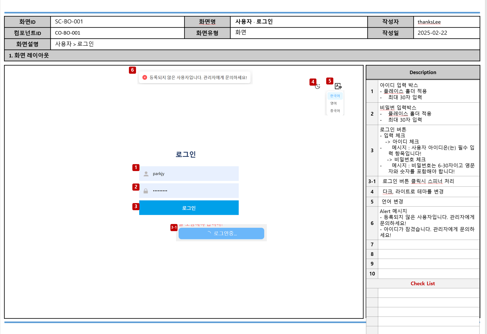
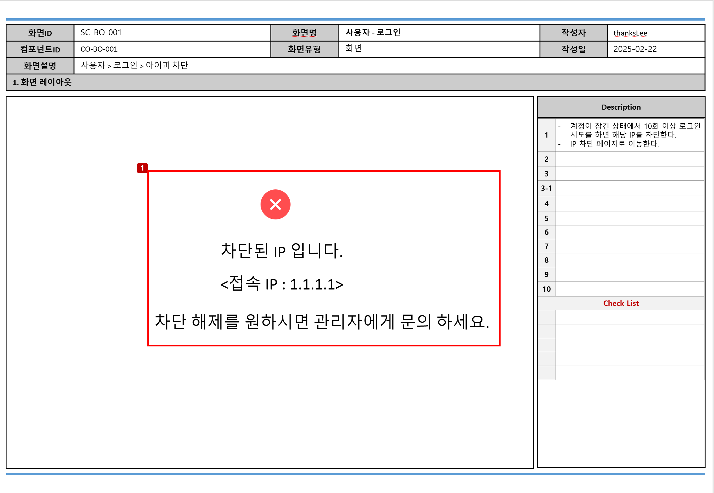

**화면**

**로그인 구현 가이드**

**1. 목적**
- 사용자가 아이디와 비밀번호를 입력하여 시스템에 인증되고 메인 화면으로 이동한다.

**2. 사전조건 (Preconditions)**
- BE: 시스템이 정상적으로 작동 중이어야 한다.
- BE: 사용자가 로그인 화면에 접근할 수 있어야 한다 (URL 접속 가능).
- BE: 관리자로부터 아이디와 비밀번호를 제공받은 사용자만 로그인을 시도할 수 있다.
- FE: 브라우저 session storage에 값이 없다면, 기본값은 테마 "light", 언어 "kr" 로 설정된다.
- BE: 서버 기동시 IP Black List가 캐시에 로드되어 있어야 한다.

**3. 기본 시나리오 (Basic Flow)**
- 로그인 정보 입력
  - FE: 사용자가 아이디 inputbox에 입력한다.
  - FE: 사용자가 비밀번호 inputbox에 입력한다.
    - FE: 비밀번호 입력시 기본은 마스킹 처리가 되고, 눈동자 아이콘을 클릭하면 비밀번호를 표시한다.
- 유효성 체크
  - 아이디 미입력:
    - FE: "사용자 아이디는 필수 입력 항목입니다!" 메시지를 아이디 inputbox 하단에 표시한다.
  - 비밀번호 미입력:
    - FE: "비밀번호는 필수 입력 항목입니다!" 메시지를 비밀번호 inputbox 하단에 표시한다.
  - 아이디/비밀번호 검증 실패
    - BE: "유효하지 않은 아이디 또는 비밀번호 입니다!" 라는 메시지 Client에 전송한다.
      - FE: 시스템에서 전송된 메시지를 alert notification으로 표시한다.
  - 입력형식이 맞지 않는 경우
    - BE/FE: "입력형식이 맞지 않습니다." 라는 메시지를 inputbox 하단에 표시한다.
    - 정책
      - BE/FE: 아이디 정책 : 영문소문자 + 숫자로 구성된 3-20자리 이내
      - BE/FE: 비밀번호 정책 : 영문자 + 숫자 + 특수문자로 구성된 6-30자리 이내
- 로그인 버튼 클릭
  - BE : 전송된 아이디와 비밀번호를 검증한다.
  - 로그인 인증 성공:
    - BE: 비밀번호 입력 오류 회수 및 아이피 로그인 시도 횟수를 초기화한다.
    - BE: Refresh token을 Db에 저장한다.
    - BE: access, refresh token을 발급하여 client로 전송한다.
      - 정책:
        - access token 만료 : 15분
        - refresh token 만료 : 48시간
      - FE: access, refresh token을 브라우저 session storage에 저장한다.
    - BE: 로그인 아이디, 로그인 일시 를 캐시에 담아둔다.
      - BE: 멀티로그인 방지를 위해 로그인시 캐시에 존재하는지 체크한다.
      - BE: WebSocket으로 메시지를 보내기 위해서도 캐시를 사용한다.
    - BE/FE: Websocket을 연결한다.
    - 멀티로그인 감지
      - BE: 로그인 아이디가 캐시에 존재하는 아이디를 비교하여 멀티로그인을 감지한다.
      - BE: 멀티로그인을 막기위해서 캐시에 아이디는 Unique하게 관리한다.
      - BE: 이전 로그인 사용자에게 Websocket을 통해 Message를 전송한다.
      - FE: "새로운 로그인이 확인 되었습니다. 자동으로 로그아웃됩니다!" 메시지를 포함한 모달 박스를 화면에 표시한다.
      - FE: 사용자를 로그인 페이지로 리다이렉트한다.
    - FE: 로그인 성공 후 메인 화면으로 이동한다.
  - 로그인 인증 실패:
    - BE: 검증 실패 시 "등록되지 않은 사용자입니다. 관리자에게 문의 하세요" 메시지를 Client로 전송한다.
      - FE: 시스템에서 전송된 메시지를 alert notification으로 표시한다.
    - BE: 비밀번호 오류횟수 + 1을 하여 DB에 저장한다.
    - BE: 비밀번호 오류횟수가 5를 초과하면 계정 상태를 잠금으로 변경하고 "계정이 잠겼습니다. 관리자에게 문의하세요!" 라는 메시지를 Client에 전송한다.
      - FE: 시스템에서 전송된 메시지를 alert notification으로 표시한다.
    - BE: 계정 잠금 상태에서 로그인 시도:
      - BE: IP + 로그인 시도 횟수 + 1을 하여 DB에 저장한다.
      - BE: IP + 로그인 시도 횟수가 10을 초과하면 IP Black list DB에 저장하고 캐시를 reload 한다.
      - BE: IP Black List는 캐시에서 관리한다.
        - Black List에 존재하는 IP 접근시 "차단된 IP 입니다. 접속 IP : {ip}" 메시지를 Client로 전송한다.
        - FE: IP 차단 페이지로 리다이렉트하며, 시스템에서 전송된 메시지를 화면에 표시한다.
    - 정책:
      - 비밀번호 오류 횟수: 기본 5회
      - 로그인 시도 횟수: 기본 10회
- 테마 변경
  - FE: 사용자는 테마(dark, light)를 변경할 수 있다.
  - FE: 변경된 테마는 브라우저 session strage에 저장한다.
- 언어변경
  - FE: 사용자는 언어(kr, en, zh)를 변경할 수 있다.
  - FE: 변경된 언어는 브라우저 session storage에 저장한다.
- 토큰만료:
  - FE: Access token 만료시 refresh token을 이용해서 access token을 재요청 한다.
  - BE: DB에 저장된 Refresh token과 client에서 전송된 refresh token을 비교한다.
    - 검증 성공시 :
      - BE: 새로운 access token을 발급한다.
      - FE: 새로운 access token을 session storage에 저장한다.
    - 검증 실패시 :
      - BE : 유효하지 않거나, 만료가 되었다면 "세션이 만료 되었습니다. 다시 로그인 해주세요!" 라는 메시지를 Client에 전송한다.
        - FE : 시스템에서 전송받은 메시지를 alert notification으로 표시한다.

----

**로그인 구현 가이드 - GPT 재작성**

## 1. 기능 개요

- 사용자가 아이디와 비밀번호를 입력하여 시스템에 인증하고 메인 화면으로 이동하는 기능입니다.

## 2. 사전 조건

- BE: 시스템이 정상적으로 작동 중이어야 합니다.
- BE: 사용자가 로그인 화면에 접근할 수 있어야 합니다 (URL 접속 가능).
- BE: 관리자로부터 아이디와 비밀번호를 제공받은 사용자만 로그인을 시도할 수 있습니다.
- FE: 브라우저 session storage에 값이 없다면, 기본값은 테마 "light", 언어 "kr"로 설정됩니다.
- BE: 서버 기동시 IP Black List가 캐시에 로드되어 있어야 합니다.

## 3. 기본 시나리오

### 3.1 로그인 정보 입력

1. FE: 사용자가 로그인 페이지에 접속합니다.
2. FE: 사용자가 아이디 inputbox에 아이디를 입력합니다.
3. FE: 사용자가 비밀번호 inputbox에 비밀번호를 입력합니다.
    - 비밀번호 입력 시 기본적으로 마스킹 처리가 됩니다.
    - 사용자가 눈동자 아이콘을 클릭하면 비밀번호가 표시됩니다.
4. FE: 사용자가 로그인 버튼을 클릭합니다.

### 3.2 로그인 인증 프로세스

1. BE: 전송된 아이디와 비밀번호를 검증합니다.
2. BE: 검증이 성공하면 다음 단계를 수행합니다:
    - 비밀번호 입력 오류 횟수 및 아이피 로그인 시도 횟수를 초기화합니다.
    - Refresh token을 DB에 저장합니다.
    - Access token(만료: 15분)과 refresh token(만료: 48시간)을 발급하여 client로 전송합니다.
    - 로그인 아이디와 로그인 일시를 캐시에 저장합니다.
3. FE: Access token과 refresh token을 브라우저 session storage에 저장합니다.
4. BE/FE: WebSocket 연결을 수립합니다.

### 3.3 멀티로그인 감지

1. BE: 로그인 아이디가 캐시에 이미 존재하는지 확인하여 멀티로그인을 감지합니다.
2. BE: 멀티로그인이 감지되면 이전 로그인 사용자에게 WebSocket을 통해 메시지를 전송합니다.
3. FE: 이전 로그인 사용자의 화면에 "새로운 로그인이 확인되었습니다. 자동으로 로그아웃됩니다!" 메시지를 포함한 모달 박스를 표시합니다.
4. FE: 이전 로그인 사용자를 로그인 페이지로 리다이렉트합니다.

### 3.4 로그인 성공 후 처리

1. FE: 로그인 성공 후 메인 화면으로 이동합니다.

### 3.5 테마 변경

1. FE: 사용자가 테마(dark, light) 변경 옵션을 선택합니다.
2. FE: 변경된 테마를 브라우저 session storage에 저장합니다.
3. FE: 선택된 테마를 화면에 즉시 적용합니다.

### 3.6 언어 변경

1. FE: 사용자가 언어(kr, en, zh) 변경 옵션을 선택합니다.
2. FE: 변경된 언어를 브라우저 session storage에 저장합니다.
3. FE: 선택된 언어로 인터페이스 텍스트를 즉시 변경합니다.

## 4. 대안 시나리오

이 유스케이스에는 별도의 대안 시나리오가 없습니다.

## 5. 사후 조건

- 성공적인 로그인 후:
    - 사용자는 메인 화면에 접근할 수 있습니다.
    - 시스템은 사용자의 로그인 상태를 유지합니다.
- 로그인 실패 후:
    - 사용자는 로그인 페이지에 머무르며 재시도할 수 있습니다.
    - 시스템은 로그인 시도 기록을 유지합니다.

## 6. 예외 시나리오

### 6.1 유효성 검사 실패

1. FE: 아이디 미입력 시 "사용자 아이디는 필수 입력 항목입니다!" 메시지를 아이디 inputbox 하단에 표시합니다.
2. FE: 비밀번호 미입력 시 "비밀번호는 필수 입력 항목입니다!" 메시지를 비밀번호 inputbox 하단에 표시합니다.
3. BE/FE: 입력 형식이 맞지 않는 경우 "입력형식이 맞지 않습니다." 메시지를 inputbox 하단에 표시합니다.
    - 아이디 정책: 영문소문자 + 숫자로 구성된 3-20자리 이내
    - 비밀번호 정책: 영문자 + 숫자 + 특수문자로 구성된 6-30자리 이내

### 6.2 로그인 인증 실패

1. BE: 검증 실패 시 "유효하지 않은 아이디 또는 비밀번호입니다!" 메시지를 Client에 전송합니다.
2. FE: 시스템에서 전송된 메시지를 alert notification으로 표시합니다.
3. BE: 비밀번호 오류횟수를 1 증가시켜 DB에 저장합니다.
4. BE: 비밀번호 오류횟수가 5를 초과하면 계정 상태를 잠금으로 변경하고 "계정이 잠겼습니다. 관리자에게 문의하세요!" 메시지를 Client에 전송합니다.
5. FE: 계정 잠금 메시지를 alert notification으로 표시합니다.

### 6.3 계정 잠금 상태에서 로그인 시도

1. BE: IP + 로그인 시도 횟수를 1 증가시켜 DB에 저장합니다.
2. BE: IP + 로그인 시도 횟수가 10을 초과하면 해당 IP를 Black list DB에 저장하고 캐시를 reload합니다.
3. BE: Black List에 존재하는 IP 접근 시 "차단된 IP입니다. 접속 IP: {ip}" 메시지를 Client로 전송합니다.
4. FE: IP 차단 페이지로 리다이렉트하며, 시스템에서 전송된 메시지를 화면에 표시합니다.

### 6.4 토큰 만료

1. FE: Access token 만료 시 refresh token을 이용해 access token을 재요청합니다.
2. BE: DB에 저장된 Refresh token과 client에서 전송된 refresh token을 비교합니다.
3. 검증 성공 시:
    - BE: 새로운 access token을 발급합니다.
    - FE: 새로운 access token을 session storage에 저장합니다.
4. 검증 실패 시:
    - BE: "세션이 만료되었습니다. 다시 로그인해주세요!" 메시지를 Client에 전송합니다.
    - FE: 시스템에서 전송받은 메시지를 alert notification으로 표시하고 로그인 페이지로 리다이렉트합니다.

## 7. 기술적 세부사항

- BE: IP Black List는 캐시에서 관리되며, 서버 기동 시 DB에서 로드됩니다.
- BE: 로그인 아이디는 캐시에서 Unique하게 관리되어 멀티로그인을 방지합니다.
- BE: WebSocket 연결은 실시간 메시지 전송을 위해 사용됩니다.
- FE: 브라우저 session storage를 사용하여 테마, 언어 설정 및 토큰을 관리합니다.
- BE: 토큰 관리 정책
    - Access token 만료: 15분
    - Refresh token 만료: 48시간
- BE: 보안 정책
    - 비밀번호 오류 허용 횟수: 5회
    - IP별 로그인 시도 허용 횟수: 10회

