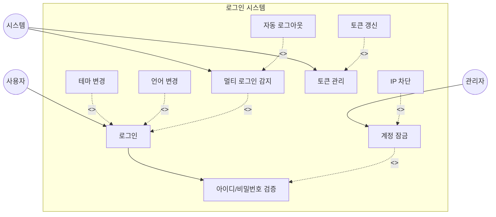

## 로그인 관련 Flow Chart

아래는 로그인 관련 유스케이스 시나리오를 기반으로 작성한 Usecase 입니다.

---

```mermaid
flowchart TB
    %% Actors
    User((사용자))
    Admin((관리자))
    System((시스템))

    %% Use Cases
    Login[로그인]
    ValidateCredentials[아이디/비밀번호 검증]
    ChangeTheme[테마 변경]
    ChangeLanguage[언어 변경]
    AccountLock[계정 잠금]
    IPBlock[IP 차단]
    TokenManagement[토큰 관리]
    MultiLoginDetection[멀티 로그인 감지]
    AutoLogout[자동 로그아웃]
    RefreshToken[토큰 갱신]

    %% Relationships
    User --> Login
    Admin --> AccountLock
    System --> MultiLoginDetection
    System --> TokenManagement

    %% Include relationships
    Login --> ValidateCredentials

    %% Extend relationships
    ChangeTheme -.-> |<<extend>>| Login
    ChangeLanguage -.-> |<<extend>>| Login
    AccountLock -.-> |<<extend>>| ValidateCredentials
    IPBlock -.-> |<<extend>>| AccountLock
    MultiLoginDetection -.-> |<<extend>>| Login
    AutoLogout -.-> |<<extend>>| MultiLoginDetection
    RefreshToken -.-> |<<extend>>| TokenManagement

    %% System boundary
    subgraph 로그인 시스템
        Login
        ValidateCredentials
        ChangeTheme
        ChangeLanguage
        AccountLock
        IPBlock
        TokenManagement
        MultiLoginDetection
        AutoLogout
        RefreshToken
    end

```