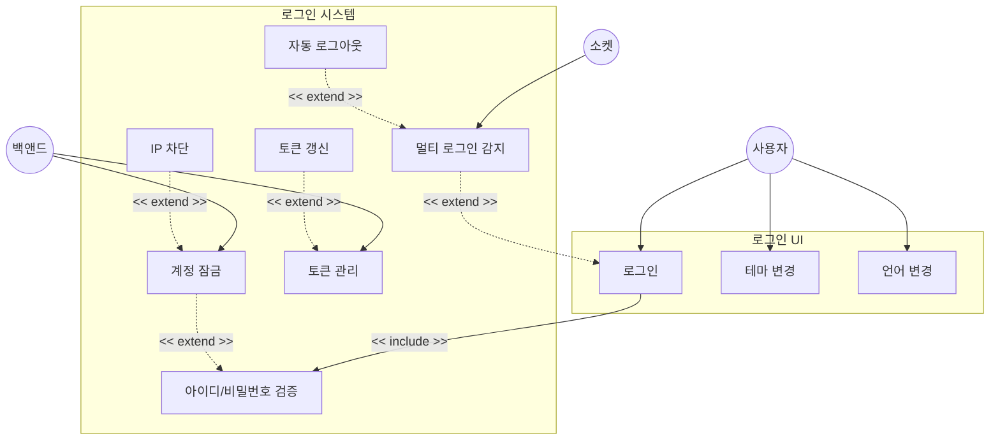

## 로그인 관련 Usecase Diagram

아래는 로그인 관련 구현 가이드를 기반으로 작성한 Usecase Diagram 입니다.

---

```mermaid
flowchart TB
    %% Actors
    User((사용자))
    Socket((소켓))
    Backend((백앤드))

    %% Use Cases
    Login[로그인]
    ValidateCredentials[아이디/비밀번호 검증]
    ChangeTheme[테마 변경]
    ChangeLanguage[언어 변경]
    AccountLock[계정 잠금]
    IPBlock[IP 차단]
    TokenManagement[토큰 관리]
    MultiLoginDetection[멀티 로그인 감지]
    AutoLogout[자동 로그아웃]
    RefreshToken[토큰 갱신]

    %% Relationships
    User --> Login
    User --> ChangeTheme
    User --> ChangeLanguage
    Socket --> MultiLoginDetection
    Backend --> AccountLock
    Backend --> TokenManagement

    %% Include relationships
    Login --> | &lt;&lt; include &gt;&gt;|ValidateCredentials

    %% Extend relationships
    AccountLock -.-> |&lt;&lt; extend &gt;&gt;| ValidateCredentials
    IPBlock -.-> |&lt;&lt; extend &gt;&gt;| AccountLock
    MultiLoginDetection -.-> |&lt;&lt; extend &gt;&gt;| Login
    AutoLogout -.-> |&lt;&lt; extend &gt;&gt;| MultiLoginDetection
    RefreshToken -.-> |&lt;&lt; extend &gt;&gt;| TokenManagement

    %% Frontend boundary
    subgraph 로그인 UI
        Login
        ChangeTheme
        ChangeLanguage
    end

    %% Backend boundary
    subgraph 로그인 시스템
        ValidateCredentials
        AccountLock
        IPBlock
        TokenManagement
        MultiLoginDetection
        AutoLogout
        RefreshToken
    end

```