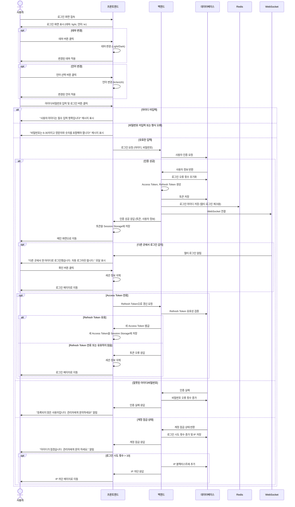

## 로그인 관련 Sequence Diagram

아래는 로그인 관련 구현 가이드를 기반으로 작성한 Sequence Diagram 입니다..

---

```mermaid
sequenceDiagram
    actor User as 사용자
    participant FE as 프론트엔드
    participant BE as 백엔드
    participant DB as 데이터베이스
    participant Redis as Redis
    participant WS as WebSocket

    %% 기본 로그인 시나리오
    User->>FE: 로그인 화면 접속
    FE->>User: 로그인 화면 표시 (테마: light, 언어: kr)

    %% 테마 변경 시나리오
    opt 테마 변경
        User->>FE: 테마 버튼 클릭
        FE->>FE: 테마 변경 (Light/Dark)
        FE->>User: 변경된 테마 적용
    end

    %% 언어 변경 시나리오
    opt 언어 변경
        User->>FE: 언어 선택 버튼 클릭
        FE->>FE: 언어 변경 (kr/en/zh)
        FE->>User: 변경된 언어 적용
    end

    %% 로그인 시도
    User->>FE: 아이디/비밀번호 입력 및 로그인 버튼 클릭

    %% 클라이언트 측 유효성 검사
    alt 아이디 미입력
        FE->>User: "사용자 아이디는 필수 입력 항목입니다!" 메시지 표시
    else 비밀번호 미입력 또는 형식 오류
        FE->>User: "비밀번호는 6-30자이고 영문자와 숫자를 포함해야 합니다!" 메시지 표시
    else 유효한 입력
        FE->>BE: 로그인 요청 (아이디, 비밀번호)

        %% 서버 측 인증 처리
        BE->>DB: 사용자 인증 요청

        alt 인증 성공
            DB->>BE: 사용자 정보 반환
            BE->>DB: 로그인 오류 횟수 초기화
            BE->>BE: Access Token, Refresh Token 생성
            BE->>DB: 토큰 저장
            BE->>Redis: 로그인 아이디 저장 (멀티 로그인 체크용)
            BE->>WS: WebSocket 연결
            BE->>FE: 인증 성공 응답 (토큰, 사용자 정보)
            FE->>FE: 토큰을 Session Storage에 저장
            FE->>User: 메인 화면으로 이동

            %% 멀티 로그인 감지 시나리오
            opt 다른 곳에서 로그인 감지
                WS->>FE: 멀티 로그인 알림
                FE->>User: "다른 곳에서 현 아이디로 로그인했습니다. 자동 로그아웃 됩니다." 모달 표시
                User->>FE: 확인 버튼 클릭
                FE->>FE: 세션 정보 삭제
                FE->>User: 로그인 페이지로 이동
            end

            %% 토큰 갱신 시나리오
            opt Access Token 만료
                FE->>BE: Refresh Token으로 갱신 요청
                BE->>DB: Refresh Token 유효성 검증

                alt Refresh Token 유효
                    BE->>FE: 새 Access Token 발급
                    FE->>FE: 새 Access Token을 Session Storage에 저장
                else Refresh Token 만료 또는 유효하지 않음
                    BE->>FE: 토큰 오류 응답
                    FE->>FE: 세션 정보 삭제
                    FE->>User: 로그인 페이지로 이동
                end
            end

        else 잘못된 아이디/비밀번호
            DB->>BE: 인증 실패
            BE->>DB: 비밀번호 오류 횟수 증가
            BE->>FE: 인증 실패 응답
            FE->>User: "등록되지 않은 사용자입니다. 관리자에게 문의하세요!" 알림

        else 계정 잠금 상태
            DB->>BE: 계정 잠금 상태 반환
            BE->>DB: 로그인 시도 횟수 증가 및 IP 저장
            BE->>FE: 계정 잠금 응답
            FE->>User: "아이디가 잠겼습니다. 관리자에게 문의 하세요." 알림

            %% IP 차단 시나리오
            opt 로그인 시도 횟수 > 10
                BE->>DB: IP 블랙리스트에 추가
                BE->>FE: IP 차단 응답
                FE->>User: IP 차단 페이지로 이동
            end
        end
    end
```