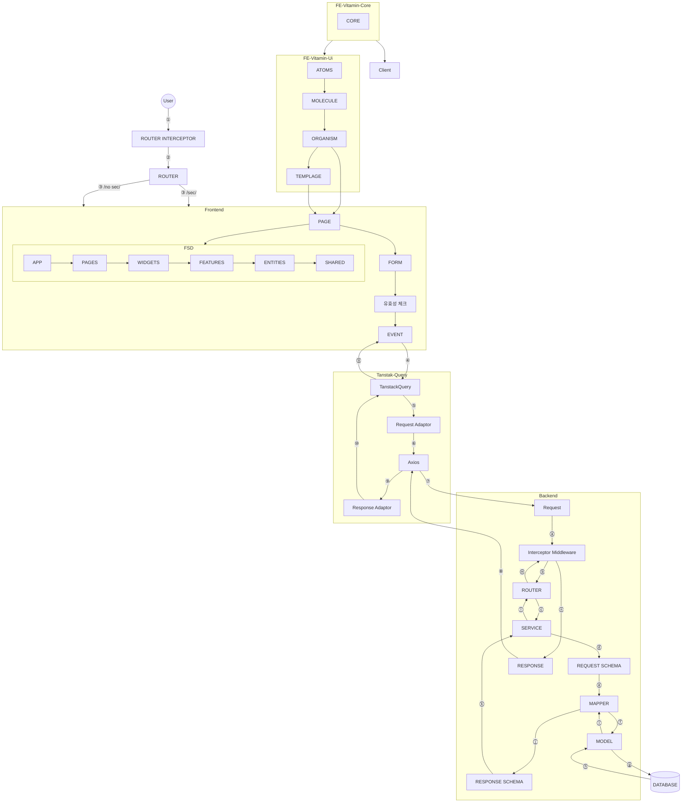
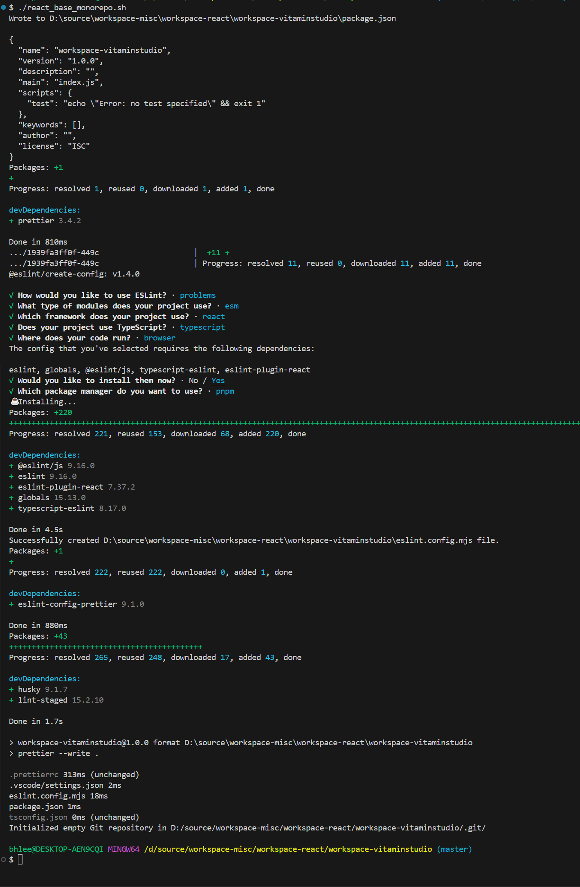
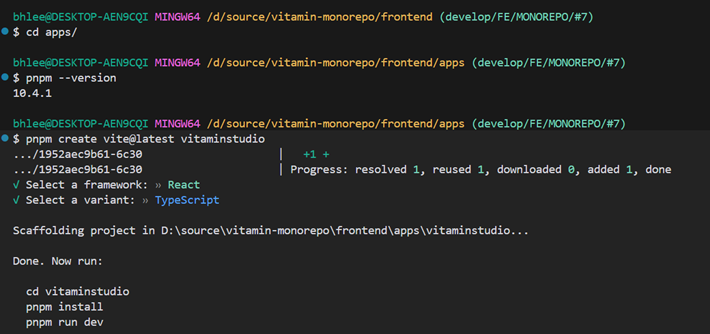
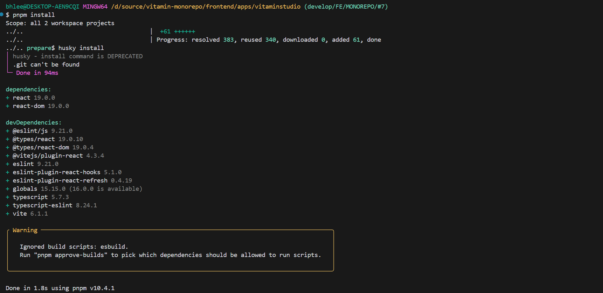
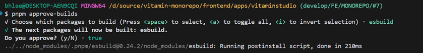
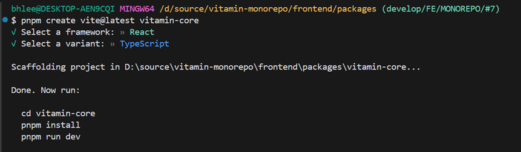
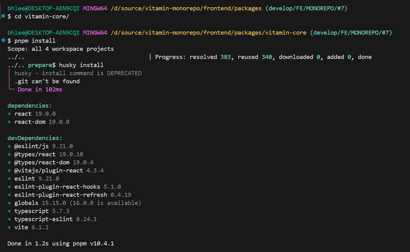
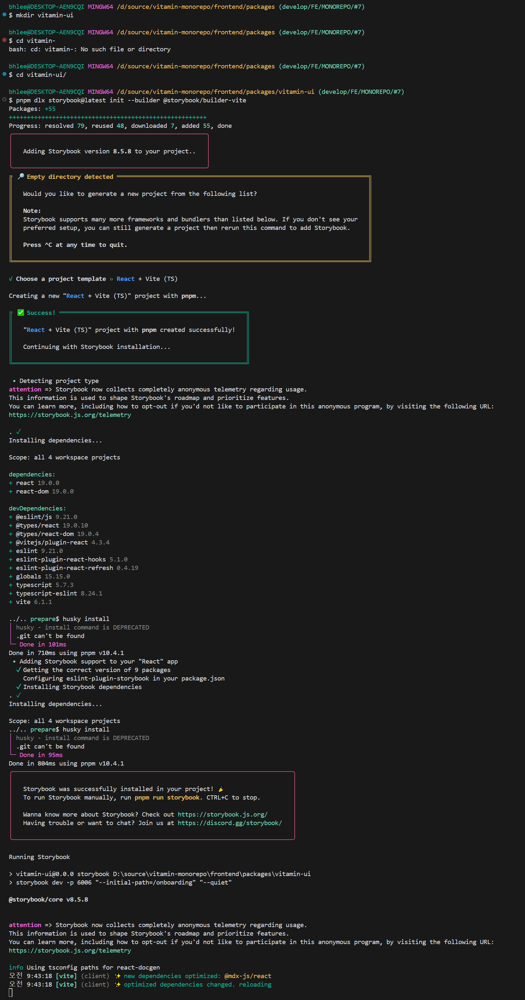
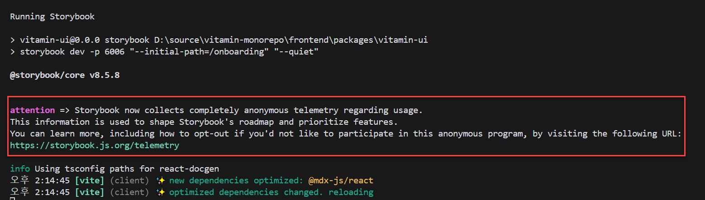

# Vitamin Monorepo Frontend

본 프로젝트는 React 를 심도있게 공부하기 위한 프로젝트입니다.

## 1. 프로젝트 구조도




# 2. 프로젝트 사용 버전 정보

- Node.js 버전 20.15.0 이상 사용하며, 현 프로젝트는 22.11.0 버전을 사용.

  > node --version

- pnpm 버전은 10.0.0 이상 사용하며, 현 프로젝트는 10.4.1 버전을 사용.

  > pnpm --version

- react 버전은 19.0.0 이상 사용.

  > pnpm list react

# 3. 프로젝트 구조

본 프로젝트는 아래와 같은 구조로 이루어져 있습니다.

## 3.1 프로젝트 생성

- React Monorepo 프로젝트 생성

  > ./react_base_monorepo.sh

  

## 3.2 apps 프로젝트 생성

  > cd apps

  > pnpm create vite@latest vitaminstudio

  

  > cd vitaminstudio

  > pnpm install

  

-  트러블 슈팅

  - Ignored build scripts: esbuild.

    

    > pnpm approve-builds

    


## 3.3 packages 프로젝트 생성

- vitamin-core 프로젝트 생성
  > cd packages

  > pnpm create vite@latest vitamin-core

  

  > cd vitamin-core

  > pnpm install

  

- vitamin-ui 프로젝트 생성
  > mkdir vitamin-ui

  > cd vitamin-ui

  > pnpm dlx storybook@latest init --builder @storybook/builder-vite

  

  - 주의
    - storybook 처음 생성을 하면 **attention** 문구가 나오는데 이 문구를 없애려면 아래와 같이 한다.
      

    > vi .env
      ```env
        VITE_DISABLE_TELEMETRY=true
      ```

