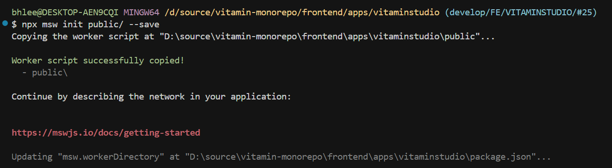
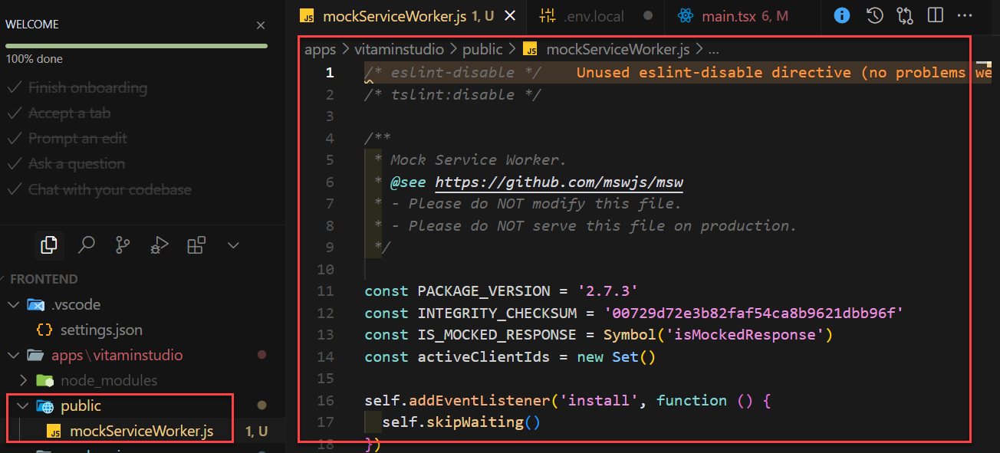
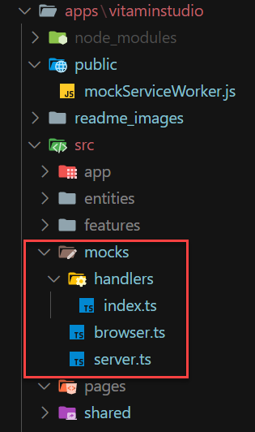
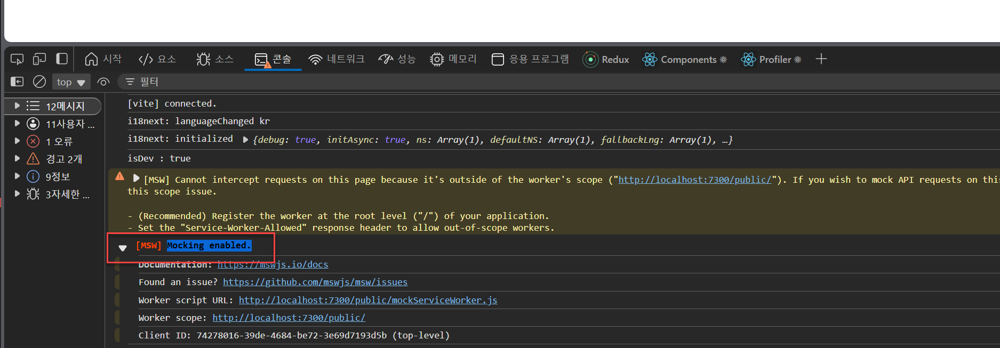

# VitaminStudio

- 실제 Application이 구현되는 프로젝트이다.

# 1. 필요 모듈 설치

## 1.1 vite.config.ts 에 필요한 Package 설치

  > pnpm add -D vite-tsconfig-paths @types/node @types/prop-types vite-plugin-checker vite-plugin-dts

  > pnpm add -D less @svgr/plugin-jsx @svgr/plugin-svgo vite-plugin-svgr

  > pnpm add -D rollup-plugin-visualizer vite-plugin-compression

## 1.2 vite.config.ts 에 필요한 모듈 설정

- vite.config.ts 파일 수정

  - checker 사용시 vite.config.ts 수정

    ```ts
      plugins: [
        ...기존코드
      checker({
          typescript: true,
          terminal: false,
          enableBuild: false,
          eslint: {
            lintCommand: 'eslint "./src/**/*.{ts,tsx}" --config ./tsconfig.json',
            useFlatConfig: true,
          },
        }),
        ...기존코드
      ]
    ```
  - workspace 에 있는 dependency 추가
    * **주의**

      아래와 같이 추가해서 사용하려면 dependency 의 vite.config.ts 파일에서 @가 아닌 @vitamin-ui, @vitamin-core 로 alias를 구분해야 한다.

      vitaminstudio에서 충돌이 발생한다.

    ```ts
      ...기존코드
      resolve: {
        alias: {
          '@': resolve(__dirname, 'src'),
          '@assets': resolve(__dirname, '../../shared/assets'), // ✅ 절대 경로 사용
          '@workspace/vitamin-ui': resolve(__dirname, '../../packages/vitamin-ui/src'),  // 재 build 하지 않아도 수정된 사항이 바로 반영된다.
          '@workspace/vitamin-core': resolve(__dirname, '../../packages/vitamin-core/src'), // 재 build 하지 않아도 수정된 사항이 바로 반영된다.
        },
      },
    ```

## 1.3 workspace 에 있는 dependency 설치

  > pnpm add @workspace/vitamin-core --workspace

  or

  > pnpm remove @workspace/vitamin-core

  > pnpm add @workspace/vitamin-ui --workspace

  or

  > pnpm remove @workspace/vitamin-ui

  - 아래와 같이 추가된다.

  ```json
    ...기존코드

    "dependencies": {
      "@workspace/vitamin-core": "workspace:^",
      "@workspace/vitamin-ui": "workspace:^"

      ...기존코드
    }

    ...기존코드
  ```

## 1.4 Package.json 에 필요한 설정

- package.json 파일 설정

  ```json
    "name": "vitaminstudio",
    "version": "0.1.0",
    "type": "module",
    "scripts": {
      "dev": "vite --mode dev --host",
      "mock": "vite --mode mock --host",
      "test": "vitest --coverage --watch --root src/ --reporter dot",
      "build": "tsc && vite build",
      "lint": "eslint . --report-unused-disable-directives --max-warnings 0 --fix",
      "preview": "vite preview"
    },
    ...기존코드

  ```

- react router

  > pnpm add react-router react-router-dom

- react error boundary

  > pnpm add react-error-boundary

- tanstack-query

  > pnpm add @tanstack/react-query

  > pnpm add -D @tanstack/react-query-devtools @tanstack/eslint-plugin-query

- Ant design

  > pnpm add antd @ant-design/cssinjs @ant-design/icons

- Styled-Component

  > pnpm add @types/styled-components styled-components

- mock Service

  > pnpm add -D msw@latest

  - MOCK Service 설정

    - project root에서 실행 (ex) ~~/apps/vitaminstudio

      > npx msw init public/ --save

      

    - 설치가 완료되면 아래와 같이 폴더와 파일이 생성된다.

      

    - package.json에 추가

      ```json
        //...기존코드
        "mock": "vite --mode mock",
        //...기존코드
      ```

    - mocks 폴더 생성

      > mkdir -p ./src/mocks/handlers


    - msw 설정 파일 생성

      > vi ./src/mocks/server.ts

        ```ts
          import { setupServer } from 'msw/node';
          import { handlers } from './handlers';

          export const worker = setupServer(...handlers);
        ```

      > vi ./src/mocks/browser.ts

        ```ts
          import { setupWorker } from 'msw/browser';
          import { handlers } from './handlers';

          export const worker = setupWorker(...handlers);
        ```

      > vi ./src/mocks/handlers/index.ts

        ```ts
          export const handlers = [];
        ```
      

    - main.ts 에 MSW 관련 설정

      ```ts
        //...기존코드
        if (import.meta.env.MODE === 'mock') {
          // 'mock' 모드일 때만 worker를 시작합니다.
          const { worker } = await import('./mocks/browser');
          await worker.start({
            onUnhandledRequest: 'warn',
            serviceWorker: {
              url: '../public/mockServiceWorker.js', // 명시적으로 경로 지정
            },
          });
        }
        //...기존코드
      ```

      

- 기타 Package

  > pnpm add nprogress

  > pnpm add -D @types/nprogress


