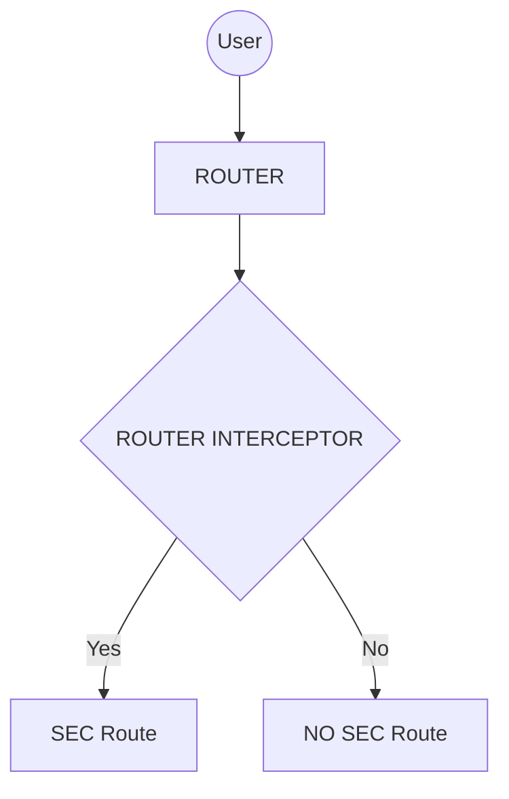

- 기본 구조

```mermaid

  flowchart TD
    A@{shape: circle, label: "User"} --> B@{shape: rect, label: "ROUTER"}
    B --> C@{shape: diamond, label: "ROUTER INTERCEPTOR"}
    C --> |Yes| D@{shape: rect, label: SEC Route}
    C -->|No| E@{shape: rect, label: NO SEC Route}

```