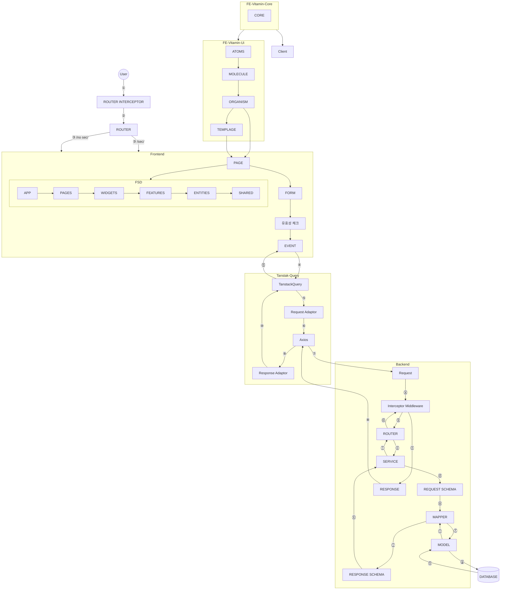
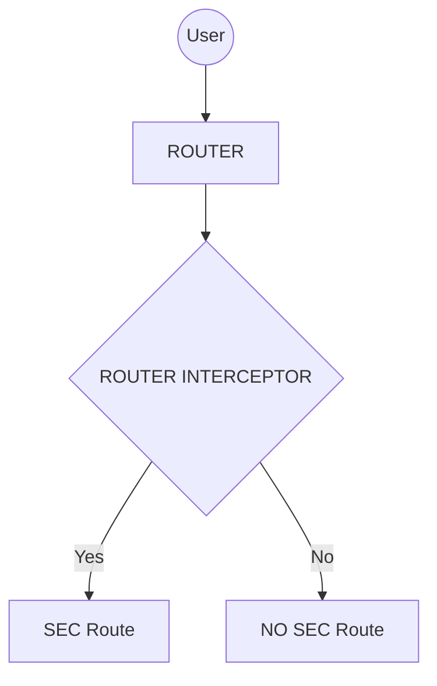

## 1. 프로젝트 구조도

```mermaid

  flowchart TB

    A@{shape: circle, label: "User"} --> |①| B@{shape: rect, label: "ROUTER INTERCEPTOR"}
    B --> |②| C@{shape: rect, label: "ROUTER"}

    subgraph Frontend
      direction TB

      J@{shape: rect, label: "PAGE"} --> K@{shape: rect, label: "FORM"}
      K --> L@{shape: rect, label: "유효성 체크"}
      L --> M@{shape: rect, label: "EVENT"}

      subgraph FSD
        direction LR

        FA@{shape: rect, label: APP} --> FB@{shape: rect, label: PAGES}
        FB --> FC@{shape: rect, label: WIDGETS}
        FC --> FD@{shape: rect, label: FEATURES}
        FD --> FE@{shape: rect, label: ENTITIES}
        FE --> FF@{shape: rect, label: SHARED}

      end
    end

    subgraph Backend
      direction TB

      BA@{shape: rect, label: Request} --> | ⓐ | BB@{shape: rect, label: Interceptor Middleware}
      BB --> | ⓑ | BC@{shape: rect, label: ROUTER}
      BC --> | ⓒ | BD@{shape: rect, label: SERVICE}
      BD --> | ⓓ | BE@{shape: rect, label: "REQUEST SCHEMA"}
      BE --> | ⓔ | BF@{shape: rect, label: MAPPER}
      BF --> | ⓕ | BG@{shape: rect, label: MODEL}

      BG --> | ⓘ | BF
      BF ---> | ⓙ | BH@{shape: rect, label: "RESPONSE SCHEMA"}
      BH --> | ⓚ | BD
      BD --> | ⓛ | BC
      BC --> | ⓜ | BB
      BB ----> | ⓝ | BI@{shape: rect, label: RESPONSE}

    end

    BG --> | ⓖ | DATABASE@{shape: cyl, label: DATABASE}
    DATABASE --> | ⓗ | BG

    J --> FSD

    C ---> | ③ /sec/ | Frontend
    C ---> | ③ /no sec/ | Frontend


    subgraph "Tanstak-Query"
      direction TB

      E@{shape: rect, label: "TanstackQuery"}
      E --> |⑤| F@{shape: rect, label: "Request Adaptor"}
      F --> |⑥| G@{shape: rect, label: "Axios"}
      G --> |⑨| I@{shape: rect, label: "Response Adaptor"}
      I --> |⑩| E
    end

    M --> |④| E
    G --> |⑦| BA
    BI --> |⑧| G
    E --> |⑪| M

    subgraph FE-Vitamin-Ui
      direction TB

      VUA@{shape: rect, label: ATOMS} --> VUB@{shape: rect, label: MOLECULE}
      VUB --> VUC@{shape: rect, label: ORGANISM}
      VUC --> VUD@{shape: rect, label: TEMPLAGE}
    end

    subgraph FE-Vitamin-Core
      direction TB

      VCA@{shape: rect, label: CORE}
    end

    VUC --> J
    VUD --> J

    FE-Vitamin-Core --> FE-Vitamin-Ui
    FE-Vitamin-Core --> Client

```
=======
- 기본 구조

```mermaid

  flowchart TD
    A@{shape: circle, label: "User"} --> B@{shape: rect, label: "ROUTER"}
    B --> C@{shape: diamond, label: "ROUTER INTERCEPTOR"}
    C --> |Yes| D@{shape: rect, label: SEC Route}
    C -->|No| E@{shape: rect, label: NO SEC Route}

```
